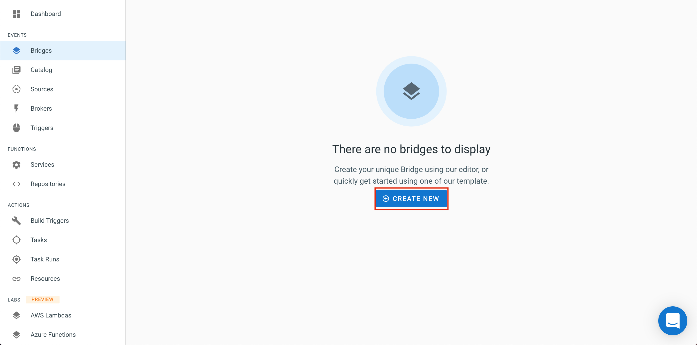
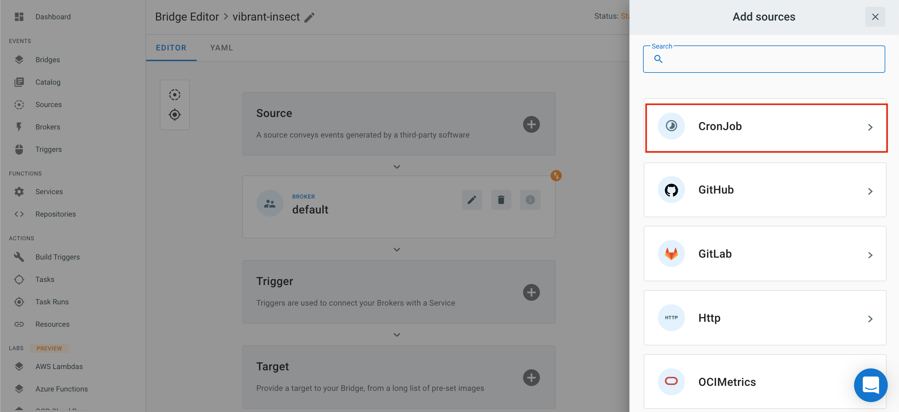
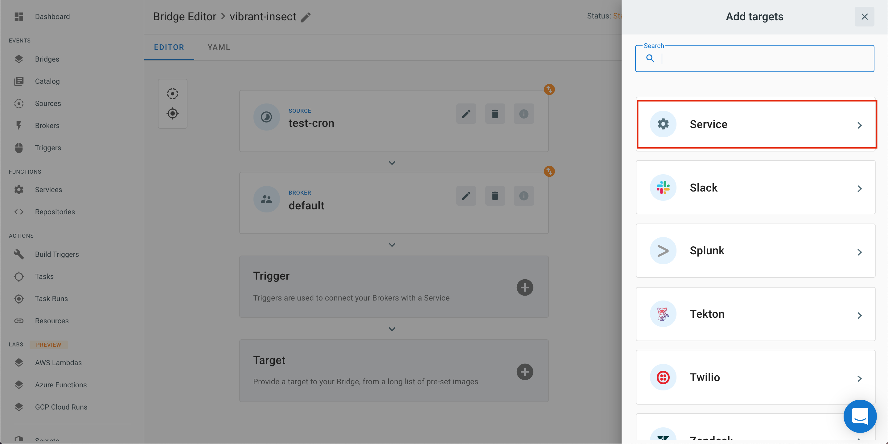
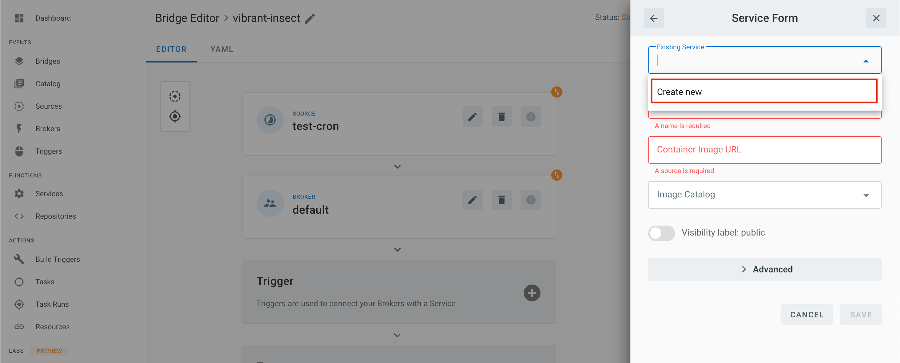
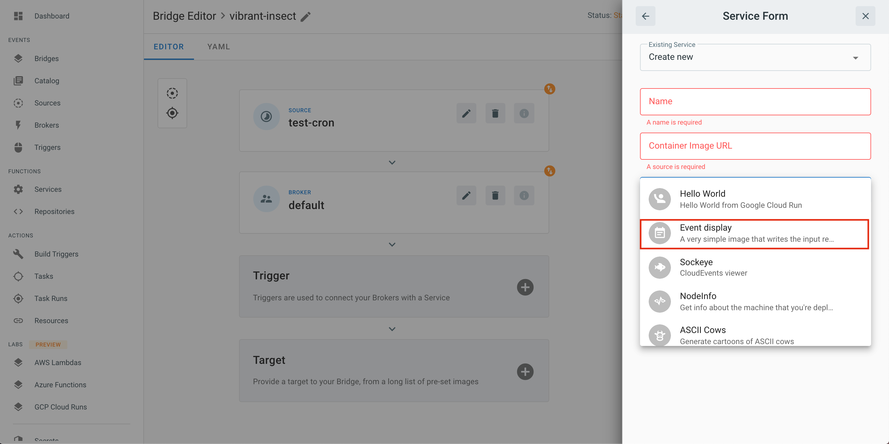
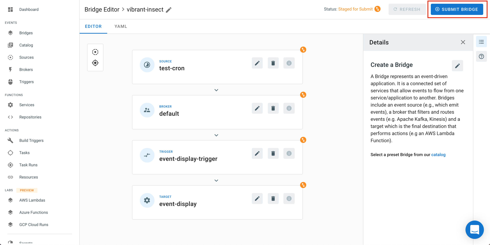
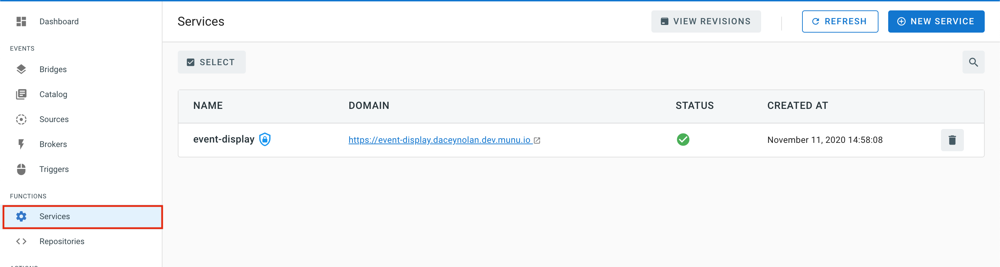
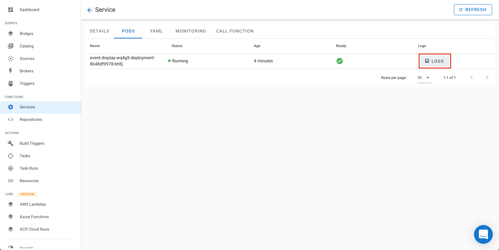
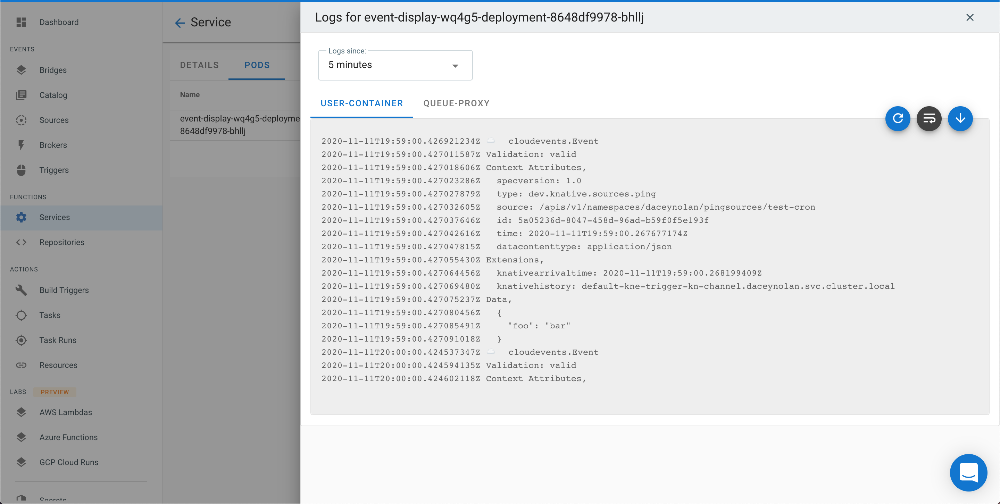

Each _bridge_ created within the TM console operates via the following `flow`:

  1. An event _*[source](https://knative.dev/docs/eventing/sources/)*_ **_retrieves_** data. <!-- Should link to OUR source docs upon their completion -->
  2. A _*[broker](https://knative.dev/docs/eventing/broker/)*_ to act as an **_event bucket_**
  3. A _*[trigger](https://knative.dev/docs/eventing/triggers/)*_ that **_subscribes_** the Target to receive events from the broker.
  4. A _*target*_ that **_receives_** events. <!-- Should be linked to the ../targets/index.md  upon completion -->

## Creating a New Bridge

For this example a small service called [Event Display](https://github.com/knative/eventing-contrib/tree/master/cmd/event_display) is used as the `Target`. `Event Display` prints all the messages it receives into a log.

* From the _Bridges_ view. Select `Create New`

* Select `Create a new Bridge`.

* Select `Sources`

* Select `CronJob` from the popup menu.

* Give it a name such as "test-cron", a Cron Schedule of every minute (or */1 * * * *), and keep the `Cron data` set at `{"foo": "bar"}`.

 Before configuring a _Bridge_, normally, a _Target_ would be created or pre-existing, because this example assumes a fresh TM console, There are no services currently deployed so a detour to the `Target` section is required.
 * Select `Service` here.

* Select `Create New` from the `Existing Service` dropdown.

* Select `Image Catalog`, then `Event display`, and finally `SAVE`

This will complete the flow from _Source_ to _Trigger_ automatically for us by creating an `auto-trigger`.

* We can finish now by selecting `SUBMIT BRIDGE` from the top right corner.

* To verify the functionality of the bridge, navigate to the [Services](https://cloud.triggermesh.io/services) section.

* The `event display` service that was created with the bridge will be shown. When
that is clicked, there will be a page showing the details of the service.

* When the `PODS` link is selected, the a list of associated pods will be shown. There is only one, but if you click the button that says "Logs" on the far right side of the list, then the log for that event will be displayed. 

* We now can see the log for that event. 

## Highlighted Bridges

* [Slack to Confluent](./bridges/slack-to-confluent.md): learn how to subscribe to events at Slack and get them delivered to a Confluent Kafka cluster.
