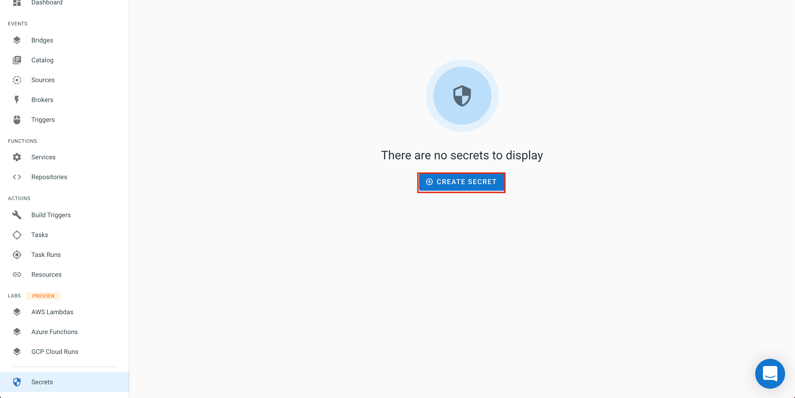
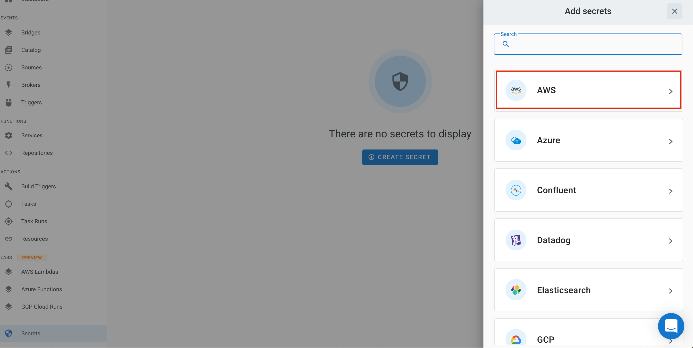
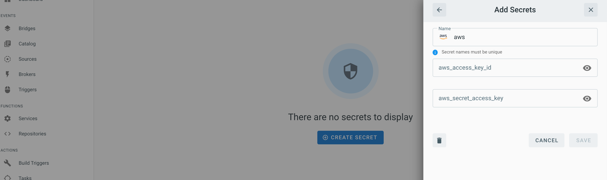
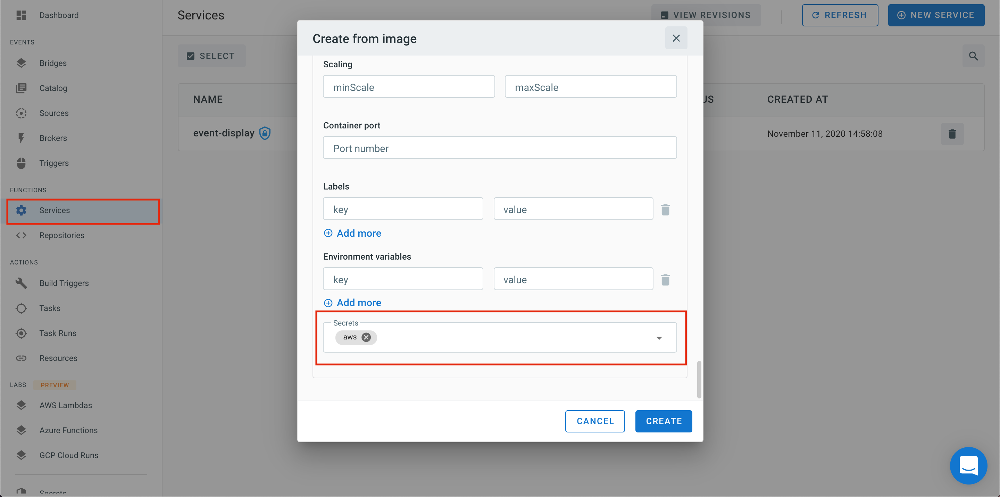
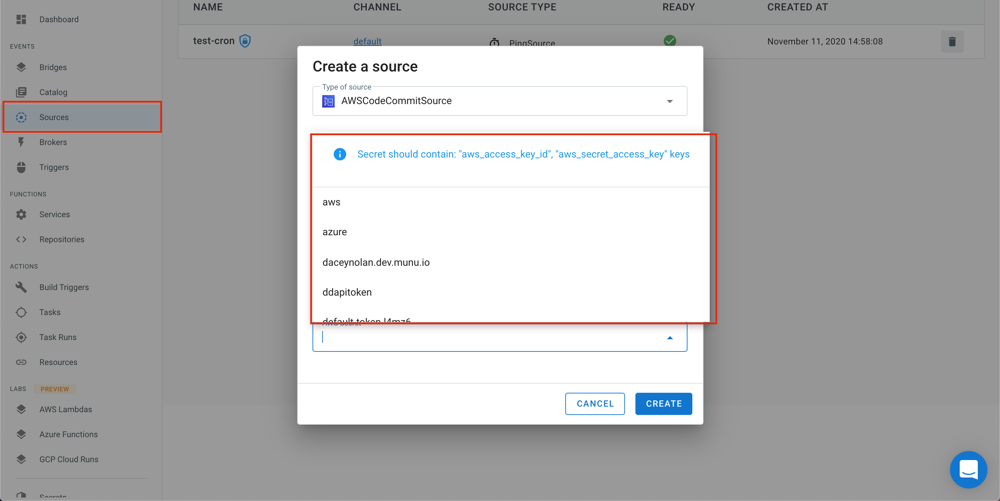

# Secrets

The TriggerMesh console provides a central location to view and store sensitive information called `Secrets.` The secrets created here can then be used by any service deployed via the Triggermesh platform.

From the _Secrets_ view. Select `Create New`. Selecting the button here will give you a choice to create various secrets (e.g AWS, GitHub, GitLab, GCP)




## AWS API Keys

All the AWS event sources need access to some AWS API credentials to be able to establish a secure connection.

You should create a AWS IAM user and generate a dedicated set of API credentials with only the proper permissions. Once you are ready to create your secret, click on `AWS`.



Once you do so, you can create a secret with the AWS specific wizard shown below:



The secret name is pre-configured to be `aws`, but you can edit this name when you are creating a new secret. The keys are `aws_access_key_id` and `aws_secrets_access_key`.

## Using a Secret in a Service Definition

If your service needs access to a secret, you can load it in a service definition through the Service creation wizard.

Select `Advanced Configuration`, a pane will expand and at the bottom you will be able to select the secrets that you want your service to use.



## Using a Secret in a Source Definition

When you deploy a new event source, that source may need a secret to access an external API. A dropdown menu is available in the source configuration which will let you choose the pre-created secret.



## Accessing Your Secrets with `kubectl`

These secrets are stored as Kubernetes [secrets](https://kubernetes.io/docs/concepts/configuration/secret/) and protected via RBAC rules.

You can interact with your secrets using [`kubectl`](https://kubernetes.io/docs/tasks/tools/install-kubectl/) and the configuration downloaded for using [`tm`](https://github.com/triggermesh/tm/blob/master/README.md).

```
kubectl --kubeconfig=config.json -n <your_login_username> get secrets
```
