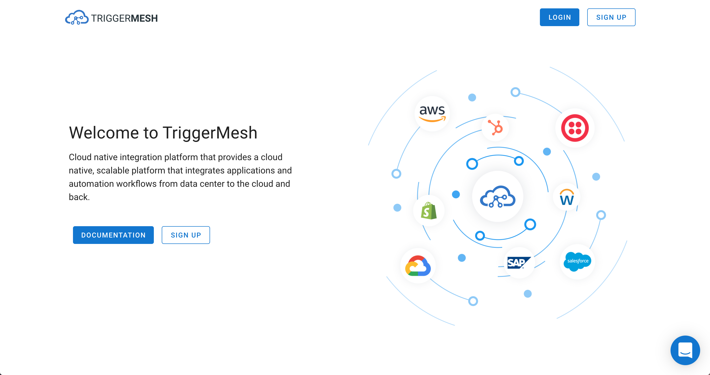
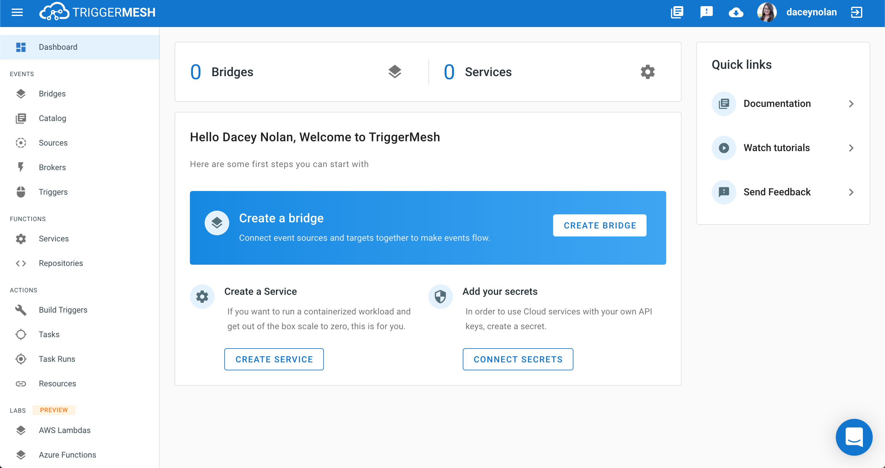

# TriggerMesh Enterprise

TriggerMesh Enterprise provides additional capabilities such as:

* Powerful web interface
* Administration dashboard
* Integration visual editor
* Single sign-on
* Custom connectors builder
* Knative distribution

## Preview

The following screenshots give you a preview of what the TriggerMesh interface looks like.

Once logged in you have acess to the Dashboard.

If you want to use our command line client keep reading...

## For CLI Lovers

If you would prefer to use a CLI, we have prepared `tm` for you.

`tm` is a generic Knative client with some added features to deploy functions from source. You can download `tm` by following our [instructions](https://docs.triggermesh.io/tm/install)

For example you will be able to bypass the console and do something like this:

