# Event Source for Azure Activity Logs

This event source forwards [Activity Logs][activity-logs] from a given Azure Subscription by routing them over [Azure
Event Hubs][eventhubs]. It does so by registering [Diagnostic Settings][diag-settings] that automatically send a
selected set of log categories to a dedicated Event Hub, then subscribing to the events from that Event Hub.

## Prerequisite(s)

- Service Principal
- Event Hubs Namespace
- Event Hubs Instance _(optional)_
- Shared Access Policy / Shared Access Signature (SAS)

### Service Principal

A [Service Principal][sp] is required in order to authenticate the event source against the Azure tenant that has
authority over the Azure Subscription to monitor. You can create a Service Principal by following the instructions at
[How to: Use the portal to create an Azure AD application and service principal that can access resources][sp-create].

The section called _Assign a role to the application_ describes how to assign permissions to the Service Principal. Make
sure you select a role which has at least the following permissions:

- `Microsoft.Insights/DiagnosticSettings/Read`
- `Microsoft.Insights/DiagnosticSettings/Delete`
- `Microsoft.Insights/DiagnosticSettings/Write`
- `Microsoft.EventHub/namespaces/authorizationRules/listkeys/action`

Additionally, assign the role `Azure Event Hubs Data Receiver` to the Service Principal to allow it to receive events
from Event Hubs.

In the example below, we create a custom IAM role that is dedicated to the TriggerMesh Activity Logs event source:

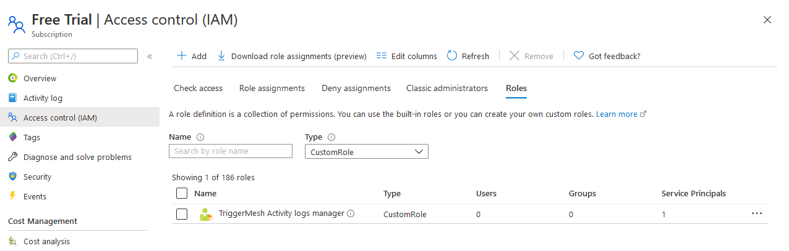
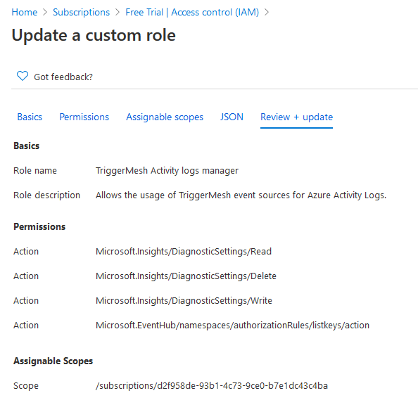

The corresponding role JSON is given as a reference which you can replicate to create a similar custom IAM role:

```json
{
    "properties": {
        "roleName": "TriggerMesh Activity logs manager",
        "description": "Allows the usage of TriggerMesh event sources for Azure Activity Logs.",
        "assignableScopes": [
            "/subscriptions/d2f958de-93b1-4c73-9ce0-b7e1dc43c4ba"
        ],
        "permissions": [
            {
                "actions": [
                    "Microsoft.Insights/DiagnosticSettings/Read",
                    "Microsoft.Insights/DiagnosticSettings/Delete",
                    "Microsoft.Insights/DiagnosticSettings/Write",
                    "Microsoft.EventHub/namespaces/authorizationRules/listkeys/action"
                ],
                "notActions": [],
                "dataActions": [],
                "notDataActions": []
            }
        ]
    }
}
```

After the Service Principal is created and assigned suitable roles, take note of the following information:

- **Tenant ID** and **Client ID** (see _Get tenant and app ID values for signing in_)
- **Client secret** (see _Create a new application secret_)

### Event Hubs Namespace

Follow the instructions at [Quickstart: Create an Event Hub using Azure portal][eventhubs-create], and create a new
Event Hubs namespace. This namespace will contain an Event Hubs instance which will be configured by the event source as
the destination of Activity Logs originating from the Azure subscription.

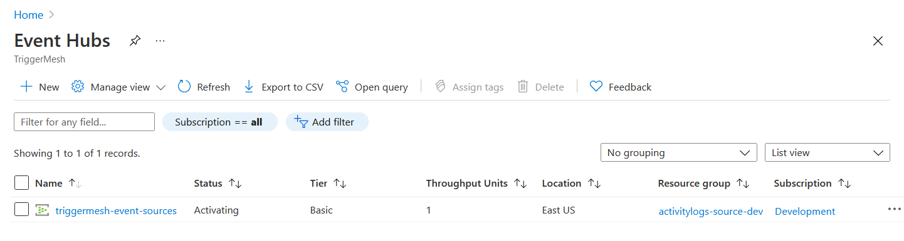

### Event Hubs Instance _(optional)_

This section can be skipped if you would like to let Azure manage the destination Event Hub. When the Event Hub's name
is omitted upon deployment of the event source, Azure creates an Event Hub with the name `insights-activity-logs` upon
reception of the first log entry (which can take a few minutes).

If, however, you prefer to provide your own Event Hub for that purpose, follow the instructions at [Quickstart: Create
an Event Hub using Azure portal][eventhubs-create] to create an Event Hubs instance. Take note of its resource ID, it is
a required input to be able to run an instance of the Azure Activity Logs event source.

A resource ID for an Event Hub has the following format:

```
/subscriptions/{subscriptionId}/resourceGroups/{resourceGroupName}/providers/Microsoft.EventHub/namespaces/{namespaceName}/eventHubs/{eventHubName}
```

!!! note
    The resource ID of the corresponding Event Hubs namespace is obtained by simply omitting the
    `/eventHubs/{eventHubName}` part of the Event Hub's resource ID.

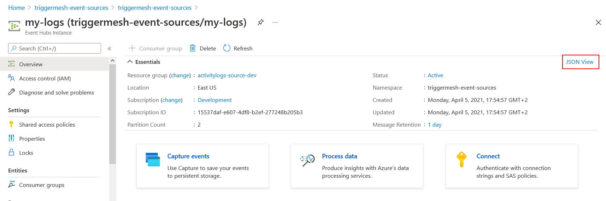
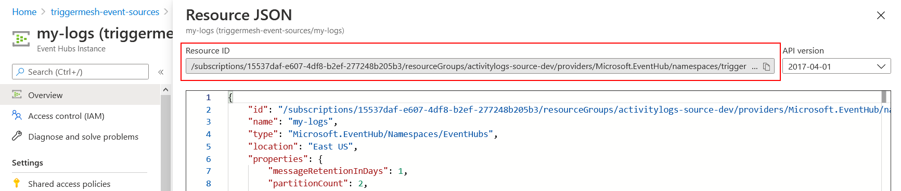

Resource IDs can also be obtained using the [Azure CLI][azure-cli] (`az`). The following command line uses values from
the screenshots above:

```console
$ az eventhubs eventhub show --resource-group activitylogs-source-dev --namespace-name triggermesh-event-sources --name my-logs
{
  "id": "/subscriptions/15537daf-e607-4df8-b2ef-277248b205b3/resourceGroups/activitylogs-source-dev/providers/Microsoft.EventHub/namespaces/triggermesh-event-sources/eventhubs/my-logs",
  "resourceGroup": "activitylogs-source-dev",
  "type": "Microsoft.EventHub/Namespaces/EventHubs",
  "name": "my-logs",
  "location": "East US",
  "status": "Active",
  ...
}
```

### Shared Access Policy / Shared Access Signature (SAS)

The TriggerMesh Activity Logs event source requires a reference to the name of a Shared Access Policy (also called
[Shared Access Signatures][sas]). This policy contains a token that can be used to delegate permissions within an Event
Hubs namespace, such as the management of Event Hub instances.

Open your Event Hubs namespace, then open the _Shared access policies_ panel under the _Settings_ section of the Event
Hubs screen. By default, the namespace contains a pre-created policy called `RootManageSharedAccessKey` with `Manage,
Send, Listen` claims, which is perfectly suitable for the TriggerMesh Activity Logs event source. If you prefer to use
your own policy instead, make sure it has the same `Manage, Send, Listen` claims as the default policy.

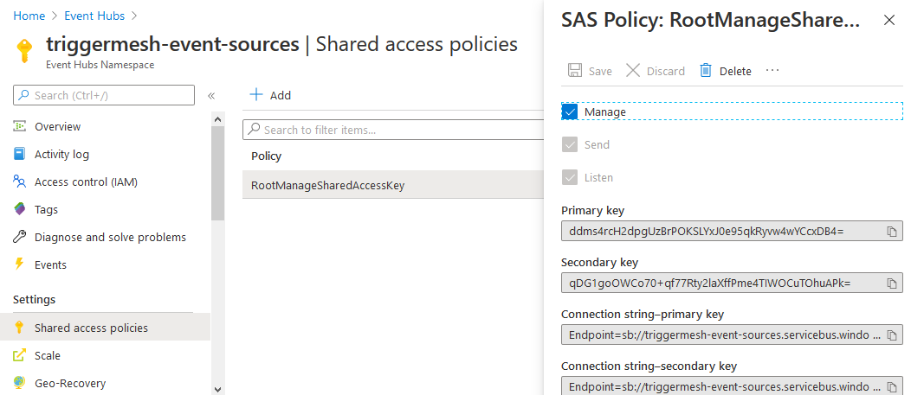

## Deploying an Instance of the Source

Open the Bridge creation screen and add a source of type `Azure Activity Logs`.

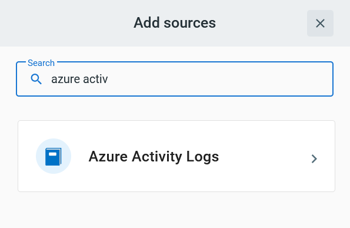

In the Source creation form, give a name to the event source and add the following information:

!!! note
    The ID of the Azure subscription which Activity Logs are to be subscribed to is inferred from the **Event Hub ID**
    parameter below. Therefore, the form does not require providing a subscription ID explicitly.

- [Secret][sp-create]: Service Principal authentication credentials, as described in the previous sections.
- [Event Hub ID][eventhubs-create]: Resource ID of either
    - an Event Hubs _namespace_ (Event Hub managed by Azure, defaults to `insights-activity-logs`)
    - an Event Hubs _instance_ (Event Hub managed by the user)
- [SAS Policy][sas-policy]: _(optional)_ Name of a SAS policy with Manage permissions on the Event Hubs namespace
  referenced in the **Event Hub ID** field. Uses Azure's default "RootManageSharedAccessKey" policy if not provided.
- [Log categories][log-categories]: _(optional)_ Categories of Activity Logs to collect. All available categories are
  selected when the list of categories is left empty.

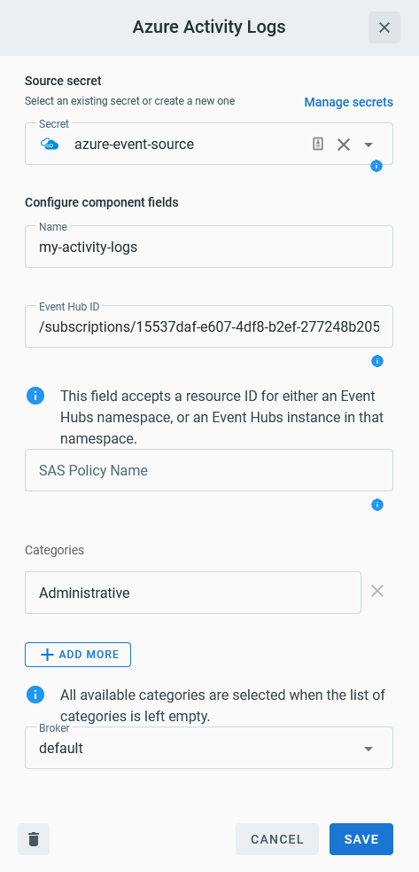

After clicking the `Save` button, you will be taken back to the Bridge editor. Proceed to adding the remaining
components to the Bridge, then submit it.

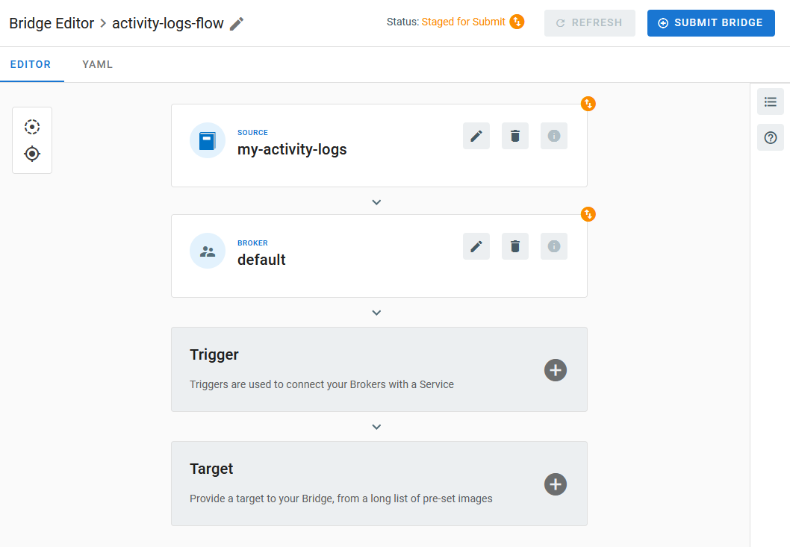

A ready status on the main _Bridges_ page indicates that the [Diagnostic Settings][diag-settings] were successfully
created and that the event source is ready to route events from Event Hubs.

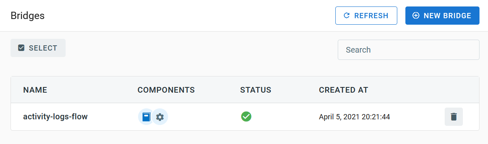

After creating a Bridge with the Azure Activity Logs event source, navigate back to the Event Hubs screen in the Azure
Portal. You should see a message count above 0 within the namespace, providing that activity logs are being generated
within the Azure Subscription.

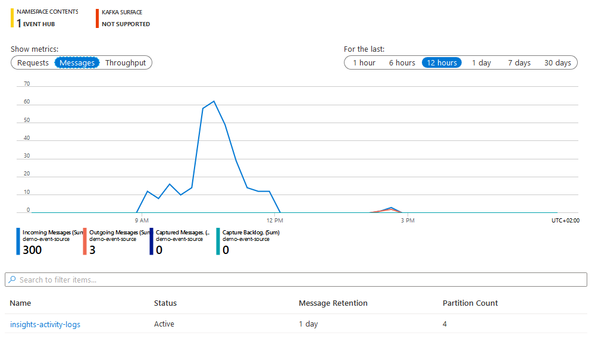

## Event Types

The Azure Activity Logs event source emits events of the following type:

- `com.microsoft.azure.monitor.activity-log`

[activity-logs]: https://docs.microsoft.com/en-us/azure/azure-monitor/platform/activity-log
[diag-settings]: https://docs.microsoft.com/en-us/azure/azure-monitor/platform/diagnostic-settings

[sp]: https://docs.microsoft.com/en-us/azure/active-directory/develop/app-objects-and-service-principals
[sp-create]: https://docs.microsoft.com/en-us/azure/active-directory/develop/howto-create-service-principal-portal

[eventhubs]: https://docs.microsoft.com/en-us/azure/event-hubs/
[eventhubs-create]: https://docs.microsoft.com/en-us/azure/event-hubs/event-hubs-create

[azure-cli]: https://docs.microsoft.com/en-us/cli/azure
[sas]: https://docs.microsoft.com/en-us/azure/storage/common/storage-sas-overview

[sas-policy]: https://docs.microsoft.com/en-us/azure/event-hubs/authorize-access-shared-access-signature
[log-categories]: https://docs.microsoft.com/en-us/azure/azure-monitor/platform/activity-log-schema#categories
