# Event Source for Azure Blob Storage

This event source subscribes to blob events from an [Azure Storage Account][storage-acc] through an Event Grid
subscription. Events are consumed from a dedicated [Event Hubs instance][eventhubs], which is used as event destination
in this setup.

## Prerequisite(s)

- Storage Account
- Service Principal
- Event Hubs Namespace
- Event Hubs Instance _(optional)_

### Storage Account

If you didn't already do so, create a [Storage Account][storage-acc] of one of the following supported types:
General-purpose V2, BlockBlobStorage or BlobStorage. Take note of its resource ID, it is a required input to be able to
run an instance of the Azure Blob Storage event source.

A resource ID for a Storage Account has the following format:

```
/subscriptions/{subscriptionId}/resourceGroups/{resourceGroupName}/providers/Microsoft.Storage/storageAccounts/{storageAccountName}
```

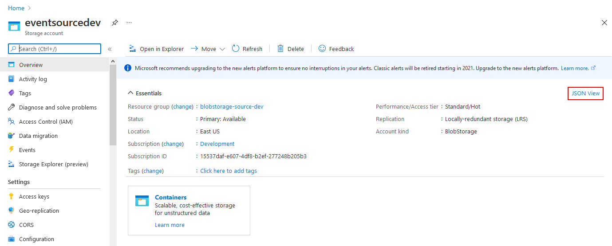
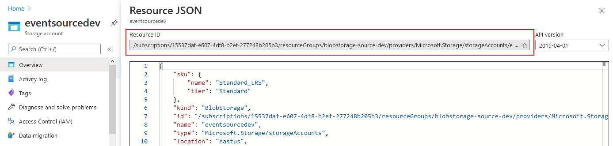

Resource IDs can also be obtained using the [Azure CLI][azure-cli] (`az`). The following command line uses values from
the screenshots above:

```console
$ az storage account show --resource-group blobstorage-source-dev --name eventsourcedev
{
  "id": "/subscriptions/15537daf-e607-4df8-b2ef-277248b205b3/resourceGroups/blobstorage-source-dev/providers/Microsoft.Storage/storageAccounts/eventsourcedev",
  "resourceGroup": "blobstorage-source-dev",
  "type": "Microsoft.Storage/storageAccounts",
  "kind": "BlobStorage",
  "name": "eventsourcedev",
  "location": "eastus",
  "provisioningState": "Succeeded",
  ...
}
```

### Service Principal

A [Service Principal][sp] is required in order to authenticate the event source against the Azure tenant that has
authority over the Azure Subscription to monitor. You can create a Service Principal by following the instructions at
[How to: Use the portal to create an Azure AD application and service principal that can access resources][sp-create].

The section called _Assign a role to the application_ describes how to assign permissions to the Service Principal. Make
sure you select a role which has at least the following permissions:

- `Microsoft.EventGrid/eventSubscriptions/read`
- `Microsoft.EventGrid/eventSubscriptions/write`
- `Microsoft.EventGrid/eventSubscriptions/delete`
- `Microsoft.EventHub/namespaces/eventhubs/write`

The following set of permissions is also required if you decide to delegate the management of the Event Hub to the event
source. In case you prefer to use your own Event Hub, these can be safely be omitted. More details on that topic are
provided in the [Event Hubs Instance](#event-hubs-instance-optional) section below.

- `Microsoft.EventHub/namespaces/eventhubs/read` _(optional)_
- `Microsoft.EventHub/namespaces/eventhubs/delete` _(optional)_

Additionally, assign the [built-in role][builtin-roles] `Azure Event Hubs Data Receiver` to the Service Principal to
allow it to receive events from an Event Hubs instance.

In the example below, we create a custom IAM role that is dedicated to the TriggerMesh event source for Azure Blob
Storage:

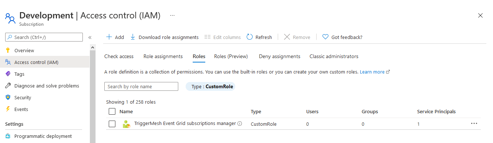
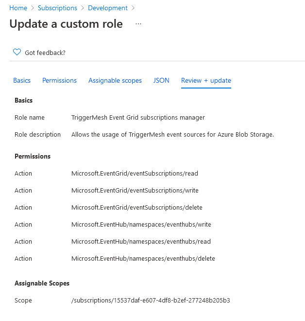

The corresponding role JSON is given as a reference which you can replicate to create a similar custom IAM role:

```json
{
    "properties": {
        "roleName": "TriggerMesh Event Grid subscriptions manager",
        "description": "Allows the usage of TriggerMesh event sources for Azure Blob Storage.",
        "assignableScopes": [
            "/subscriptions/15537daf-e607-4df8-b2ef-277248b205b3"
        ],
        "permissions": [
            {
                "actions": [
                    "Microsoft.EventGrid/eventSubscriptions/read",
                    "Microsoft.EventGrid/eventSubscriptions/write",
                    "Microsoft.EventGrid/eventSubscriptions/delete",
                    "Microsoft.EventHub/namespaces/eventhubs/read",
                    "Microsoft.EventHub/namespaces/eventhubs/write",
                    "Microsoft.EventHub/namespaces/eventhubs/delete"
                ],
                "notActions": [],
                "dataActions": [],
                "notDataActions": []
            }
        ]
    }
}
```

After the Service Principal is created and assigned suitable roles, take note of the following information:

- **Tenant ID** and **Client ID** (see _Get tenant and app ID values for signing in_)
- **Client secret** (see _Create a new application secret_)

### Event Hubs Namespace

Follow the instructions at [Quickstart: Create an Event Hub using Azure portal][eventhubs-create], and create a new
Event Hubs namespace. This namespace will contain an Event Hubs instance which will be configured by the event source as
the destination of events originating from the Azure Storage Account.

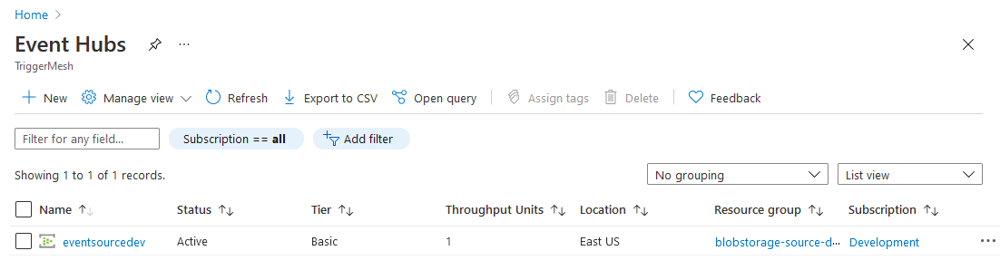

### Event Hubs Instance _(optional)_

This section can be skipped if you would like to let the event source manage its own Event Hub. In this case, please
ensure you granted all necessary permissions to the Service Principal in the previous section.

If, however, you prefer to provide your own Event Hub for that purpose, follow the instructions at [Quickstart: Create
an Event Hub using Azure portal][eventhubs-create] to create an Event Hubs instance. Take note of its resource ID, it is
a required input to be able to run an instance of the Azure Blob Storage event source.

A resource ID for an Event Hub has the following format:

```
/subscriptions/{subscriptionId}/resourceGroups/{resourceGroupName}/providers/Microsoft.EventHub/namespaces/{namespaceName}/eventHubs/{eventHubName}
```

!!! note
    The resource ID of the corresponding Event Hubs namespace is obtained by simply omitting the
    `/eventHubs/{eventHubName}` part of the Event Hub's resource ID.

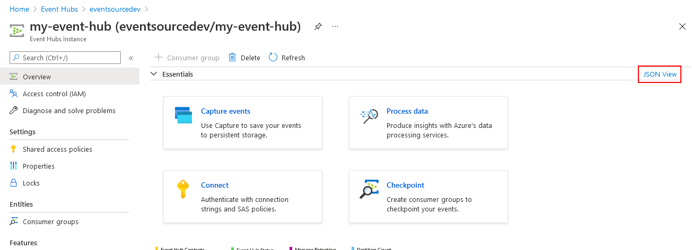
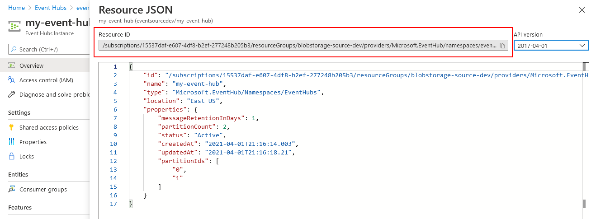

Resource IDs can also be obtained using the [Azure CLI][azure-cli] (`az`). The following command line uses values from
the screenshots above:

```console
$ az eventhubs eventhub show --resource-group blobstorage-source-dev --namespace-name eventsourcedev --name my-event-hub
{
  "id": "/subscriptions/15537daf-e607-4df8-b2ef-277248b205b3/resourceGroups/blobstorage-source-dev/providers/Microsoft.EventHub/namespaces/eventsourcedev/eventhubs/my-event-hub",
  "resourceGroup": "blobstorage-source-dev",
  "type": "Microsoft.EventHub/Namespaces/EventHubs",
  "name": "my-event-hub",
  "location": "East US",
  "status": "Active",
  ...
}
```

## Deploying an Instance of the Source

Open the Bridge creation screen and add a source of type `Azure Blob Storage`.

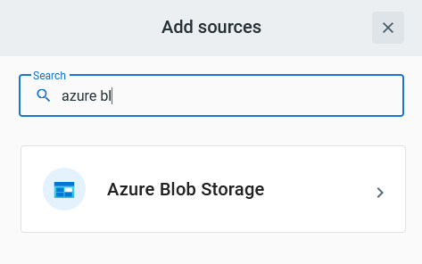

In the Source creation form, give a name to the event source and add the following information:

- [Secret][sp-create]: Service Principal authentication credentials, as described in the previous sections.
- [Storage Account ID][storage-acc]: Resource ID of the Storage Account.
- [Event Hub ID][eventhubs-create]: Resource ID of either
    - an Event Hubs _namespace_ (Event Hub managed by the event source)
    - an Event Hubs _instance_ (Event Hub managed by the user)
- [Event types][event-types]: _(optional)_ List of event types to subscribe to. `BlobCreated` and `BlobDeleted` are
  enabled by default when no item is set.

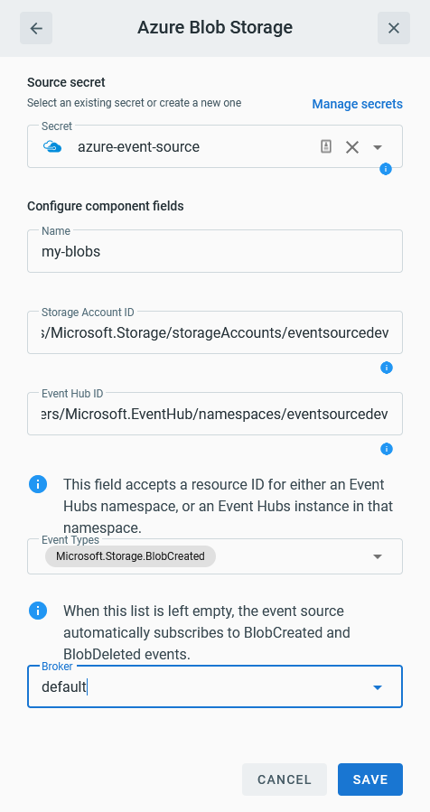

After clicking the `Save` button, you will be taken back to the Bridge editor. Proceed to adding the remaining
components to the Bridge, then submit it.

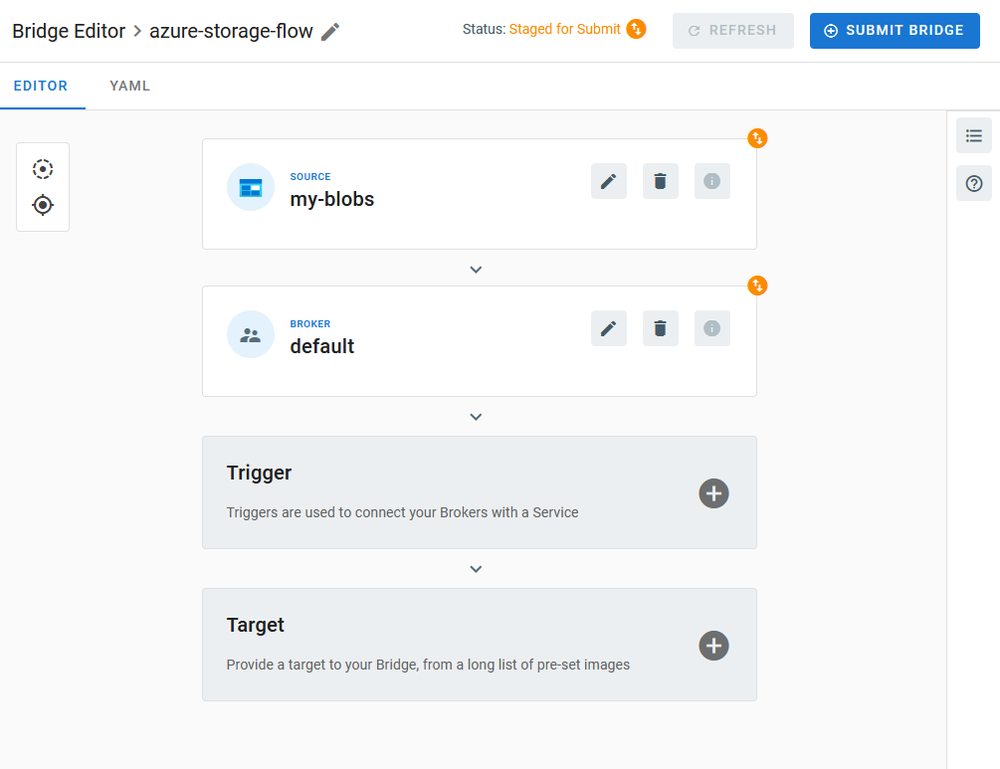

A ready status on the main _Bridges_ page indicates that the event subscription was successfully created in the
configured Storage Account, and that the event source is ready to consume events from Event Hubs.

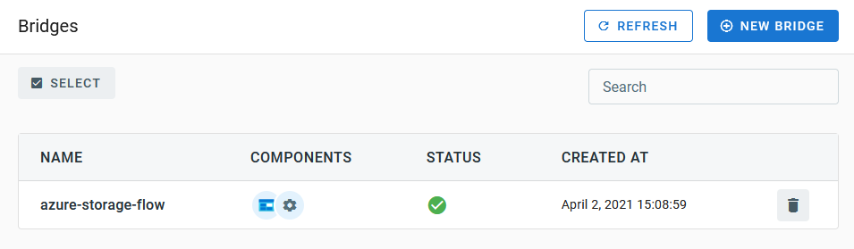

This can be confirmed by navigating back to the Azure Portal and ensuring that:

- The Storage Account contains a new Event Subscription targeting Event Hubs.
- The Resource Group contains an Event Grid System Topic with an Event Subscription matching the one from the Storage
  Account.

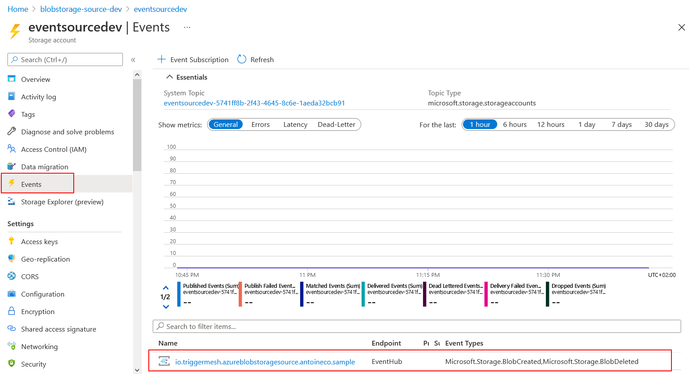
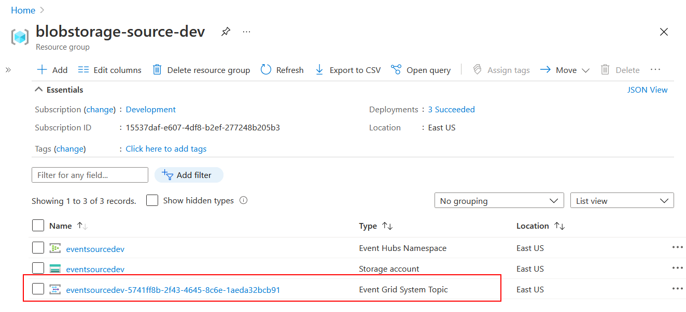

## Event Types

The TriggerMesh event source for Azure Blob Storage emits events of the following types:

- `Microsoft.Storage.BlobCreated`
- `Microsoft.Storage.BlobDeleted`
- `Microsoft.Storage.BlobRenamed`
- `Microsoft.Storage.DirectoryCreated`
- `Microsoft.Storage.DirectoryDeleted`
- `Microsoft.Storage.DirectoryRenamed`
- `Microsoft.Storage.BlobTierChanged`
- `Microsoft.Storage.AsyncOperationInitiated`
- `Microsoft.Storage.BlobInventoryPolicyCompleted`

[storage-acc]: https://docs.microsoft.com/en-us/azure/storage/common/storage-account-overview

[sp]: https://docs.microsoft.com/en-us/azure/active-directory/develop/app-objects-and-service-principals
[sp-create]: https://docs.microsoft.com/en-us/azure/active-directory/develop/howto-create-service-principal-portal
[builtin-roles]: https://docs.microsoft.com/en-us/azure/role-based-access-control/built-in-roles

[eventhubs]: https://docs.microsoft.com/en-us/azure/event-hubs/
[eventhubs-create]: https://docs.microsoft.com/en-us/azure/event-hubs/event-hubs-create

[azure-cli]: https://docs.microsoft.com/en-us/cli/azure

[event-types]: https://docs.microsoft.com/en-us/azure/event-grid/event-schema-blob-storage
