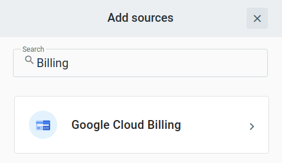
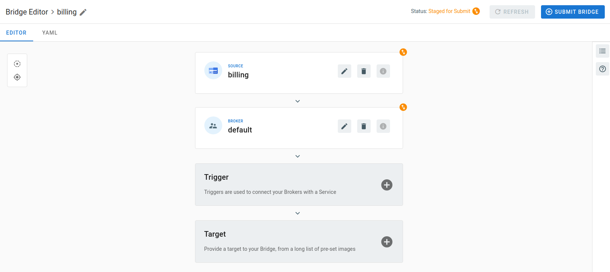

# Event Source for Google Cloud Billing

This event source receives messages from a [Google Cloud Billing][gc-billing] Budget by subscribing
to a [Google Cloud Pub/Sub][gc-billing-events] topic.

### Service Account

A Service Account is required to authenticate the event source and allow it to interact with Google
Cloud Billing budget.

The service account must be granted an IAM Role with at least the following permissions:

- `billing.budgets.get`
- `billing.budgets.update`

The following set of permissions is also required because this source delegates the management of the Pub/Sub subscription to the Pub/Sub Source.

- `pubsub.subscriptions.create`
- `pubsub.subscriptions.delete`

The predefined `roles/billing.costsManager` and `roles/pubsub.editor` roles are an example of roles that are suitable for use with the TriggerMesh event
source for Google Cloud Billing.

Create a key for this service account and save it. This key must be in JSON format. It is required to be
able to run an instance of the Google Cloud Billing event source.

### Deploying an Instance of the Source

#### Prerequisite(s)

- Billing Account ID: The identifier for the Cloud Billing account owning the budget. For example, 01D4EE-079462-DFD6EC.
- Budget ID: The identifier for the Cloud Billing budget. You can locate the budget's ID in your budget under Manage notifications.
             The ID is displayed after you select Connect a Pub/Sub topic to this budget. For example, de72f49d-779b-4945-a127-4d6ce8def0bb.

Open the Bridge creationg screen and add a source of type Google Cloud Billing.

In the Source creation form, give a name to the event source and add the required parameters:

After clicking the Save button, you will be taken back to the Bridge editor. Proceed to adding the remaining components to the Bridge, then submit it.

A ready status on the main Bridges page indicates that the event source is ready to consume messages from the Billing budget configured.

### Event Types
The TriggerMesh event source for Google Cloud Billing emits events of the following type:

- com.google.cloud.billing.message

[gc-billing]: https://cloud.google.com/billing/docs
[gc-billing-events]: https://cloud.google.com/billing/docs/how-to/budgets-programmatic-notifications

### Known Issues

This event source has a bug at the deletion time because a problem with Google Cloud Billing API.
The Google Cloud Billing Budget Notification field will continue be enabled after the deletion,
but the notification will be disabled because the Google Pub/Sub Topic will be deleted.
