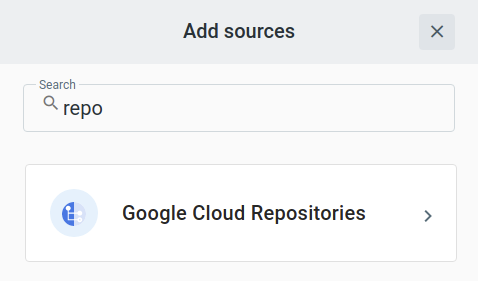
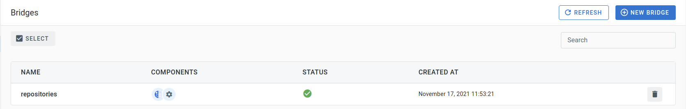

# Event Source for Google Cloud Repositories

This event source receives messages from a [Google Cloud Repositories][gc-source-repositories]
over a [Google Cloud Pub/Sub][gc-source-repositories-events] topic.

### Service Account

A Service Account is required to authenticate the event source and allow it to interact with Google
Cloud Repositories.

The service account must be granted an IAM Role with at least the following permissions:

- `source.repos.updateRepoConfig`
- `iam.serviceAccounts.actAs`

The following set of permissions is also required to allow this source to manage the Pub/Sub topic and subscription:

- `pubsub.subscriptions.create`
- `pubsub.subscriptions.delete`

The predefined `roles/source.admin`, `roles/iam.serviceAccountUser` and `roles/pubsub.editor` roles are an example of roles that are suitable for use with the TriggerMesh event
source for Google Cloud Repositories.

Create a key for this service account and save it. This key must be in JSON format. It is required to be
able to run an instance of the Google Cloud Repositories event source.

## Prerequisite(s)

- Repository
- Pub/Sub Topic _(optional)_

### Repository

Full resource name of the Repository. For example, projects/my-project/repos/my-repo.

### Pub/Sub Topic _(optional)_
Full resource name of the Pub/Sub topic where change notifications originating from the
configured repo are sent to. If not supplied, a topic is created on behalf of the user, in the
GCP project referenced by the 'project' attribute. The expected format is described at
https://cloud.google.com/pubsub/docs/admin#resource_names

## Deploying an Instance of the Source

Open the Bridge creationg screen and add a source of type Google Cloud Repositories.

In the Source creation form, give a name to the event source and add the required parameters:

After clicking the Save button, you will be taken back to the Bridge editor. Proceed to adding the remaining components to the Bridge, then submit it.

A ready status on the main Bridges page indicates that the event source is ready to consume messages from the Repository configured.

## Event Types

The TriggerMesh event source for Google Cloud Repositories emits events of the following type:

- `com.google.cloud.repositories.notification`

[gc-source-repositories]: https://cloud.google.com/source-repositories/docs
[gc-source-repositories-events]: https://cloud.google.com/source-repositories/docs/configuring-notifications
