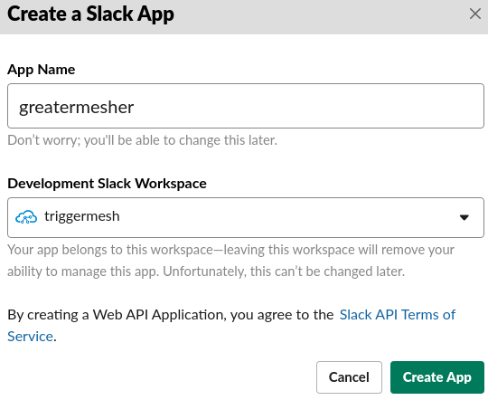
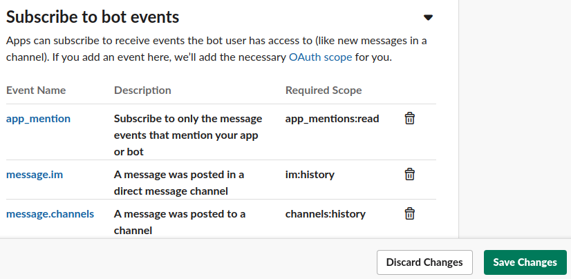
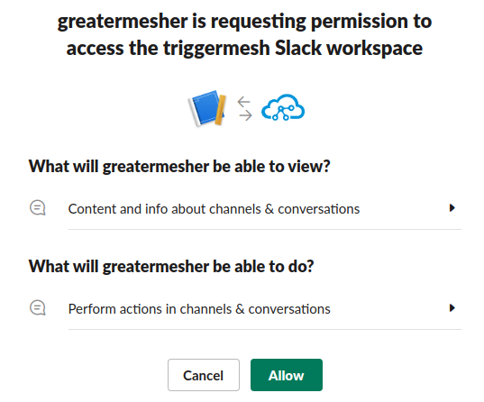
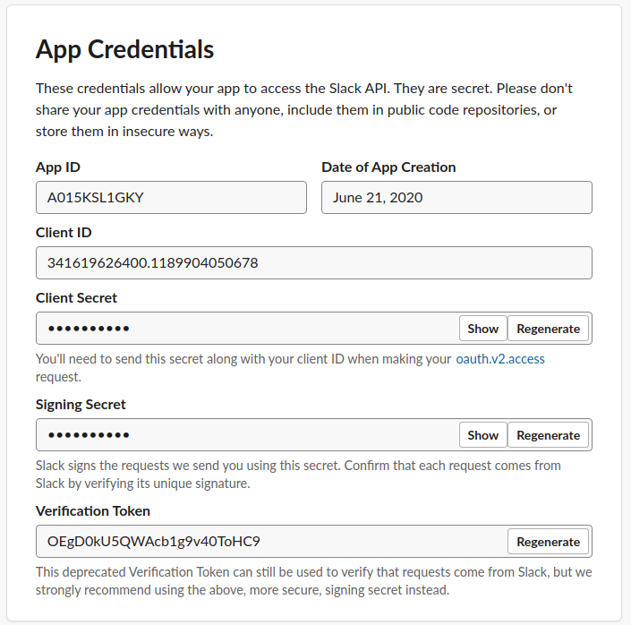
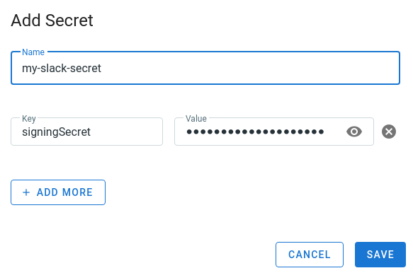

# Event Source for Slack

This event source uses the [Slack Events API][slack-events-api] through a [bot user][slack-bot-user] to ingest events into Triggermesh.

## Prerequisite(s)

- A Slack user that can manage applications is required to configure the source.

## Create the Slack Source Integration

Deploy the Slack source in 3 steps:

1. Deploy the Slack source, retrieve exposed endpoint at Triggermesh.
1. Configure Slack App to send events to the Slack Source endpoint.
1. (optional) Modify the Slack Source to add Signing Secret and AppID from the configured App.

### Deploy Slack Source

Create an instance of the Slack Source at Triggermesh as part of a Bridge.

- `name` is an internal identifier inside the bridge.
- `broker` where messages should be sent to.

Save the source, fill the rest of the bridge fields and press `Submit Bridge`. The Slack source creates a service, navigate to Functions/Services and copy the URL for the exposed service.

### Configure Slack Events API App

1. Create a new [Slack App][slack-app]



1. From Basic Information, Features and functionality, select `Event Subscriptions`

  

1. Slide the `Enable Events` selector to `on` and write the Slack source exposed URL at the `Request URL` box. A request with a verification challenge will be sent and when the Slack source adapter answer it will be validated and a green check will be shown.

  

1. At the `Subscribe to bot events` section select the bot events that will be sent on behalf of this integration and then press `Save Changes` at the bottom of the page.. Refer to Slack documentation on which ones to use, as a hint the we think these 3 could be useful for different scenarios:

   - `app_mention` will send an event when the App is mentioned.
   - `message.im` will send an event when sending a direct message to the App.
   - `message.channels` an event will be sent for each message at a channel where the App is invited.

  

1. At `Install App` section click on `Install App to Workspace`

  

1. (Optional)Return to the application's `Basic Information` and take note of `App ID` and `Signing Secret`

    

You will now have a working integration. Any Slack action that matches the configured event subscription will be sent to the Slack Source and from there to the sink.

### Secure the Slack Source (optional)

Create a new secret at Triggermesh and add a key named `signingSecret` containing the value retrieved at the previous step.

  

Go back to the bridge and edit the source:

- `Signing secret` set to the created secret.
- `App ID` is also optional and will filter for the App ID in case the endpoint is used for multiple integrations.

## Events

The Slack source creates a cloud event for each Slack event sent on behalf of the integration. Slack events are wrapped in a structure that is used for CloudEvents categorization, while the [wrapped event][wrapped-event] is sent as the payload.

Cloud Event header example:

| CloudEvent  | Description   | Example             |
|---          |---            |---                  |
| type        | fixed value   | `com.slack.events`  |
| source      | Team ID (Slack workspace)   | `TA1J7JEBS`   |
| subject     | Event type   | `message`                    |
| time     | Event wrapper time   | `2020-06-21T09:44:35Z`  |
| id     | Event wrapper ID   | `Ev01656P5WP3`  |

Cloud Event data example:

```json
{
  "blocks": [
    {
      "block_id": "ws9ME",
      "elements": [
        {
          "elements": [
            {
              "text": "waving hello ",
              "type": "text"
            },
            {
              "type": "user",
              "user_id": "U015NKH6R6G"
            }
          ],
          "type": "rich_text_section"
        }
      ],
      "type": "rich_text"
    }
  ],
  "channel": "C01112A09FT",
  "channel_type": "channel",
  "client_msg_id": "9fc2ed3e-c823-4dcf-be6b-4d788ab0beea",
  "event_ts": "1592732675.009400",
  "team": "TA1J7JEBS",
  "text": "waving hello \u003c@U015NKH6R6G\u003e",
  "ts": "1592732675.009400",
  "type": "message",
  "user": "UT8LFLXR8"
}
```

[slack-events-api]: https://api.slack.com/events-api
[slack-bot-user]: https://api.slack.com/bot-users
[wrapped-event]: https://api.slack.com/types/event
