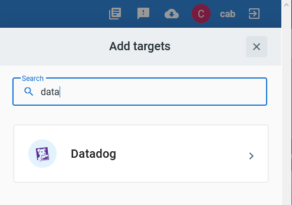
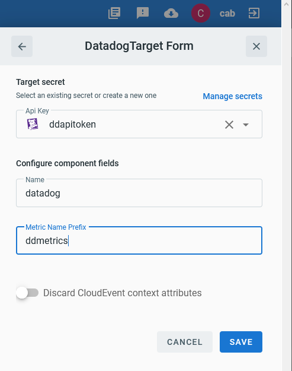
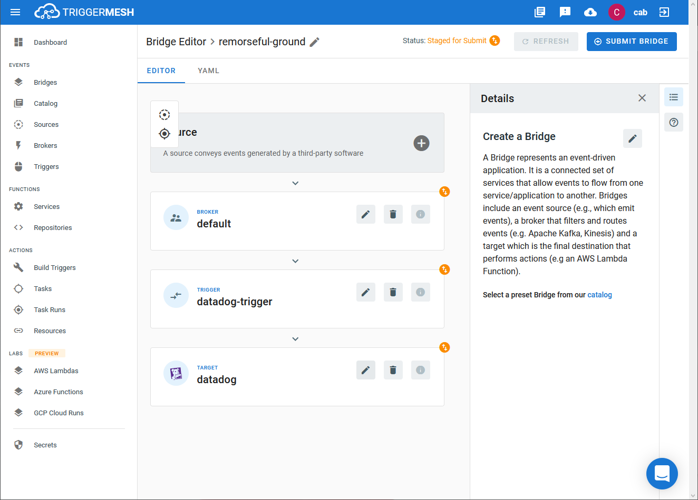
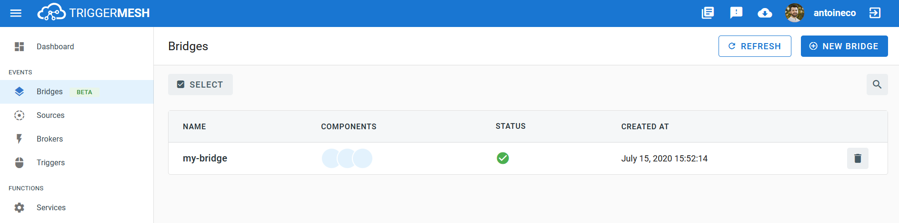

# Event Target for Datadog

This event Target receives [CloudEvents][ce] and sends it to [Datadog][datadog].

## Prerequisite(s)

- Datadog API token

Consult the [Secrets](../guides/secrets.md) guide for more information about
how to add the Datadog API token as a secret.

## Deploying an Instance of the Target

Open the Bridge creation screen and add a Target of type `Datadog`.

In the Target creation form, provide a name for the event Target and add the following information:

- **API Key**: Reference to a [TriggerMesh secret](../guides/secrets.md) containing the Datadog API key as discussed in the [prerequisites](#prerequisites).
- **Metric Name Prefix (_Optional_)**: Prefix to prepend to the metrics being sent.

After clicking the `Save` button, the console will self-navigate to the Bridge editor. Proceed by adding the remaining components to the Bridge.

After submitting the Bridge, and allowing for some configuration time, a green check mark on the main _Bridges_ page indicates that the Bridge with a Datadog event Target was successfully created.

For more information about using Datadog, please refer to the [Datadog documentation][datadog].

## Event Types

A Datadog event Target accepts the following [CloudEvent][ce] types:

### io.triggermesh.datadog.event.post

Events of this type contain event messages to be published to Datadog.

This type expects a [JSON][ce-jsonformat] payload with the following properties:

| Name  |  Type |  Comment | Required |
| ---|---|---|---|
| **text**|string|The body of the event. Limited to 4000 characters. The text supports markdown. |true|
| **title**|string|The event title. Limited to 100 characters. Use msg_title with the Datadog Ruby library.|true|
| **alert_type**|string|If an alert event is enabled, set its type. For example, error, warning, info, success, user_update, recommendation, and snapshot. Allowed enum values: error,warning,info,success,user_update,recommendation,snapshot. | false|
| **date_happened**|int64|POSIX timestamp of the event. Must be sent as an integer (i.e. no quotes). Limited to events no older than 7 days.| false|
| **device_name**|string|A device name.| false|
| **host**|string|Host name to associate with the event. Any tags associated with the host are also applied to this event.| false|
| **id**|int64|Integer ID of the event.| false|
| **priority**|string|The priority of the event. For example, normal or low. Allowed enum values: normal,low. | false|
| **related_event_id**|int64|ID of the parent event. Must be sent as an integer (i.e. no quotes).| false|
| **source_type_name**|string|The type of event being posted. Option examples include nagios, hudson, jenkins, my_apps, chef, puppet, git, bitbucket, etc. A complete list of source attribute values available here.|false|
| **status**|string|A status.|false|
| **tags**|[]string|A list of tags to apply to the event.|false|
| **url**|string|URL of the event.|false|

### io.triggermesh.datadog.metric.submit

Events of this type consist of a singular metric to be published to Datadog.

This type expects a [JSON][ce-jsonformat] payload with the following properties:

| Name | Type | Comment | Required |
|---|---|---|---|
| **host**|string|The name of the host that produced the metric.|false|
| **interval**|int64|If the type of the metric is rate or count, define the corresponding interval.|false|
| **metric**|string|The name of the timeseries.|true|
| **points**|[][]string|Points relating to a metric. All points must be tuples with timestamp and a scalar value (cannot be a string). Timestamps should be in POSIX time in seconds, and cannot be more than ten minutes in the future or more than one hour in the past.|true|
| **tags**|[]string|A list of tags associated with the metric.|false|
| **type**|string|The type of the metric either count, gauge, or rate.|false|

### io.triggermesh.datadog.logs.send

Events of this type consist log data to be published to Datadog.

This type expects a [JSON][ce-jsonformat] payload with the following properties:

| Name | Type | Comment | Required |
|---|---|---|---|
| **ddsource**|string|The integration name associated with your log: the technology from which the log originated. When it matches an integration name, Datadog automatically installs the corresponding parsers and facets.|true|
| **ddtags**|string|Tags associated with your logs.|false|
| **hostname**|string|The name of the originating host of the log.|true|
| **message**|string|The message reserved attribute of your log. By default, Datadog ingests the value of the message attribute as the body of the log entry. That value is then highlighted and displayed in the Logstream, where it is indexed for full text search.|true|
| **service**|string|The name of the application or service generating the log events. It is used to switch from Logs to APM, so make sure you define the same value when you use both products.|false|

[ce]: https://cloudevents.io/
[ce-jsonformat]: https://github.com/cloudevents/spec/blob/v1.0/json-format.md
[datadog]: https://docs.datadoghq.com
