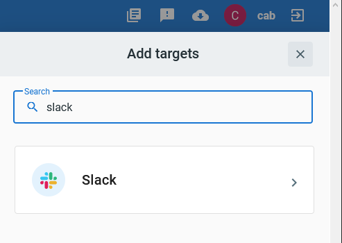
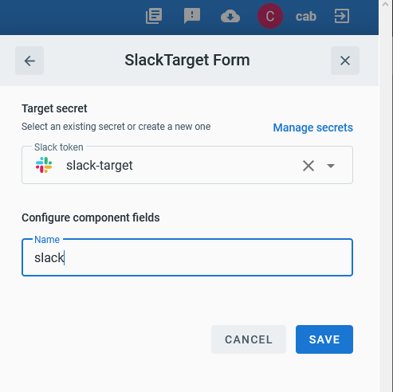
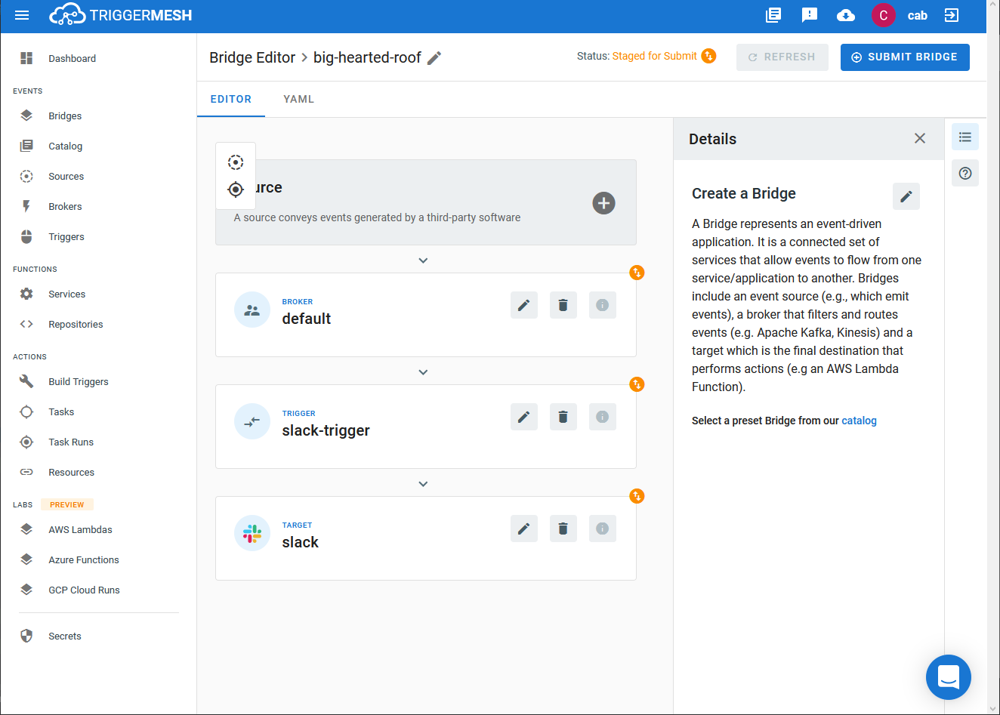
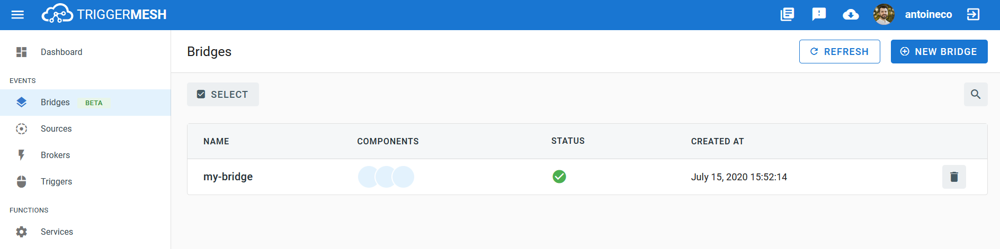

# Event Target for Slack

This event Target receives [CloudEvents][ce] over HTTP and sends them to Slack using the [Slack Web API][slack-web-api].

## Prerequisite(s)

- Slack user that can manage applications
- Pre-existing Slack App
- Slack API token

Consult the [Secrets](../guides/secrets.md) guide for more information about how to add a Slack API token as a secret.

## Configuring Your Slack App
1. Create a new [Slack App][slack-apps].
1. Go to **Basic Information > Add features and functionality** and select the `Permissions` pane.
1. Under **Bot Token Scopes** add `chat:write`.
1. From the **Install App** menu follow steps to deploy to your workspace.
1. Copy the **Bot OAuth Access token**, it should begin with `xoxb-...`

## Deploying an Instance of the Target

From TriggerMesh, open the Bridge creation screen and add a Target of type `Slack`.



In the Target creation form, provide a name for the event Target, and add the following information:

* **Slack Secret**: Reference a [TriggerMesh secret](../guides/secrets.md) containing a Slack API token.



After clicking the `Save` button, the console will self-navigate to the Bridge editor. Proceed by adding the remaining components to the Bridge.



After submitting the Bridge, and allowing for some configuration time, a green check mark on the main _Bridges_ page indicates that the Bridge with the Slack Target was successfully created.



For more information about using the Slack API, please refer to the [Slack API documentation][slack-web-api].

## Event Types

CloudEvents consumed by this Target must be of one of these types:

- `com.slack.webapi.chat.postMessage`
- `com.slack.webapi.chat.scheduleMessage`
- `com.slack.webapi.chat.update`

These types expect a [JSON][ce-jsonformat] payload with the following properties:

- [chat.postMessage][chat.postMessage]
- [chat.scheduleMessage][chat.scheduleMessage]
- [chat.update][chat.update]

### Example

Post message:

```sh
curl -v http://slack-target:8080 \
 -X POST \
 -H "Content-Type: application/json" \
 -H "Ce-Specversion: 1.0" \
 -H "Ce-Type: com.slack.webapi.chat.postMessage" \
 -H "Ce-Source: awesome/instance" \
 -H "Ce-Id: aabbccdd11223344" \
 -d '{"channel":"C01112A09FT", "text": "Hello from TriggerMesh!"}'
```

Schedule message:

```sh
curl -v http://slack-target:8080 \
 -X POST \
 -H "Content-Type: application/json" \
 -H "Ce-Specversion: 1.0" \
 -H "Ce-Type: com.slack.webapi.chat.scheduleMessage" \
 -H "Ce-Source: awesome/instance" \
 -H "Ce-Id: aabbccdd11223344" \
 -d '{"channel":"C01112A09FT", "text": "Hello from scheduled TriggerMesh!", "post_at": 1593430770}'
```

[ce]: https://cloudevents.io/
[slack-web-api]: https://api.slack.com/web
[slack-apps]: https://api.slack.com/apps

[chat.postMessage]: https://api.slack.com/methods/chat.postMessage
[chat.scheduleMessage]: https://api.slack.com/methods/chat.scheduleMessage
[chat.update]:  https://api.slack.com/methods/chat.update
