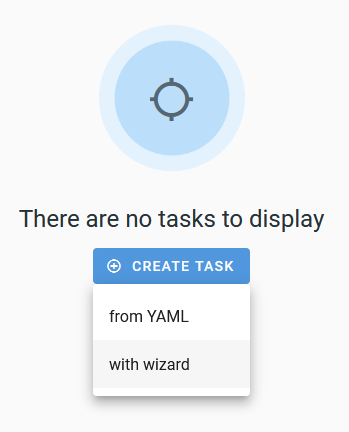
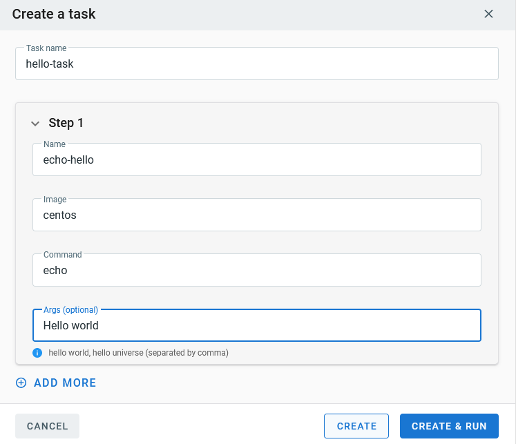
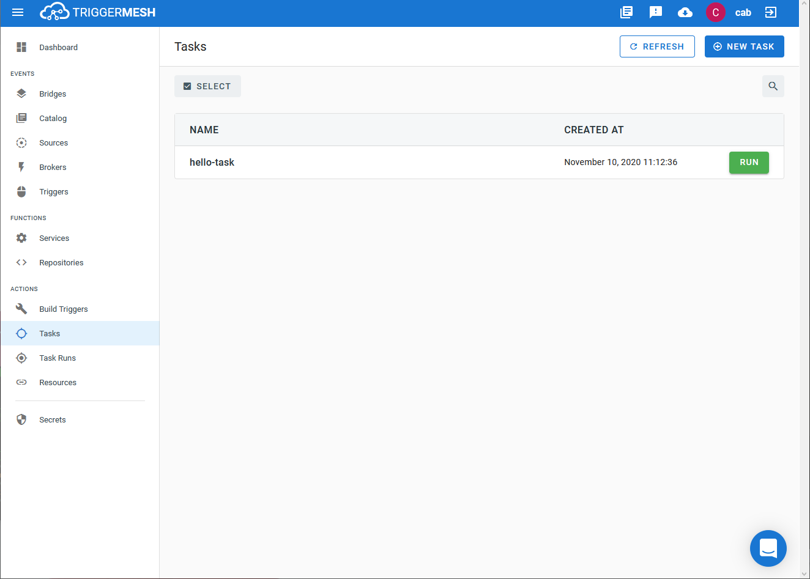

# Event Target for Tekton Pipeline

This event Target receives [CloudEvents][ce] over HTTP and will use it to
create a [Tekton][tekton] `TaskRun` or `PipelineRun` object.

## Prerequisite(s)

- Tekton Task

## Creating a Tekton Task

From TriggerMesh, go to **Tasks**, and click the `Create Task` button. A
menu will drop down providing the option to create the task `from YAML` or `with wizard`. Select `with wizard`.

Give the task a name that will be referenced later on by the Target, and click
the arrow to expose the task details. Provide a name for `Step 1`, specify 
the build image to use as well as the command and arguments to run.  Click
`ADD MORE` if more steps will be required.  When finished, click `CREATE`.

The task should appear in the **Tasks** page.  Now to create the Target.

Refer to the [Tekton documentation][tekton] for more information about how to create
tasks and pipelines.

## Deploying an Instance of the Target

From TriggerMesh, open the Bridge creation screen and add a Target of type `Tekton`.

In the Target creation form, provide a name for the event Target, and click `Save`.

After clicking the `Save` button, the console will self-navigate to the Bridge editor. Proceed by adding the remaining components to the Bridge.

After submitting the Bridge, and allowing for some configuration time, a green check mark on the main _Bridges_ page indicates that the Bridge with the Tekton Target was successfully created.

## Event Types

### io.triggermesh.targets.tekton

Events of this type intend to create a new Tekton `PipelineRun` or `TaskRun` object.

This type expects a [JSON][ce-jsonformat] payload with the following properties:

| Name  |  Type |  Comment |
|---|---|---|
| **buildType**| string  |  The run object type consisting of `task` or `pipeline` |
| **name** |  string | The Tekton `task` or `pipeline` object to invoke  |
| **params**| map[string]string | Dictionary mapping of parameters to pass to the Tekton task or pipeline|

No response events are created with this Target type.

---
**NOTE:**
`TaskRun` and `PipelineRun` objects nor their associated pods are deleted after execution.
It is up to the user to perform the clean-up.

---

[ce]: https://cloudevents.io/
[ce-jsonformat]: https://github.com/cloudevents/spec/blob/v1.0/json-format.md
[tekton]: https://tekton.dev/
