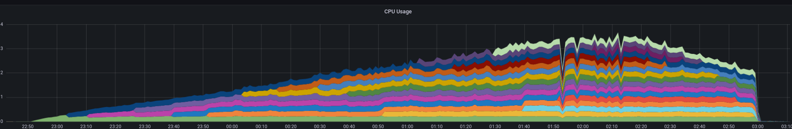

# Component Scaling

TriggerMesh Components that are able to spin up replicas without leading to missing or duplicated events will scale under heavy load.

In contrast those components whose external system imposes a model where multiple instances of a client are not allowed or require distributed coordination won't scale.

As a general rule scaling per component type defaults to:

Type | Scalable | Exceptions
------------ | ------------- | -------------
Source | No | SlackSource, TwilioSource, WebhookSource and ZendeskSource
Target | Yes |
Transformation | Yes |
Routing | Yes |

!!! tip "Tip"
    When a component that does not support scaling reaches its maximum capacity it is usually a good practice to partition the external service/data and configure multiple components.

## Scaling behavior

Scaling components are configured with the following parameters:

- Scaler metrics: requests per second (RPS).
- Minimum scale: 0, allows scale to zero.
- Maximum scale: 30 instances.
- Scale down delay: 5m, an scaled up instance will wait for 5m before being considered for retiring.
- Requests per second: 300.
- Time window: 1m, the window to aggregate metrics and take actions.

As an example a load test for a single TriggerMesh component looks like this:

!!! tip "Scale to 0"
    Components that are able to scale are also able to scale to zero, saving resources when there is no load. A scaled to zero component can still receive data, that will be buffered by an activator agent while the backend is created (which usually takes ~ 1 second).

    A component that has received no data for the last minute is a candidate for downscaling.

!!! example "Example"
    

    - Ramp up: the load for the first half of the test, the autoscaler creates replicas of the component based on demand.
    - Stabilizing requests: there are some adjustments but the number of replicas is kept around 16 in the example.
    - Ramp down: replicas start to be removed as long as they are not needed.
    - Zero load: replicas are kept for 5 minutes receiving no requests, then they are removed.

## Configuration

When installing TriggerMesh scaling parameters can be customized to configure:

- Scale to zero enabling.
- Scaling metrics (requests, concurrency, resources).
- Metrics threshold.
- Scaling rate.
- Time windows.

!!! tip "Tip"
    Depending on the scaling metrics used a range of further options might be available.
