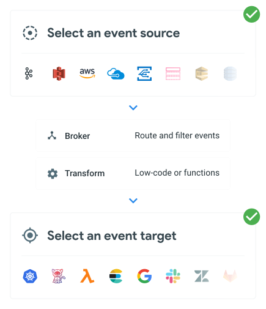

# TriggerMesh Concepts

TriggerMesh lets you capture events with Sources, route and transform them using Transformations, Brokers, and Triggers, and deliver them to consumers using Targets. TriggerMesh provides a unified eventing experience meaning all events can be centralised to a single Broker with a common format called CloudEvents.



## Events

In TriggerMesh, an Event is described using a common format that defines the structure and metadata description of events.

The format is based on a subset of the [CloudEvents specification](https://github.com/cloudevents/spec/blob/main/cloudevents/spec.md). TriggerMesh supports the JSON format of CloudEvents and uses the [HTTP protocol binding](https://github.com/cloudevents/spec/blob/main/cloudevents/bindings/http-protocol-binding.md) to transport CloudEvents over HTTP.

A TriggerMesh Event is composed of the following elements:

* `id`: Identifies the event
* `specversion`: The version of the CloudEvents specification which the event uses. This enables the interpretation of the context
* `type`: This attribute contains a value describing the type of event related to the originating occurrence. Often this attribute is used for routing, observability, policy enforcement, etc.
* (optional) `dataschema`: Identifies the schema that data adheres to. When using the Registry, this can be an explicit reference to a schema version in the Registry.
* (optional) `subject`: This describes the subject of the event, for example a filename if the event is “S3 object created”
* (optional) `time`: timestamp of when the occurrence happened
* (optional) `datacontenttype`: Content type of data value. For now TriggerMesh only supports JSON for Transformations and Advanced filters.

Events may include any number of additional attributes with distinct names, known as extension attributes.

The `data` attribute carries the event payload encoded into a media format specified by datacontenttype (e.g. application/json). It and adheres to the dataschema format if present.

Example event:

```json
{
  "specversion" : "1.0",
  "type" : "com.aws.s3.objectcreated",
  "source" : "aws.s3",
  "subject" : "mynewfile.jpg",
  "id" : "A234-1234-1234",
  "time" : "2018-04-05T17:31:00Z",
  "extension1" : "value",
  "datacontenttype" : "application/json",
  "dataschema": "http://schemas.myorg.com/schemagroups/awsS3/schemas/com.aws.s3.objectcreated@aws.s3/versions/2",
  "data" : "{\"hello\":\"world\"}"
}
```

## Sources

Sources are the origin of data and events. These may be on-premises or cloud-based. Examples include databases, message queues, logs, and events from applications or services.

All sources are listed and documented in the [sources documentation](../source/awscloudwatch.md) and in the [API Reference](../reference/sources.md).

## Brokers, Triggers and Filters

TriggerMesh provides a Broker that acts as an intermediary between between event producers and consumers, decoupling them from each other and providing delivery guarantees to ensure that no events are lost along the way.

Brokers behave like an event bus, meaning all events are buffered together as a group. Triggers are used to determine which events go to which targets. A Trigger is attached to a Broker, and contains a Filter which specifies which events should cause the Trigger to fire. These filters are based on event metadata or payload contents. If a Trigger fires, it sends the event to the Target defined in the Trigger.

There are two flavours of the TriggerMesh Broker: MemoryBroker and RedisBroker. The former has no persistence, whereas the later is able to recover from failure scenarios without losing events.

## Targets

Targets are the destination for the processed events or data. Examples include databases, message queues, monitoring systems, and cloud services.

In some cases, a Target may in turn reply with another event (acknowledgment, error, ...). These response events can be handled with additional Triggers. Typically, the event `type`of a response event is the same as the original event type with `.response` appended to the end.

All targets are listed and documented in the [targets documentation](../targets/alibabaoss.md) and in the [API Reference](../reference/targets.md)

## Transformations

Transformations are a set of modifications to incoming events. Examples include annotating incoming events with timestamps, dropping fields, or rearranging data to fit an expected format.

TriggerMesh provides a few ways to transform events:

* using the low-code TriggerMesh transformation language called Bumblebee
* using functions written Python, NodeJS, and Ruby
