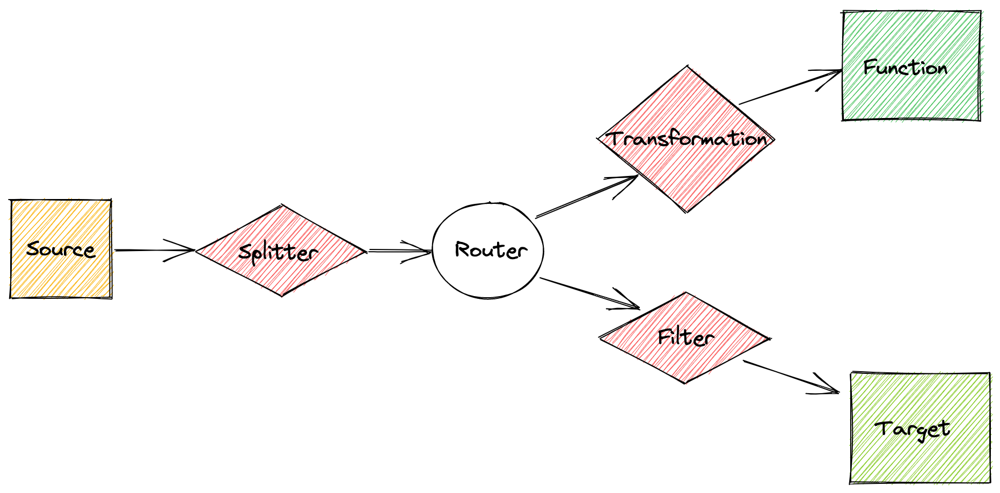

# TriggerMesh Concepts

The TriggerMesh Cloud Native Integration Platform allows you to integrate applications by defining sources and targets which are seen as the start and the end of what we call "Bridges". While data and events flow through the Bridge, they are defined using an API object and may undergo filtering, splitting, and/or transformations.

|  |
|:--:|
| TriggerMesh Bridges Concepts |

## Events


## Sources

Sources are the origin of data and events. These may be on-premises or cloud-based. Examples include databases, message queues, logs, and events from applications or services.

Sources are the origin of data and events for ingestion into TriggerMesh. An event source often acts as a gateway between an external service and the Bridge. Sources may be irregular events, periodic data updates, batch processes, or even continuous event streams.

All sources available can be found by listing the CRDs like so:

```console
$ kubectl get crd -o jsonpath='{.items[?(@.spec.group=="sources.triggermesh.io")].spec.names.kind}'
AWSCloudWatchLogsSource AWSCloudWatchSource AWSCodeCommitSource AWSCognitoIdentitySource AWSCognitoUserPoolSource AWSDynamoDBSource AWSKinesisSource AWSPerformanceInsightsSource AWSS3Source AWSSNSSource AWSSQSSource AzureActivityLogsSource AzureBlobStorageSource ...
```

All TriggerMesh-provided sources are listed and documented in the [API Reference](../reference/sources.md).

There are a number of additional [event sources provided by Knative](https://knative.dev/docs/developer/eventing/sources/).

The specification of each source is available through `kubectl explain`. For example:

```console
kubectl explain googlecloudstoragesource.spec
KIND:     GoogleCloudStorageSource
VERSION:  sources.triggermesh.io/v1alpha1

RESOURCE: spec <Object>

DESCRIPTION:
     Desired state of the event source.

FIELDS:
   bucket	<string> -required-
     Name of the Cloud Storage bucket to receive change notifications from. Must
     meet the naming requirements described at
     https://cloud.google.com/storage/docs/naming-buckets

   eventTypes	<[]string>
     Types of events to receive change notifications for. Accepted values are
     listed at
     https://cloud.google.com/storage/docs/pubsub-notifications#events. All
     types are selected when this attribute is not set.

   pubsub	<Object> -required-
     Attributes related to the configuration of Pub/Sub resources associated
     with the Cloud Storage bucket.

   serviceAccountKey	<Object> -required-
     Service account key used to authenticate the event source and allow it to
     interact with Google Cloud APIs. Only the JSON format is supported.

   sink	<Object> -required-
     The destination of events received via change notifications.
```


## Brokers

## Triggers

## Filters

Filters determine which events to process based on their content. These may be the basis for dropping unwanted events or for creating rules engines for event processing.

## Targets

Targets are the destination for the processed events or data. Examples include databases, message queues, monitoring systems, and cloud services.

A target is an event receiver which performs some processing on the received data. An event target may act as a gateway between the Bridge and an external service.

Although a target may be considered the destination for an event, it may in turn reply with another event (acknowledgment, error, ...) generating further events. These additional events may need to be managed with separate Bridges.

All targets available can be found by listing the CRDs like so

```console
$ kubectl get crd -o jsonpath='{.items[?(@.spec.group=="targets.triggermesh.io")].spec.names.kind}'
AlibabaOSSTarget AWSComprehendTarget AWSDynamoDBTarget AWSEventBridgeTarget AWSKinesisTarget AWSLambdaTarget AWSS3Target AWSSNSTarget AWSSQSTarget ConfluentTarget DatadogTarget ElasticsearchTarget GoogleCloudFirestoreTarget ...
```

All TriggerMesh-provided targets are listed and documented in the [API Reference](../reference/targets.md)

The specification of each target is available through `kubectl explain`. For example:

```console
kubectl explain awslambdatarget.spec
KIND:     AWSLambdaTarget
VERSION:  targets.triggermesh.io/v1alpha1

RESOURCE: spec <Object>

DESCRIPTION:
     Desired state of event target.

FIELDS:
   arn	<string>
     ARN of the Lambda function that will receive events. The expected format is
     documented at
     https://docs.aws.amazon.com/service-authorization/latest/reference/list_awslambda.html

   awsApiKey	<Object>
     API Key to interact with the Amazon Lambda API. For more information about
     AWS security credentials, please refer to the AWS General Reference at
     https://docs.aws.amazon.com/general/latest/gr/aws-security-credentials.html

   awsApiSecret	<Object>
     API Secret to interact with the Amazon Lambda API. For more information
     about AWS security credentials, please refer to the AWS General Reference
     at
     https://docs.aws.amazon.com/general/latest/gr/aws-security-credentials.html

   discardCloudEventContext	<boolean>
     Produce a new cloud event based on the response from the lambda function.
```

## Transformations

Transformations are a set of modifications to incoming events. Examples include annotating incoming events with timestamps, dropping fields, or rearranging data to fit an expected format.

Functions implement custom event flow logic and may act as a source, transformation, or target. Functions support Python, NodeJS, and Ruby runtimes.
