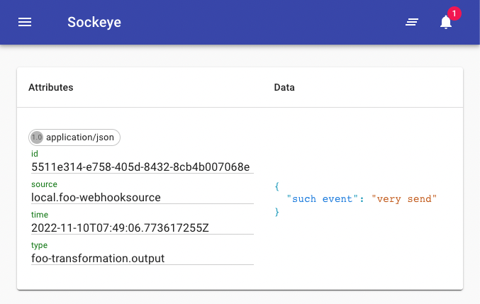
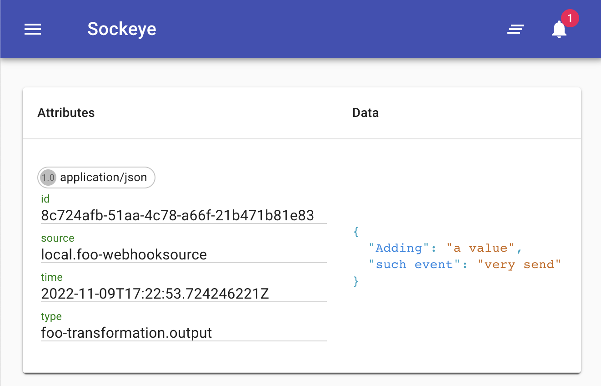

# Quickstart

This quickstart will take you through the fastest and easiest way to start using Events with TriggerMesh. Start with the most basic hello world example, and expand from there. We hope you have fun :material-party-popper:.

## Hello world

**:material-numeric-1-box: Install `tmctl`**

`tmctl` is the TriggerMesh command line interface (CLI) that makes it easy to work with events from the safety of your office (or couch).

On Mac, try:

``` console
brew install triggermesh.com/brew/tmctl
```

For Linux:

```console
TODO
```

and last but not least Windows:

```console
TODO
```

**:material-numeric-2-box: Create a Broker**

Your Broker will reliably route and deliver events from producers to consumers:

```console
tmctl create broker foo
```

**:material-numeric-3-box: Send it an event**

Choose something nice to send to your Broker.

```console
tmctl send-event {"hello":"world"}
```

**:material-numeric-4-box: Watch events sent to the Broker**

Open a new terminal and type:

```console
tmctl watch
```

From the original terminal, send another event:

``` console
tmctl send-event {"hello":"world"}
```

You should see the event received by your Broker, something like this:

``` console
tmctl % tmctl watch
2022/11/08 16:35:33 Watching...
☁️  cloudevents.Event
Context Attributes,
  specversion: 1.0
  type: triggermesh-local-event
  source: triggermesh-cli
  id: 93dbed08-fb66-43d7-811b-2725f0e1d74e
  time: 2022-11-08T15:38:35.507676Z
  datacontenttype: application/json
Data,
  "{hello:world}"

```

You can keep `watch` running as it will come in handy later.

!!! warning "Doesn't work?"
    Copy any output and [PLEASE TELL US NOW](https://github.com/triggermesh/triggermesh/issues/new) :material-bug:.

## Send the Broker an event over HTTP

**:material-numeric-1-box: Create an HTTP endpoint**

HTTP is one of the easiest ways to send events to the Broker from which ever HTTP client you prefer ([Postman](https://www.postman.com/), Curl, [API Tester](https://chrome.google.com/webstore/detail/talend-api-tester-free-ed/aejoelaoggembcahagimdiliamlcdmfm)...). To do this, let's create a Webhook Source:

```console
tmctl create source webhook --eventType contact.created
```

We're declaring that events of type `contact.created` will be sent to this endpoint. This event type will be part of the event metadata as it flows through TriggerMesh, and can be used later on for routing.

**:material-numeric-2-box: Obtain the URL**

Find the Webhook Source URL:

```console
tmctl describe
```

The output should look something like this:

```console
tmctl % tmctl describe

Broker     Status
foo        online(http://localhost:59882)


Source                Kind              EventTypes          Status
foo-webhooksource     webhooksource     contact.created     online(http://localhost:59936)
```

As you can see, `tmctl describe` displays useful info about your current configuration. It lists all the sources, targets, and other components you've defined, and their properties.

Copy the webhooksource URL, in this case `http://localhost:59936` (this will vary depending on your environment). **Do not** confuse this with the Broker's URL.

**:material-numeric-3-box: Send an event over HTTP**

We'll use curl here. Remember to replace the endpoint URL with yours.

```console
curl http://localhost:59936 -d '{"http":"is easy"}' -H 'Content-type: application/json'
```

The event should show up in `tmctl watch`:

```console
2022/11/09 16:17:38 Watching...
☁️  cloudevents.Event
Context Attributes,
  specversion: 1.0
  type: contact.created
  source: local.foo-webhooksource
  id: 8bce0cd7-74a2-443b-b8ef-825473cc5c51
  time: 2022-11-09T15:37:00.435002345Z
  datacontenttype: application/x-www-form-urlencoded
Data,
  {
    "http": "is easy"
  }
```

If you're paying attention, you'll notice that the values of the `type` and `source` attributes of your event have values that should mean something to you.

## Route events from the Broker to an HTTP service

**:material-numeric-1-box: Create a target**

The CloudEvents Target acts as an HTTP client that sends events in their original CloudEvents format which is used by TriggerMesh.

We're going to point to a service called Sockeye that you can use to view the events as they arrive at their destination.  

``` console
tmctl create target cloudevents --endpoint https://sockeye-tu4luqbmqq-uc.a.run.app/ --source foo-webhooksource
```

The `--source` parameter is used here to indicate that all events from the `foo-webhooksource`should be routed to our new target.

**:material-numeric-2-box: Send an event**

Now we can trigger our whole event flow by sending an event to our original Webhook Source, using the same command as before (just changing the payload a bit now):

```console
curl http://localhost:59936 -d '{"such event":"very send"}' -H 'Content-type: application/json'
```

If you open `https://sockeye-tu4luqbmqq-uc.a.run.app/` in your browser, events you send should start showing up there:



If you still have `tmctl watch` running (which you should), you'll also see events there when they hit the Broker, before passing on to Sockeye.

## Transform the event

Lets transform the incoming event before it gets passed to our target service.

**:material-numeric-1-box: Design a transformation**

Using TriggerMesh's Bumbleebee transformation component, we can easily modify an event as it passes through the Broker.

Create a file called `transform.yaml` with the following contents (Alternatively, you can skip the file and enter the transformation inline in `tmctl` later):

``` yaml
data:
- operation: add
  paths:
  - key: Adding
    value: "a value"
```

This simple transformation adds a new key to the event's JSON payload.

**:material-numeric-2-box: Add the Transformation to the Broker**

Let's create a Transformation that will transform the data before it hits the HTTP target:

``` console
tmctl create transformation --from my-configs/transformation.yaml --source foo-webhooksource --target foo-cloudeventstarget
```

**:material-numeric-2-box: Send an event**

Let's send an event to our original Webhook Source, using the same command as before, and watch how it gets transformed:

```console
curl http://localhost:59936 -d '{"such event":"very send"}' -H 'Content-type: application/json'
```

`tmctl watch` will display both the original and transformed event:

``` console
☁️  cloudevents.Event
Context Attributes,
  specversion: 1.0
  type: contact.created
  source: local.foo-webhooksource
  id: 438f2a25-75f1-4896-874e-f69b8e494a94
  time: 2022-11-09T17:21:51.658525262Z
  datacontenttype: application/json
Data,
  {
    "such event": "very send"
  }

☁️  cloudevents.Event
Context Attributes,
  specversion: 1.0
  type: foo-transformation.output
  source: local.foo-webhooksource
  id: 438f2a25-75f1-4896-874e-f69b8e494a94
  time: 2022-11-09T17:21:51.658525262Z
  datacontenttype: application/json
Data,
  {
    "Adding": "a value",
    "such event": "very send"
  }
```

If you open `https://sockeye-tu4luqbmqq-uc.a.run.app/` again, you should only see the transformed event there:



## Next steps

Now that you know what a source, target, and transformation are, you can start adding sources and targets that make sense to you.

:material-aws: **AWS** users:

- try ingesting AWS events by using an [SQS source](../sources/awssqs.md)
- or trigger a Lambda function with the [Lambda target](../targets/awslambda.md)

:material-microsoft-azure: **Azure** users:

- try ingesting Azure events by using the [Azure Event Hubs source](../sources/azureeventhubs.md)
- or sending events to [Azure Sentinel](../targets/azuresentinel.md) for threat analysis

:material-google-cloud: **Google Cloud** users:

- try ingesting Google events using the [Google Pub/Sub Source](../sources/googlecloudpubsub.md)
- or sending events to [Google Cloud Workflows](../targets/googlecloudworkflows.md)

:material-apache-kafka: **Kafka** users:

- you can read and write to kafka easily using our [Kafka Source](../sources/kafka.md) and [Kafka Target](../targets/kafka.md)
