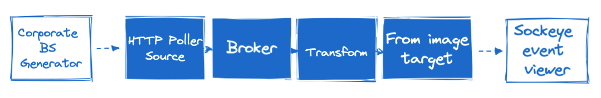
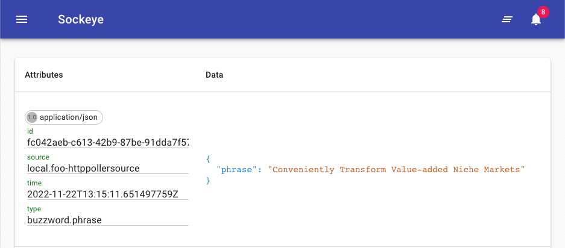
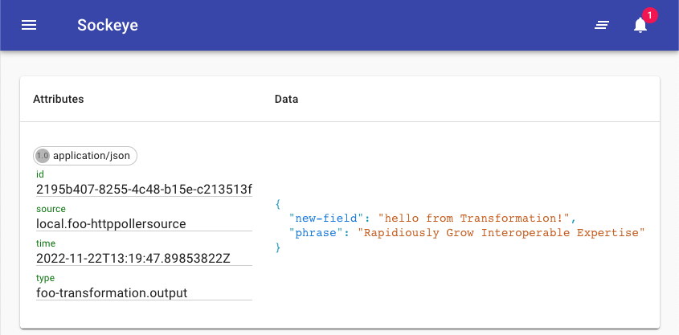

<!-- If we want external targets:

tmctl create target http --endpoint https://image-charts.com --method GET --response.eventType qr-data.response
tmctl send-event --eventType qr-data.request '{"path_suffix":"chart","query":"chs=150x150&cht=qr&chl=Hello%20world&choe=UTF-8"}' -->

# Quickstart

This quickstart will take you through the fastest and easiest way to start using events with TriggerMesh's command line interface, `tmctl`. `tmctl` makes it easy to create, configure and run a TriggerMesh Broker on any machine that has Docker.

We'll go through a simple hello world example, and you can expand from there. By the end of this quickstart, you will have created the flow shown below, in which we gather events containing buzzword-laden quotes, transform them and route them to a browser-based event viewer.



!!! info "Prerequisites"

    Please make sure you are able to run docker containers on your machine before proceeding.

## Installation

**:material-numeric-1-box: Install `tmctl`**

`tmctl` is the TriggerMesh command line interface (CLI) that makes it easy to work with events from the safety of your office (or couch).

TriggerMesh CLI can be installed from different sources: brew repository, pre-built binary, or compiled from source.

=== "Brew"

    Coming soon...
    <!-- ```
    brew install tmctl
    ``` -->

=== "Pre-built binary"

    Use the following one-liner to automatically download and install the CLI:

    ```
    curl -sSfL https://raw.githubusercontent.com/triggermesh/tmctl/HEAD/hack/install.sh | sh
    ```

    Alternatively, visit the [releases page](https://github.com/triggermesh/tmctl/releases) to manually download the latest version for your platform and make sure the path of the downloaded binary is configured in the `PATH` environment variable.

=== "From source"

    The most recent version of the `go` compiler is recommended to build `tmctl` binary from source:

    ```
    git clone git@github.com:triggermesh/tmctl.git
    cd tmctl
    go install
    ```

    Make sure that the binary's location is configured in the `PATH` environment variable, like so:

    ```
    export PATH="$HOME/go/bin:$PATH"
    ```

    Verify that the binary has been successfully installed:

    ```
    tmctl --help
    ```

**:material-numeric-2-box: Setup autocompletion**

This will let you hit the Tab key to get recommendations when using `tmctl`.

=== "Bash (Linux, Windows WSL)"

    ```
    echo 'source <(tmctl completion bash)' >>~/.bash_profile
    ```

=== "ZSH (MacOS, Linux)"

    ```
    tmctl completion zsh > $(brew --prefix)/share/zsh/site-functions/_tmctl
    ```

    <!-- For certain MacOS environments:
    ```
    tmctl completion zsh > $(brew --prefix)/share/zsh/site-functions/_tmctl
    ``` -->

For other shells, try `tmctl completion help` for more information.

## Create a Broker and send it an event

**:material-numeric-1-box: Create a Broker**

Your Broker will reliably route and deliver events from producers to consumers:

```console
tmctl create broker foo
```

**:material-numeric-2-box: Watch events sent to the Broker**

Open a second terminal to display all events passing through the broker. Keep this second terminal open throughout the quickstart.

Type:

```console
tmctl watch
```

Wait for this command to say complete and print `Watching...`.

**:material-numeric-3-box: Send it an event**

Back to the 1st terminal, and send an event to the Broker with JSON data:

```console
tmctl send-event '{"hello":"world"}'
```

In the `Watching...`terminal, you should see the event received by your Broker, something like this:

``` console
tmctl % tmctl watch
2022/11/08 16:35:33 Watching...
☁️  cloudevents.Event
Context Attributes,
  specversion: 1.0
  type: triggermesh-local-event
  source: triggermesh-cli
  id: 93dbed08-fb66-43d7-811b-2725f0e1d74e
  time: 2022-11-08T15:38:35.507676Z
  datacontenttype: application/json
Data,
  {
    "hello": "world"
  }
```

!!! warning "Doesn't work?"
    Copy any output and [PLEASE TELL US NOW](https://github.com/triggermesh/triggermesh/issues/new) :material-bug:.

## Add an external event source

**:material-numeric-1-box: Create an HTTP endpoint**

Let's create external source:
```
tmctl create source httppoller \
	--endpoint https://corporatebs-generator.sameerkumar.website/ \
	--eventType buzzword.phrase \
	--interval 20s \
	--method GET
```

With the `eventType` parameter we're saying that events from this source should be given the type `buzzword.phrase`. This can be used later on for routing.

**:material-numeric-2-box: Watch the events**

In the second terminal that is `Watching...`the Broker, you should be regularly receiving some corporate BS:

```console
2022/11/09 16:17:38 Watching...
☁️  cloudevents.Event
Context Attributes,
  specversion: 1.0
  type: buzzword.phrase
  source: local.foo-httppollersource
  id: c3cf14c5-8228-4366-8a33-c42c8e5847cb
  time: 2022-11-22T13:07:51.659171708Z
  datacontenttype: application/json
Data,
  {
    "phrase": "Rapidiously Brand Covalent Architectures"
  }
```

## Route events from the Broker to the Sockeye event viewer

**:material-numeric-1-box: Create a target**

Now let's send those events somewhere.

We're going to run a local service called Sockeye that is used to view events in the browser. Create a Target that points to this service and runs the necessary container with the following command:

```
tmctl create target \
	--name sockeye \
	--from-image docker.io/n3wscott/sockeye:v0.7.0 \
	--source foo-httppollersource
```

After running this command, it should output a URL that you can open in your browser:

```
Listening on:     http://localhost:<port>
```

**:material-numeric-2-box: View events in Sockeye**

Open this in your browser and events you should start showing up there:



If you still have `tmctl watch` running in a second terminal, you'll also see events there when they hit the Broker, before passing on to Sockeye.

## Transform the event

Lets transform the incoming events before they are passed to Sockeye.

**:material-numeric-1-box: Create a transformation**

Using TriggerMesh's Bumbleebee transformation component, we can easily modify an event as it passes through the TriggerMesh.

```
tmctl create transformation --target sockeye <<EOF
data:
- operation: add
  paths:
  - key: new-field
    value: hello from Transformation!
EOF
```

This simple transformation adds a new key to the event's JSON payload. We're using the `--target` parameter to indicate that the transformed events should be passed along to `sockeye`.

**:material-numeric-2-box: Send an event**

Although you can wait till the HTTPPoller fetches an another event, you can also simulate you own event with the following command:

```
tmctl send-event '{"hello":"triggermesh"}' --eventType buzzword.phrase
```

Notice how events displayed in Sockeye now include the additional field that was added by the transformation.



**:material-numeric-1-box: View your TriggerMesh configuration**

Run the following command:

```
tmctl describe
```

As you can see, `tmctl describe` displays useful info about your current configuration. It lists all the sources, targets, triggers, and other components you've defined, and their properties.

``` sh
~ % tmctl describe
Broker     Status
foo        online(http://localhost:54591)

Trigger                  Target                 Filter
foo-trigger-43facd4e     foo-transformation     type is buzzword.phrase
foo-trigger-9dad7875     sockeye                type is foo-transformation.output

Transformation         EventTypes                    Status
foo-transformation     foo-transformation.output     online(http://localhost:55073)

Source                   Kind                 EventTypes          Status
foo-httppollersource     httppollersource     buzzword.phrase     online(http://localhost:55028)

Target      Kind                                               Expected Events     Status
sockeye     kn-service (docker.io/n3wscott/sockeye:v0.7.0)     *                   online(http://localhost:54853)
```

## Next steps

Now that you know what a source, target, and transformation are, you can start adding sources and targets that make sense to you.

:material-aws: **AWS** users:

- try ingesting AWS events by using an [SQS source](../sources/awssqs.md)
- or trigger a Lambda function with the [Lambda target](../targets/awslambda.md)

:material-microsoft-azure: **Azure** users:

- try ingesting Azure events by using the [Azure Event Hubs source](../sources/azureeventhubs.md)
- or sending events to [Azure Sentinel](../targets/azuresentinel.md) for threat analysis

:material-google-cloud: **Google Cloud** users:

- try ingesting Google events using the [Google Pub/Sub Source](../sources/googlecloudpubsub.md)
- or sending events to [Google Cloud Workflows](../targets/googlecloudworkflows.md)

:material-apache-kafka: **Kafka** users:

- you can read and write to kafka easily using our [Kafka Source](../sources/kafka.md) and [Kafka Target](../targets/kafka.md)

:material-code-json: **HTTP** users:

- try ingesting events over standard HTTP with the [Webhook Source](../sources/webhook.md) or with CloudEvents over HTTP with the [CloudEvents Source](../sources/cloudevents.md)
- or sending events over HTTP with fine control over HTTP parameters with the [HTTP Target](../targets/http.md), or using CloudEvents over HTTP with the [CloudEvents Target](../targets/cloudevents.md).

:material-kubernetes: **Kubernetes** users:

- try exporting your local configuration as a Kubernetes manifest by using `tmctl dump`, and deploying to a cluster. You can learn more about it in the [dedicated guide](moving-from-dev-to-K8s.md).

## Clean up

I've you run through this quickstart guide, you'll now have a number of containers running on Docker.

You can stop all TriggerMesh-related containers with:

```sh
tmctl stop
```

To delete you local configuration (all sources, targets, brokers, transformations) and stop all containers, you can try:

```sh
tmctl delete --broker foo
```

Replace `foo` with the name of your broker. Be careful, you can't go back once you've deleted everything.
