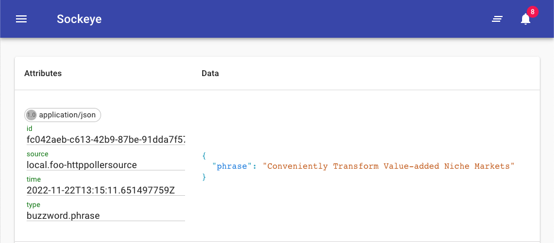

# Display events in TriggerMesh Console

TriggerMesh Console provides a web GUI to display events and their metadata and filter for specific events. It is something you host locally and can display in your browser.

To use it, you can define it as an event Target and Route events to it using Triggers.

```
tmctl create target --from-image gcr.io/triggermesh/triggermesh-console:v0.0.1
```

After running this command, a URL should be display that you can open in your browser:

```
open http://localhost:<port>
```

This is what it looks like:


