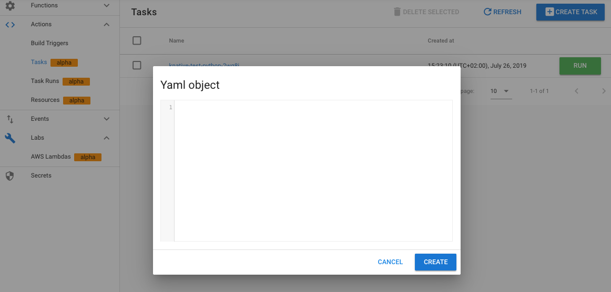
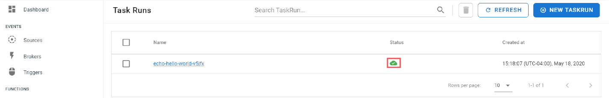
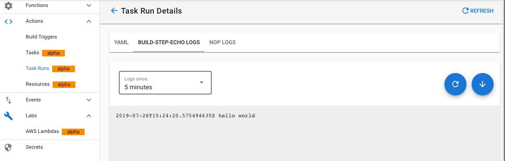

## Actions

TriggerMesh Actions are based on [Tekton Pipeline](https://github.com/tektoncd/pipeline). We use Tekton to build the container images that contain functions and we use it to run application pipelines expressed as [GitHub Actions](https://github.com/triggermesh/aktion).

### Create a Task

You can express a _Task_ in a manifest. For example, the following manifest represents a Task that will echo _Hello World_:

```
apiVersion: tekton.dev/v1alpha1
kind: Task
metadata:
  name: echo-hello-world
spec:
  steps:
    - name: echo
      image: ubuntu
      command:
        - echo
      args:
        - "hello world"
``` 

You can use `kubectl` and `tm` to create this Task from the CLI. Via the console, we provide an easy to use YAML window. Click on the _Create Task_ button and select _from YAML_, you will be presented with the following view in which you can paste your Task manifest.



### Execute a Task

Clicking on the greeen _RUN_ button will launch the execution of the Task


Once executed, the _TaskRun_ view will show a green TaskRun object as below:



And clicking on the object name will lead you to the logs of the Task with a magnificient `hello world`:



