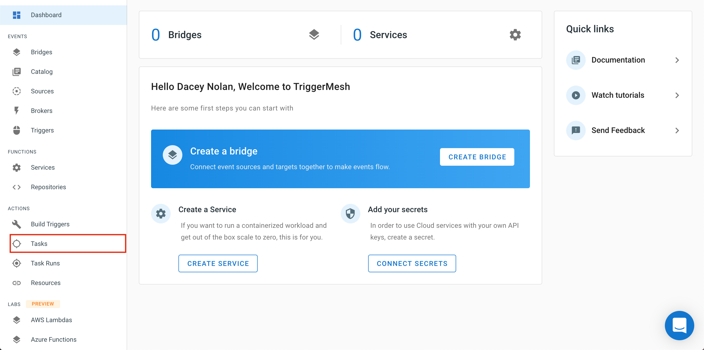
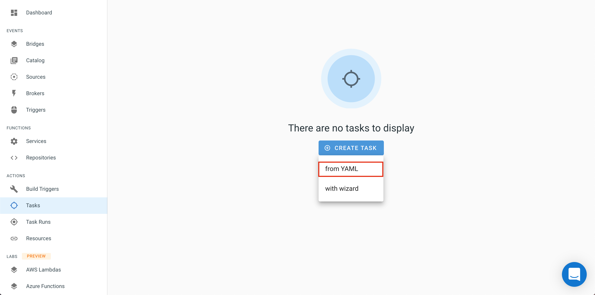
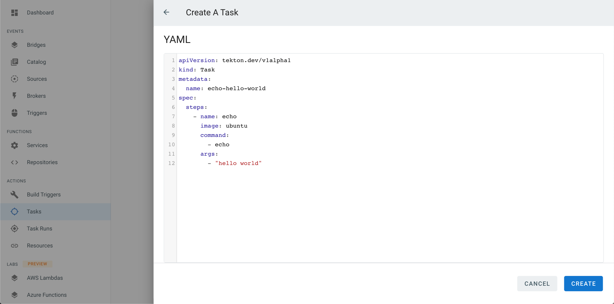
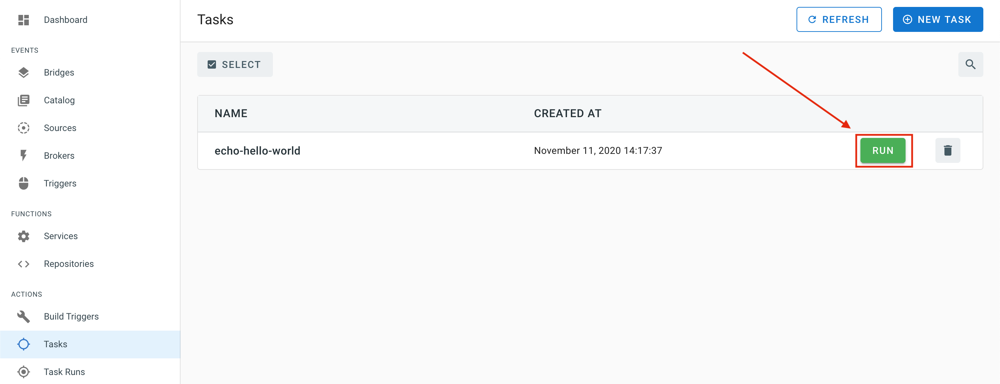
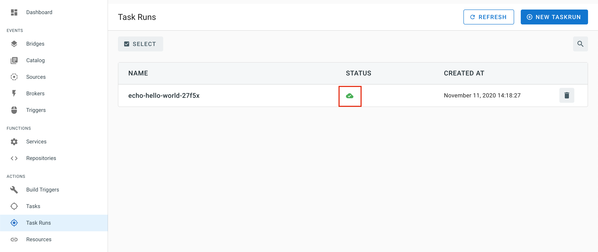
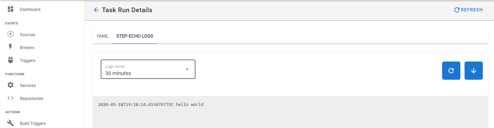

## Actions

TriggerMesh Actions are based on [Tekton Pipeline](https://github.com/tektoncd/pipeline). Tekton builds the container images used to run application pipelines expressed as [GitHub Actions](https://github.com/triggermesh/aktion).

### Create a Task

  You can express a _Task_ in a manifest. For example, the following manifest represents a Task that will echo _Hello World_:

```yaml
apiVersion: tekton.dev/v1alpha1
kind: Task
metadata:
  name: echo-hello-world
spec:
  steps:
    - name: echo
      image: ubuntu
      command:
        - echo
      args:
        - "hello world"
```

The TM console provides an easy to use YAML window for deploying Tasks from the browser. This is accessed by selecting _Tasks_ from the Navigation menu.




  Click on the _Create Task_ button and select _from YAML_, to create a new task.

 


You will be presented with the following view in which you can paste your Task manifest.



### Execute a Task

Clicking on the green _RUN_ button will launch the execution of the Task



Once executed, the _TaskRun_ view will show a green TaskRun object as below:



Clicking on the object name will lead you to the _Task Run Details_ here we can view our YAML as well as the Logs. Navigate to the logs to find the a magnificent `hello world`:




### CLI lovers can use use [`kubectl`](https://kubernetes.io/docs/reference/kubectl/overview/) and [`tm`](https://github.com/triggermesh/tm) to [create Tasks from the CLI.](https://github.com/triggermesh/tm#deployment-pipelines)
