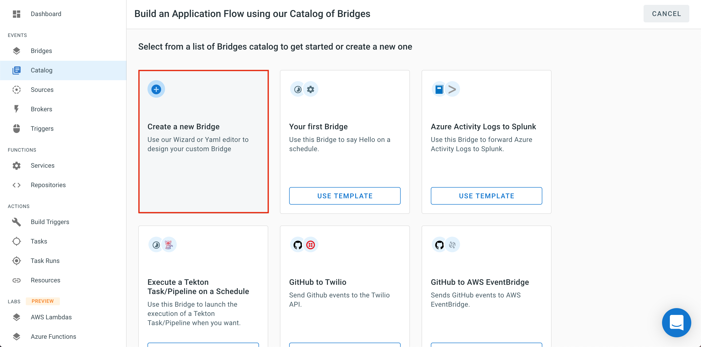
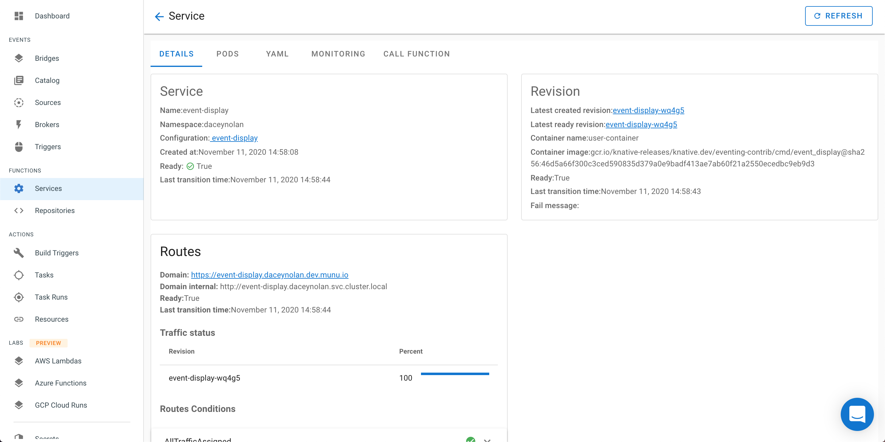

# EveryBridge

The [EveryBridge](https://triggermesh.com/cloud_native_integration_platform/everybridge/) service makes it easy to create links between event sources and targets.

Each _bridge_ created within the TM console operates via the following `flow`:

  1. An event _*[source](https://knative.dev/docs/eventing/sources/)*_ **_retrieves_** data.
  2. A _*[broker](https://knative.dev/docs/eventing/broker-trigger/)*_ to act as an **_event bucket_**
  3. A _*[trigger](https://knative.dev/docs/eventing/broker-trigger/)*_ that **_subscribes_** our target to recieve events from the broker.
  4. A _*target*_ that **_receives_** events. <!-- This will be linked to the Targets docs upon completion -->

## Creating a new Bridge

For this example a small service called `Event Display` is used as the `target`. `Event Display` prints all the messages it receives into a log.

* From the _Bridges_ view. Select `Create New`

* Select `Create a new Bridge`.

* Select `Sources`
  

* Select `CronJob` from the popup menu.

* Give it a name such as "TestCron", a Cron Schedule of every minute (or */1 * * * *), and keep the `Cron data` set at `{"foo": "bar"}`.

* Now the glue of the trigger can be made. Click inside the trigger area, and a menu on the left will come up prompting for the type of service.

<!-- This section is pending updates from a current issue and is unfinished -->

  That will complete the flow from
source to trigger.  Click on `SUBMIT BRIDGE` to create the bridge.

To verify the functionality of the bridge, go to the `Services` menu from functions.
The `event display` service that was created with the bridge will be shown. When
that is clicked, there will be a page showing the details of the service.

When the `PODS` link is clicked, the a list of pods associated with the service
will be shown.  There is only one, but on the far right side of the list is a
chevron icon under the logs.  When that is clicked, then the log from the event
will be displayed.

