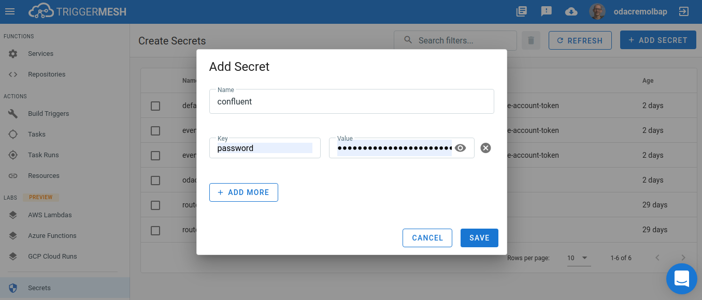
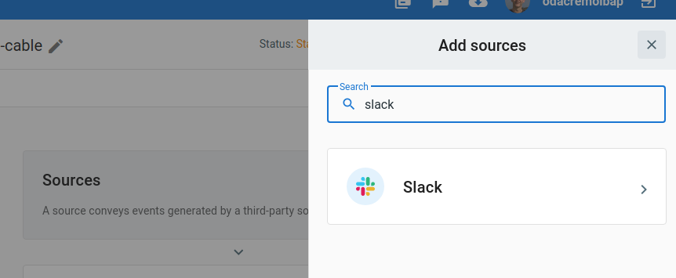
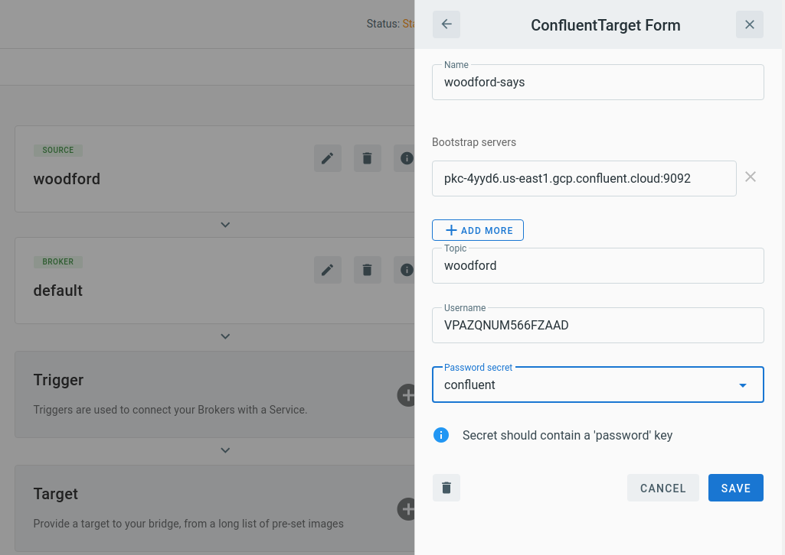
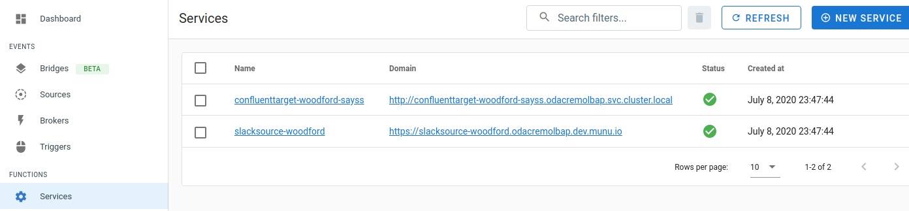
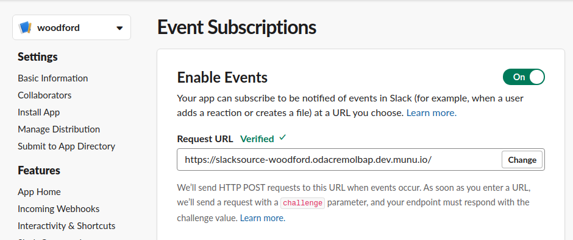
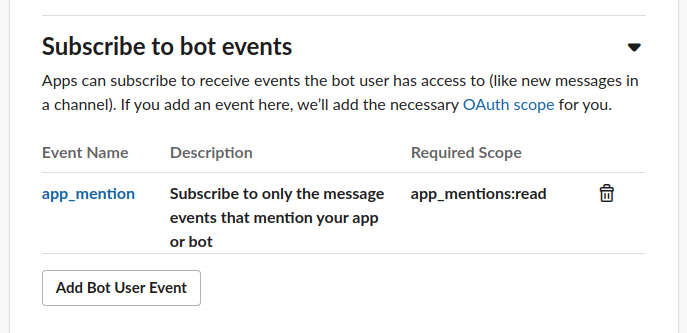
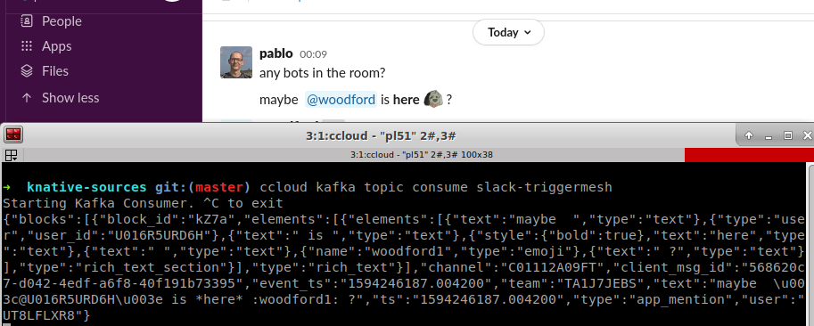

# Slack to Confluent Bridge

This Guide will help you creating a Bridge that sends Slack events to a Confluent Kafka instance.

You will need:

- Admin privileges on an Slack workspace. You can create one [here](https://slack.com/create)
- A Confluent instance admin user.

## Contents

- [Slack to Confluent Bridge](#slack-to-confluent-bridge)
  - [Contents](#contents)
  - [Create Confluent User](#create-confluent-user)
  - [Create The Slack to Confluent Bridge](#create-the-slack-to-confluent-bridge)
  - [Retrieve Slack Source Exposed URL](#retrieve-slack-source-exposed-url)
  - [Subscribe to Slack Events](#subscribe-to-slack-events)
  - [Testing the Integration](#testing-the-integration)

## Create Confluent User

- Create a user for the integration that can produce messages to a topic. Potentially that user could also create the topic if it doesn't exists.
- We will require for this example Bridge a target component configured with this data:

  - SASL/PLAIN mechanism
  - SASL/SSL protocol
  - Topic (to be written to, and to be created if not existing)
  - Bootstrap Servers
  - User name
  - User password

From that list above `password` is a sensible field which we require to be inserted through a secret. It is required that the created key is named `password`:

## Create the Slack to Confluent Bridge

We can proceed to create the Bridge now. Slack Event API needs the URL to send data to, that means we need to provide the URL first, then head to Slack Admin site to configure the bot that will serve for this integration.

Create a new Bridge, click on `Source`, and look for Slack.

We are using the `default` broker for this demo, select it, add a name to the component and press `Save`.

Now click on the `Target` block at the bottom of the page, a list of targets to connect to will be shown, look for Confluent and fill

- Name of component at the bridge (your choice).
- Bootstrap servers for your Confluent instance, at least one entry.
- A topic to write to. If it doesn't exists the target will create it.
- Username for the integration.
- The secret containing the password created at a previous step.

Press `Submit Bridge` and you are done with TriggerMesh configuration.

## Retrieve Slack Source Exposed URL

The Slack Source component creates an external URL that should be used as the `Request URL` callback when configuring the Slack Bot App. In order to obtain it, open the `Services` area at TriggerMesh and look for a service by the name of the Slack Source you just created. Then copy the exposing URL.

## Subscribe to Slack Events

Open the Slack web site at the [Apps home](https://api.slack.com/apps) anc click on `Create New App`

- Enter a name for your App and the workspace where it will be hosted.
- Once create navigate to `Basic Information`.
- Click on the `Event Subscriptions` pane.
- Slide the `Enable Events` slide button.
- At the `Request URL` field set the Slack Source URL that TriggerMesh is exposing. The Slack Source is a serverless service, it could happen that the verification process expires waiting for the first request to succeed. If that happens, please try again to do the verification.

Scroll down and expand the Subscribe to bot events. Select which events you want your bot to subscribe to.
Once you have selected them, press save changes at the bottom of the page.

Your application needs to get deployed to your workspace. For that to happen click on Install App, select the workspace and review permissions.
Once you allow the App to be deployed, you are all set.

## Testing the Integration

At our example we subscribed out App bot to the `app_mention` event, we just need to mention by its name and the message should make its way from Slack to Confluent:

