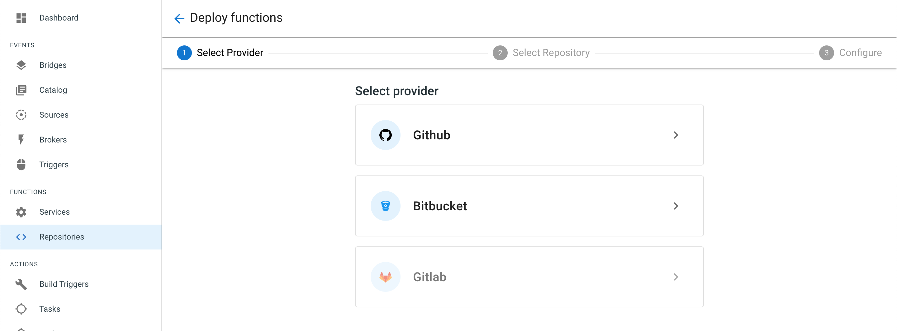
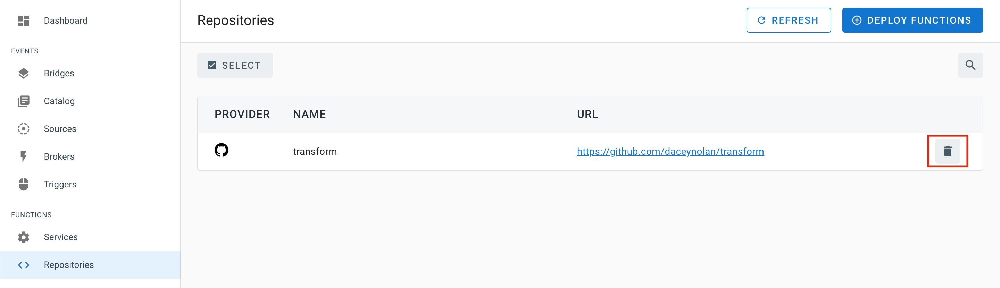

## Continuous Deployment of your Functions

To continously deploy your functions on TriggerMesh you can register a source code repository which contains your function code and a manifest (`serverless.yaml`).

The **Function** section in the console contains a _Repositories_ view where you can register all the repositories that contain functions you want to get deployed.
In the snapshot below you can see the _Deploy Functions_ button, click on it and you will go through a wizard that will help you setup your repository.

### Register the repository

Clone the [sample repository](https://github.com/sebgoa/tmserverless) which contains a function and an example `serverless.yaml` manifest. Then in the wizard, pick the source control provider that you used. You will be prompted to authenticate.

After authentication, a drop down list will let you select the name of the repository. You will need to agree to the TriggerMesh use of your authentication token.

If your `serverless.yaml` manifest is not in the root of the source tree and that you want to trigger function deployment only in specific branch you can set that up in the following wizard:

Once registration is complete the _Repositories_ view will contain your function prject. You can disable the registration at any time by selecting the project and clicking on the _Disable Selected_ button.

### Check the Task being created

On regsitration, a _Task_ will be created. You will see this Task in the **Actions** section's _Task_ view. Clicking on the _Task_ link will show you the manifest of the Task itself.

### Deploying on Push events

On each push event, the Task will get executed. This will be performed and traceable via a _TaskRun_. The _TaskRun_ view will show you the deployment being done.

Any push event on the registered repository will trigger a new build described in your `serverless.yaml` manifest.

### Service creation

On successfull execution of the build `Task` the service will be available and you will be able to use the function

