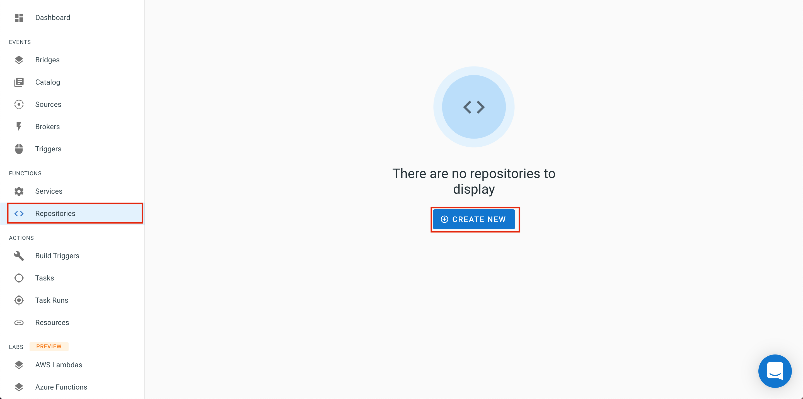
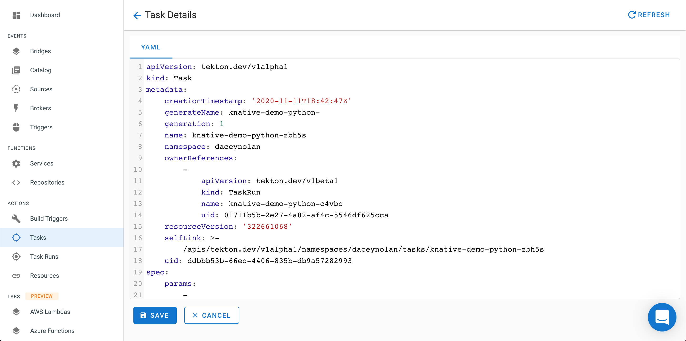
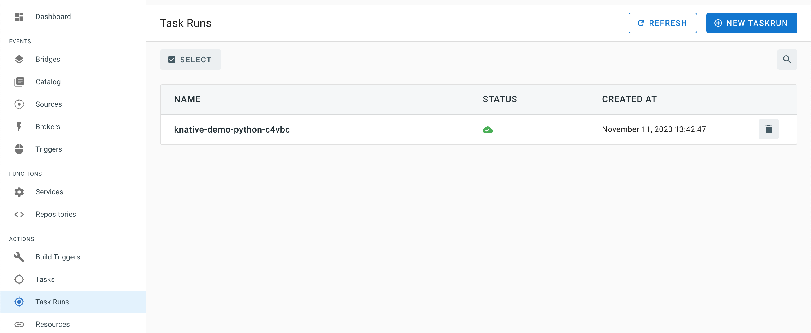

## Continuous Deployment of your Functions

To continously deploy your functions on TriggerMesh you can register a source code repository which contains your function code and a manifest (`serverless.yaml`).

The **_Repositories_** section in the console contains a view where you can register all the repositories that contain functions you want to have continously deployed.

### Register the repository

**Begin by forking the [sample repository](https://github.com/sebgoa/tmserverless) which contains a function and an example `serverless.yaml` manifest.**

Select the _Repositories_ section from the Navigation menu and then select _CREATE NEW_ 

In the wizard, pick the source control provider that you used. You will be prompted to authenticate.

After authentication, a drop down list will let you select the name of the repository. You will need to agree to the TriggerMesh use of your authentication token.

Here you can specify the location of the `serverless.yaml` manifest as well as select specific _Branch_ and _Tag_ name's from the repository. 

Once registration is complete the _Repositories_ view will contain your function prject. You can disable the registration at any time by selecting the project and clicking on the _Disable Selected_ button.

### Viewing The Deployment

After every sucessful registration of a new repository a _Task_ will be created for it.

Navigate to the _Tasks_ view in the **Actions** section and click on the _Task_ name. 

This will display the manifest of the Task.

### Deploying on Push events

A Task will execute on each push event to its respective repository. You can view the details of theTask in the _Task Runs_ section

The _TaskRun_ view will show you the deployment being done.

Any push event on the registered repository will trigger a new build described in your `serverless.yaml` manifest.

### Service creation

On successfull execution of the build `Task` the service will be available and you will be able to use the function

