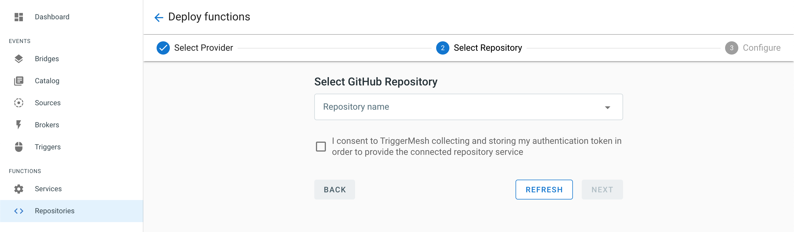
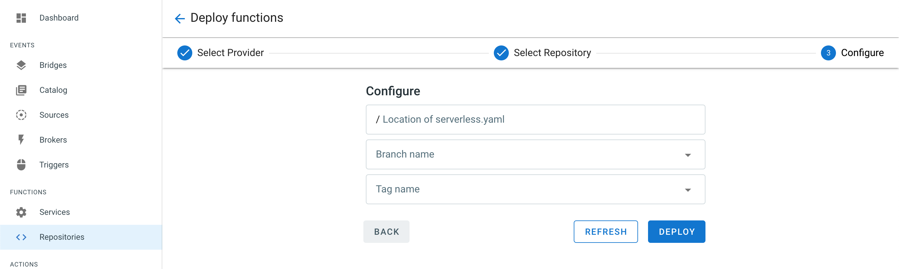

# Continuous Deployment of Your Functions

The Triggermesh console provides an interface called [Repositories.](https://cloud.triggermesh.io/function-triggers) Here the user is able to select a codebase, from a linked repository provider, to be continuously deployed. This codebase **must** contain a deployment manifest[^1] .

## Register the Repository

###### The following example uses this [sample repository.](https://github.com/sebgoa/tmserverless) To follow along begin by forking the example to your repository provider.

1. Select the _Repositories_ section from the Navigation menu and then _CREATE NEW_

2. Select a source control provider. Upon submission of this form you will be asked to authenticate with the chosen provider.

3. Select the  [sample repository](https://github.com/sebgoa/tmserverless) from the drop down list.

4. Here you can specify the location of the `serverless.yaml` manifest as well as select specific _Branch_ and _Tag_ name's from the repository.

5. Once registration is complete the _Repositories_ view will contain your function project. You can disable the registration at any time by clicking on the _Trash Can_ icon located on the right hand side of the item you would like to disable. 

## Viewing the Deployment

***After every successful registration of a new repository a _Task_ will be created for it.***

* Navigate to the _Tasks_ view in the **Actions** section and click on the _Task_ name.

* This will display the manifest of the Task.

## Deploying on Push Events

* A _Task_ will execute on each push event to its respective repository. You can view the details of the _Task_ in the [_Task Runs_](https://cloud.triggermesh.io/taskruns) section

* Any push event on the registered repository will trigger a new build described in your `serverless.yaml` manifest.

## Service Creation

* On successfull execution of the _Task_ the service will be available and you will be able to see and use the function by navigating to the [_Services_](https://cloud.triggermesh.io/services) tab.

[^1]: A sample manifest can be found here -> [https://github.com/sebgoa/transform/blob/master/serverless.yaml](https://github.com/sebgoa/transform/blob/master/serverless.yaml)
