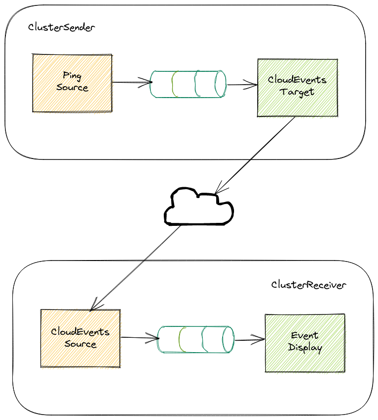

# Connecting TriggerMesh Clusters

!!! Info "Installation"
    Make sure you have completed the installation [procedure](installation.md) before proceeding with any of the guides.

In this guide we will connect 2 TriggerMesh/Knative clusters that will be able to interchange CloudEvents flowing through them. You might want to connect multiple TriggerMesh instances to:

- Move events between environments. For example from production to staging in order to perform tests with actual events.
- Geographically distribute events among clusters.
- Perform Cluster migrations.

## Scenario

For this scenario we will need to setup 2 TriggerMesh clusters that we will call at this document `ClusterSender` and `ClusterReceiver`.

ClusterSender components:

- `Broker` is the temporary storage for CloudEvents.
- `PingSource` is a peridic CloudEvents producer that will send them to the Broker.
- `CloudEventsTarget` will listen to CloudEvents and send them to an external location.
- `Trigger` will subscribe to CloudEvents at the Broker and send them to the CloudEventsTarget.

ClusterReceiver components:

- `Broker` is the temporary storage for CloudEvents.
- `CloudEventsSource` will listen to CloudEvents from remote locations and send them to the Broker.
- `event-display` service will listen to CloudEvents and log them at the output console.
- `Trigger` will subscribe to CloudEvents at the Broker and send them to the EventDisplay.



Events produced at the PingSource will flow as depicted above until they reach the EventDisplay at the second cluster.

## Setup

!!! Info "Local setup"
    You can use a local setup by creating 2 kind clusters.

    ```console
    $ kind create cluster --name clustersender
    ...

    $ kind create cluster --name clusterreceiver
    ...
    ```

    Add LoadBalancer support to the receiver cluster by following [kind instructions](https://kind.sigs.k8s.io/docs/user/loadbalancer/).

    You can switch to each configured cluster using `kubectl config use-context` command.

    ```console
    $ kubectl config use-context kind-clustersender

    $ kubectl config use-context kind-clusterreceiver
    ```

### Receiver Cluster

!!! Info "Receiver cluster"
    Make sure your kubectl configuration is pointing to the receiver cluster.

Create the Broker that as the host for this cluster's CloudEvents:

```console
kubectl apply -f - <<EOF
apiVersion: eventing.knative.dev/v1
kind: Broker
metadata:
  name: receiver
EOF
```

Create a Knative service that runs the `event_display` image. We will look for received events looking at the logs of this service.

```console
kubectl apply -f - <<EOF
apiVersion: serving.knative.dev/v1
kind: Service
metadata:
  name: event-display
spec:
  template:
    metadata:
      annotations:
        autoscaling.knative.dev/min-scale: "1"
    spec:
      containers:
      - image: gcr.io/knative-releases/knative.dev/eventing/cmd/event_display
EOF
```

Using a Trigger we can link the `event-display` service with the broker to subscribe to all events flowing through it.

```console
kubectl apply -f - <<EOF
kind: Trigger
apiVersion: eventing.knative.dev/v1
metadata:
  name: all-events-to-event-display
spec:
  broker: receiver
  subscriber:
    ref:
      apiVersion: serving.knative.dev/v1
      kind: Service
      name: event-display
EOF
```

The `CloudEventsSource` component will expose an HTTP endpoint that ingest CloudEvents from external systems. We will configure this component to send ingested CloudEvents to the broker.

```console
kubectl apply -f - <<EOF
apiVersion: sources.triggermesh.io/v1alpha1
kind: CloudEventsSource
metadata:
  name: gateway-in
spec:
  sink:
    ref:
      apiVersion: eventing.knative.dev/v1
      kind: Broker
      name: receiver
EOF
```

After completing the setup for all the receiver cluster components, any CloudEvent sent to the `CloudEventsSource` public endpoint will flow throw the broker and be delivered to the `event-display` service.

We will retrieve and take note of the exposed URL at the `CloudEventsSource`, it will be used later at the the sender cluster.

```console
kubectl get cloudeventssources.sources.triggermesh.io gateway-in -ojsonpath='{.status.address.url}'
```

### Sender Cluster

!!! Info "Sender cluster"
    Make sure your kubectl configuration is pointing to the sender cluster.

Create the Broker that as the host for this cluster's CloudEvents:

```console
kubectl apply -f - <<EOF
apiVersion: eventing.knative.dev/v1
kind: Broker
metadata:
  name: sender
EOF
```

A `PingSource` produces periodic events based on a cron expression. We will send the produced events to the broker object.

```console
kubectl apply -f - <<EOF
apiVersion: sources.knative.dev/v1
kind: PingSource
metadata:
  name: periodic-event-producer
spec:
  schedule: "*/1 * * * *"
  contentType: "application/json"
  data: '{"message": "greetings from sender cluster"}'
  sink:
    ref:
      apiVersion: eventing.knative.dev/v1
      kind: Broker
      name: sender
EOF
```

The `CloudEventsTarget` component is able to subscribe to a broker (using a trigger), and forward events to a remote destination. We will configure this component using the endpoint exposed by the `CloudEventsSource` at the destination cluster, make sure you replace the placeholder text at the following command.

```console
kubectl apply -f - <<EOF
apiVersion: targets.triggermesh.io/v1alpha1
kind: CloudEventsTarget
metadata:
  name: gateway-out
spec:
  endpoint: <REPLACE-WITH-CLOUDEVENTSSOURCE-HTTP-ENDPOINT>
EOF
```

Subscribing the `CloudEventsTarget` to CloudEvents flowing through a broker is done via a trigger.

```console
kubectl apply -f - <<EOF
kind: Trigger
apiVersion: eventing.knative.dev/v1
metadata:
  name: all-events-to-cloudeventstarget
spec:
  broker: sender
  subscriber:
    ref:
      apiVersion: targets.triggermesh.io/v1alpha1
      kind: CloudEventsTarget
      name: gateway-out
EOF
```

### Receiving Events

With all components being setup CloudEvents should be flowing from `PingSource` at the sender cluster to the `event-display` service at the receiver cluster. We can make sure by looking at the receiving service logs.

```console
$ kubectl logs -l serving.knative.dev/service=event-display -c user-container -f
...
Context Attributes,
  specversion: 1.0
  type: dev.knative.sources.ping
  source: /apis/v1/namespaces/default/pingsources/periodic-event-producer
  id: eddd0d10-64ef-4c82-bfc0-c0caea63a510
  time: 2022-05-26T12:44:00.265933805Z
  datacontenttype: application/json
Extensions,
  knativearrivaltime: 2022-05-26T12:44:00.272805675Z
Data,
  {
    "message": "greetings from sender cluster"
  }
...
```

## Further improvements

Triggers can be configured with filters to make sure only allowed CloudEvents travels between clusters. Refer to [trigger's documentation](https://knative.dev/docs/eventing/broker/triggers/) for configuration options.

[CloudEventsSource](cloudeventssource.md) and [CloudEventsTarget](cloudeventstarget.md) can be configured with HTTP Basic Authentication.

!!! Info "HTTP Basic Authentication"
    HTTP Basic Authentication is not enctrypted. When used it is thoroughly recommended that Knative Serving is configured with TLS capabilities.
