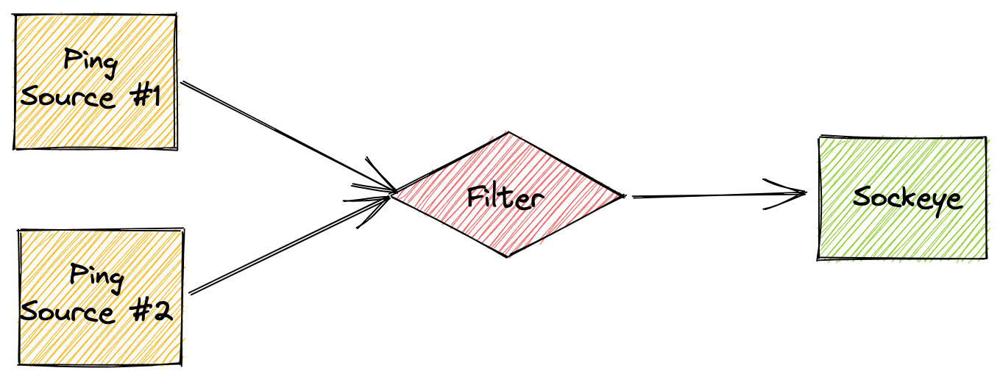
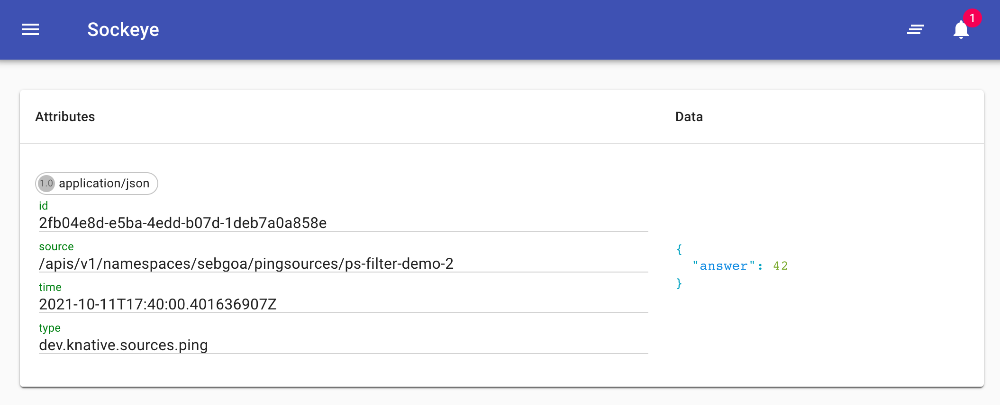

# Filters

Filters are an important part of TriggerMesh's event routing mechanism. They allow for filtering events based on the content of the payload. This content-based event filtering is expressed with Google's
[Common Expression Language](https://opensource.google/projects/cel) within the TriggerMesh `Filter` API specification.

## Tutorial for Filters on Kubernetes

!!! Tip
    You can verify that the API is available with the following command:

    ```console
    $ kubectl get crd filters.routing.triggermesh.io
    NAME                             CREATED AT
    filters.routing.triggermesh.io   2021-10-06T09:01:33Z
    ```
    You can also explore the API specification with:
    ```console
    $ kubectl explain filter
    ```

To demonstrate filtering in TriggerMesh we are going to create the event flow depicted in the diagram below. Two sources of kind `PingSource` will send events on a repeating schedule, and only the events which pass the filter will be displayed on the final event target. The target is the [Sockeye application](https://github.com/n3wscott/sockeye), a microservice which displays the content of a [CloudEvent](https://cloudevents.io/).



Let's create all the required objects:

- [x] The `sockeye` target which serves as an event display.
- [x] Two `PingSource` to produce events.
- [x] The `Filter` to discard unwanted events.

### Event display

First we need to have a tool to see our filter results. Create a `sockeye`
service by saving the following YAML manifest in a file called `sockeye.yaml` and applying it to your Kubernetes cluster:

```yaml
apiVersion: serving.knative.dev/v1
kind: Service
metadata:
  name: sockeye
spec:
  template:
    spec:
      containers:
        - image: docker.io/n3wscott/sockeye:v0.7.0@sha256:e603d8494eeacce966e57f8f508e4c4f6bebc71d095e3f5a0a1abaf42c5f0e48
```

```
kubectl apply -f sockeye.yaml
```

Open the web interface in a browser at the URL found with the following command:

```shell
$ kubectl get ksvc sockeye -o=jsonpath='{.status.url}'
```

### Event producers

Next, create the two
[PingSources](https://knative.dev/docs/developer/eventing/sources/ping-source) to
produce CloudEvents by saving the following YAML manifests in two separate files and applying them to your Kubernetes cluster with `kubectl apply`:

```yaml
apiVersion: sources.knative.dev/v1
kind: PingSource
metadata:
  name: ps-filter-demo-1
spec:
  schedule: "*/1 * * * *"
  contentType: "application/json"
  data: '{
   "name": "TriggerMesh",
	"sub": {
		"array": ["hello", "Filter"]
	    }
    }'
  sink:
    ref:
      apiVersion: routing.triggermesh.io/v1alpha1
      kind: Filter
      name: filter-demo
```

The second source uses a different payload to show you how the `Filter` expression may be used to express complex filtering rules.

```yaml
apiVersion: sources.knative.dev/v1
kind: PingSource
metadata:
  name: ps-filter-demo-2
spec:
  schedule: "*/1 * * * *"
  contentType: "application/json"
  data: '{
      "answer": 42
    }'
  sink:
    ref:
      apiVersion: routing.triggermesh.io/v1alpha1
      kind: Filter
      name: filter-demo
```

### Filter events

Finally, create the `Filter` object to filter out events from the first PingSource. Once again save the following YAML manifest in a file and apply it to your Kubernetes cluster with `kubectl apply`.

```yaml
apiVersion: routing.triggermesh.io/v1alpha1
kind: Filter
metadata:
  name: filter-demo
spec:
  expression: $sub.array.0.(string) == "hello" && $name.(string) != "TriggerMesh" || $answer.(int64) == 42
  sink:
    ref:
      apiVersion: serving.knative.dev/v1
      kind: Service
      name: sockeye
```

Verify that your filter is ready with `kubectl` like so:

```console
$ kubectl get filter
NAME          ADDRESS                                                      READY   REASON
filter-demo   http://filter-adapter.sebgoa.svc.cluster.local/filter-demo   True
```

Only events from the second source should appear in the `sockeye` web interface as shown in the screenshot below:



!!! tip "Test your Filter as Code"
    You can test modifying the filter expression and re-applying it with `kubectl`. This gives you a declarative event filter which you can manage with your [GitOps workflow](https://www.weave.works/technologies/gitops/)

## Another filter on Kubernetes example

```yaml
apiVersion: routing.triggermesh.io/v1alpha1
kind: Filter
metadata:
  name: filter-test
spec:
  expression: |-
    ($id.first.(int64) + $id.second.(int64) >= 8) || $company.(string) == "bar" || $0.name.first.(string) == "Jo"
  sink:
    ref:
      apiVersion: serving.knative.dev/v1
      kind: Service
      name: sockeye
---
apiVersion: sources.knative.dev/v1beta2
kind: PingSource
metadata:
  name: ps1
spec:
  contentType: application/json
  data: '{"id":{"first":5,"second":3}}'
  schedule: '*/1 * * * *'
  sink:
    ref:
      apiVersion: routing.triggermesh.io/v1alpha1
      kind: Filter
      name: filter-test
---
apiVersion: sources.knative.dev/v1beta2
kind: PingSource
metadata:
  name: ps2
spec:
  contentType: application/json
  data: '{"id":{"first":2,"second":3}}'
  schedule: '*/1 * * * *'
  sink:
    ref:
      apiVersion: routing.triggermesh.io/v1alpha1
      kind: Filter
      name: filter-test
---
apiVersion: sources.knative.dev/v1beta2
kind: PingSource
metadata:
  name: ps3
spec:
  contentType: application/json
  data: '{"foo":"bar"}'
  schedule: '*/1 * * * *'
  sink:
    ref:
      apiVersion: routing.triggermesh.io/v1alpha1
      kind: Filter
      name: filter-test
---
apiVersion: serving.knative.dev/v1
kind: Service
metadata:
  name: sockeye
spec:
  template:
    spec:
      containers:
      - image: docker.io/n3wscott/sockeye:v0.7.0@sha256:e603d8494eeacce966e57f8f508e4c4f6bebc71d095e3f5a0a1abaf42c5f0e48
```
