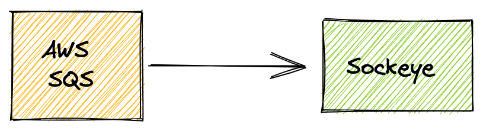

# Creating a Source

!!! Info "Installation"
    Make sure you have completed the installation [procedure](installation.md) before continuing with any of the guides.

In this guide we will create a point to point Bridge between an AWS SQS queue and a microservice application called `sockeye` which displays events in a web interface. This simple flow is depicted below.



We will create:

- [x] The `sockeye` target which serves as an event display.
- [x] The `AWSSQSSource` which consumes events from an AWS SQS queue.

!!! tip "Kubernetes namespace"
    All objects mentioned in this guide must be created inside the same Kubernetes namespace.

## Sockeye CloudEvents viewer display

First of all, we need to have a tool to see the events that come from our source.

Create a `sockeye` deployment and service by saving the following YAML manifest in a file called `sockeye.yaml` and applying it to your Kubernetes cluster:

```yaml
apiVersion: v1
kind: Service
metadata:
  name: sockeye
spec:
  selector:
    app.kubernetes.io/name: sockeye
  ports:
  - port: 80
    protocol: TCP
    targetPort: 8080

---

apiVersion: apps/v1
kind: Deployment
metadata:
  name: sockeye
spec:
  selector:
    matchLabels:
      app.kubernetes.io/name: sockeye
  template:
    metadata:
      labels:
        app.kubernetes.io/name: sockeye
    spec:
      containers:
      - name: sockeye
        image: docker.io/n3wscott/sockeye:v0.7.0@sha256:e603d8494eeacce966e57f8f508e4c4f6bebc71d095e3f5a0a1abaf42c5f0e48
```

```console
$ kubectl apply -f sockeye.yaml
```

Forward the sockeye service locally to be able to open it in your web browser. Open a dedicated console and issue the following command:

```console
$ kubectl port-forward svc/sockeye 8080:80
```

Sockeye should be not avaialble at `http://localhost:8080/`

## Create a AWS SQS Event source

You can explore the specification of the object using the `kubectl explain` command. You will see that you need the ARN (i.e Amazon Resource Name) of your AWS SQS queue and the AWS API keys that give you access to SQS.


```console
$ kubectl explain awssqssource.spec
KIND:     AWSSQSSource
VERSION:  sources.triggermesh.io/v1alpha1

RESOURCE: spec <Object>

DESCRIPTION:
     Desired state of the event source.

FIELDS:
   adapterOverrides     <Object>
     Kubernetes object parameters to apply on top of default adapter values.

   arn  <string> -required-
     ARN of the Amazon SQS queue to consume messages from. The expected format
     is documented at
     https://docs.aws.amazon.com/IAM/latest/UserGuide/list_amazonsqs.html#amazonsqs-resources-for-iam-policies.

   auth <Object>
     Authentication method to interact with the Amazon SQS API.

   endpoint     <Object>
     Customizations of the AWS REST API endpoint.

   messageProcessor     <string>
     Name of the message processor to use for converting SQS messages to
     CloudEvents. Supported values are "default" and "s3".

   receiveOptions       <Object>
     Options that control the behavior of message receivers.

   sink <Object> -required-
     The destination of events sourced from Amazon SQS.
```

Create a secret called `awscreds` which contains your access key and your secret key like so:

```console
kubectl create secret generic awscreds \
  --from-literal=access_key_id=<ACCESS_KEY_ID> \
  --from-literal=secret_access_key=<SECRET_ACCESS_KEY>
```

!!! tip "AWS Credentials"
    Instructions about setting up AWS security credentials can be found in the [documentation page for the Amazon SQS source](https://docs.triggermesh.io/cloud/sources/awssqs/#api-credentials).

Then, write a YAML manifest for your SQS source similar to the one below. The following sample points to a SQS queue, referenced by its ARN and a secret called `awscreds`.

```yaml
apiVersion: sources.triggermesh.io/v1alpha1
kind: AWSSQSSource
metadata:
  name: sqs-guide
spec:
  arn: arn:aws:sqs:us-east-1:123456789012:triggermesh
  auth:
    credentials:
      accessKeyID:
        valueFromSecret:
          name: awscreds
          key: access_key_id
      secretAccessKey:
        valueFromSecret:
          name: awscreds
          key: secret_access_key
  sink:
    ref:
      apiVersion: serving.knative.dev/v1
      kind: Service
      name: sockeye
```

Create this source with the `kubectl apply -f` command.

## Results

Verify that your source is ready with:

```console
$ kubectl get awssqssource
NAME          READY   REASON   SINK                                      AGE
sqs-guide     True             http://sockeye.sebgoa.svc.cluster.local   3m57s

```

You can go to the AWS SQS console and put a message in the queue as shown in the following screenshot:


The message will get consumed by the source and sent directly to Sockeye in a [CloudEvent](https://cloudevents.io/) format. Below is a screenshot of Sockeye displaying the received event.


## More about Sources

Learn more about Sources on the [Concepts page](../concepts/sources.md).
