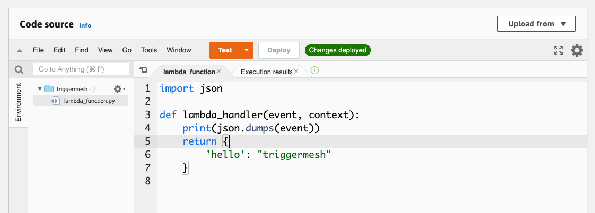

# Creating a Target

A `Target` is an API object defining an event receiver, processing that event and interacting with a third-party service. See the [concepts page](../concepts/targets.md) for details.

In this getting started guide on targets we are going to create a bridge between a `PingSource` and AWS Lambda. The source will emit an event on schedule and we will receive this event in an AWS Lambda function.


We will:

- [x] Write a simple AWS Lambda function
- [x] Write an `AWSLambdaTarget` object pointing to the function we created
- [x] Write a `PingSource` which will emit an event to the Target.

## Creating an AWS Lambda function

For full details with using the console follow these official [steps](https://docs.aws.amazon.com/lambda/latest/dg/getting-started-create-function.html).

Our function is writing in Python 3.9 and will print the payload of the incoming event to stdout.



This function is uniquely identified by its Amazon Resource Name (i.e ARN).

## Writing the `AWSLambdaTarget` specification

To learn how to write a Target the fastest way to explore the specification is to use `kubectl explain`. Looking specifically into the `spec` section we see that the ARN of the Lambda is needed

```console
$ kubectl explain awslambdatarget.spec
KIND:     AWSLambdaTarget
VERSION:  targets.triggermesh.io/v1alpha1

RESOURCE: spec <Object>

DESCRIPTION:
     Desired state of event target.

FIELDS:
   arn	<string>
     ARN of the Lambda function that will receive events. The expected format is
     documented at
     https://docs.aws.amazon.com/service-authorization/latest/reference/list_awslambda.html

   awsApiKey	<Object>
     API Key to interact with the Amazon Lambda API. For more information about
     AWS security credentials, please refer to the AWS General Reference at
     https://docs.aws.amazon.com/general/latest/gr/aws-security-credentials.html

   awsApiSecret	<Object>
     API Secret to interact with the Amazon Lambda API. For more information
     about AWS security credentials, please refer to the AWS General Reference
     at
     https://docs.aws.amazon.com/general/latest/gr/aws-security-credentials.html

   discardCloudEventContext	<boolean>
     Produce a new cloud event based on the response from the lambda function.
```

In addition to be able to interact with AWS you need to have your AWS API keys available. You can specify them literally in an object manifest but for better security you will want to use a Kubernetes secrets.

Create the following object by saving the YAML manifest in a file and using the `kubectl apply` command.

```yaml
apiVersion: targets.triggermesh.io/v1alpha1
kind: AWSLambdaTarget
metadata:
  name: lambda-guide
spec:
  arn: arn:aws:lambda:us-east-1:587264368683:function:triggermesh
  awsApiKey:
    secretKeyRef:
      key: access_key_id
      name: awscreds
  awsApiSecret:
    secretKeyRef:
      key: secret_access_key
      name: awscreds
  discardCloudEventContext: false
```

## Creating the event source

For the event source we use a `PingSource` which emits a CloudEvent every minute.

```yaml
apiVersion: sources.knative.dev/v1
kind: PingSource
metadata:
  name: ping-lambda
spec:
  data: '{"hello": "triggermesh"}'
  schedule: '*/1 * * * *'
  sink:
    ref:
      apiVersion: targets.triggermesh.io/v1alpha1
      kind: AWSLambdaTarget
      name: lambda-guide
```

Note the definition of the `sink` in the previous manifest. You see that it points to the `AWSLambdaTarget` created before.

## Verifying the Results

You can verify that your objects are ready:

```console
$ kubectl get pingsource
NAME               SINK                                                                      SCHEDULE      AGE     READY   REASON
ping-lambda        http://broker-ingress.knative-eventing.svc.cluster.local/sebgoa/default   */1 * * * *   7m52s   True    

$ kubectl get awslambdatarget
NAME          URL   READY   REASON               AGE
lambda-guide         True                         3m12s
```

Finally head over to the AWS Lambda console and see the logs of your Lambda. It will show the `{"hello": "triggermesh"}` string in the standard output.

## Full API Specification

All Targets object specification can be found in the API
[reference](../apis/targets.md).