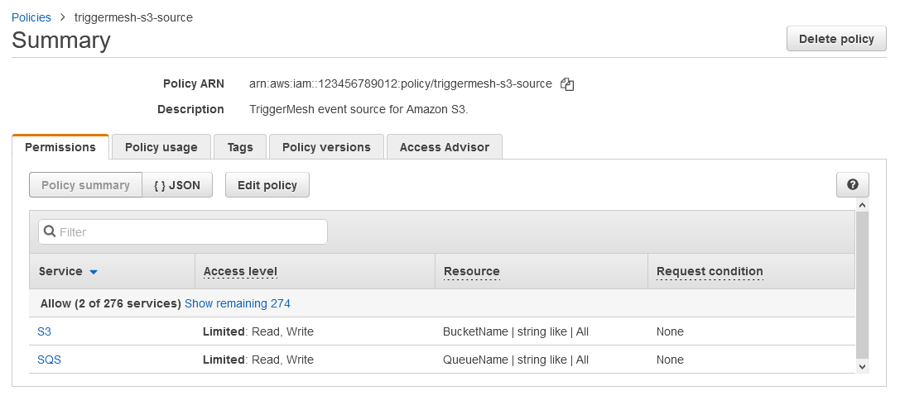

# AWS credentials

## Using an access key

You can use AWS Access Keys to authenticate to the AWS API from TriggerMesh components. The page
[Understanding and getting your AWS credentials][accesskey] contains instructions to create access keys when signed-in
either as the root user or as an IAM user. Take note of the **Access Key ID** and **Secret Access Key** which need to be provided to TriggerMesh.

Below is a quick summary of how to create an access key for a specific user in the AWS console:

1. Log in to the AWS console and open the IAM service
2. Select Users from the left menu, select the user you want
3. Open the security credentials tab and scroll down to the section called "Access keys"
4. Click on "Create access key", choose "Application running outside AWS" as the use case
5. Create the key, and make sure to copy the secret access key as it will only be visible once

It is considered a [good practice][iam-bestpractices] to create dedicated users with restricted privileges in order to
programmatically access AWS services. Permissions can be added or revoked granularly for a given IAM user by attaching
[IAM Policies][iam-policies] to it.

As an example, the following IAM policy contains only the permissions required by the [Amazon S3 event source](../../sources/awss3.md) to operate:

```json
{
    "Version": "2012-10-17",
    "Statement": [
        {
            "Sid": "S3SourceSetBucketConfig",
            "Effect": "Allow",
            "Action": [
                "s3:GetBucketNotification",
                "s3:PutBucketNotification"
            ],
            "Resource": "arn:aws:s3:::*"
        },
        {
            "Sid": "S3SourceConsumeMessages",
            "Effect": "Allow",
            "Action": [
                "sqs:GetQueueUrl",
                "sqs:ReceiveMessage",
                "sqs:DeleteMessage"
            ],
            "Resource": "arn:aws:sqs:*:*:*"
        }
    ]
}
```

There are cases in which additional permissions are required, such as when the TriggerMesh component manages other AWS resources on your behalf. For example, the S3 source uses an SQS queue under the hood to gather and consume S3 bucket notifications. You can either provide a reference to an existing queue that you created beforehand, or you can let TriggerMesh create it on your behalf by providing the following permissions:

```json
{
    "Version": "2012-10-17",
    "Statement": [
        {
            "Sid": "S3SourceGetBucketLocation",
            "Effect": "Allow",
            "Action": [
                "s3:GetBucketLocation"
            ],
            "Resource": "arn:aws:s3:::*"
        },
        {
            "Sid": "S3SourceManageQueue",
            "Effect": "Allow",
            "Action": [
                "sqs:CreateQueue",
                "sqs:DeleteQueue",
                "sqs:GetQueueAttributes",
                "sqs:SetQueueAttributes",
                "sqs:GetQueueUrl",
                "sqs:ListQueueTags",
                "sqs:TagQueue"
            ],
            "Resource": "arn:aws:sqs:*:*:*"
        }
    ]
}
```



## Using an IAM role from an EKS cluster

IAM Role authentication is supported for most TriggerMesh AWS sources and targets. Please make sure you are familier with the official AWS documentation on [IAM Roles](https://docs.aws.amazon.com/eks/latest/userguide/iam-roles-for-service-accounts.html) before proceeding.

Below is an example manifest that shows how to use it:

``` 
apiVersion: targets.triggermesh.io/v1alpha1
kind: AWS*
spec:
  ...
  auth:
    iamRole: arn:aws:iam::<redacted>:role/<role-name>
```

There are two simple steps required to configure authentication on the AWS side:

1. enable the OIDC provider for the EKS cluster 
2. create an IAM Role

There are different ways to achieve these steps, in this guide we'll use the CLI tools: `aws` and `eksctl` ([installation](https://docs.aws.amazon.com/eks/latest/userguide/eksctl.html)).
 
### Enable the OIDC provider
 
```
eksctl utils associate-iam-oidc-provider --cluster my-cluster --approve
```
 
We'll use AWS S3 target as an example in this guide. All other targets are configured in the same manner with corresponding resource updates in IAM policies.
 
Create an IAM policy file with full access to S3 bucket `test-bucket`:
 
```
cat >aws-s3-target-policy.json <<EOF
{
    "Version": "2012-10-17",
    "Statement": [
        {
            "Effect": "Allow",
            "Action": "*",
            "Resource": "arn:aws:s3:::test-bucket"
        }
    ]
}
EOF
```

Create the policy from the file:

```
aws iam create-policy --policy-name aws-s3-target-policy --policy-document file://aws-s3-target-policy.json
```

Set the account variables:

```
account_id=$(aws sts get-caller-identity --query "Account" --output text)
oidc_provider=$(aws eks describe-cluster --name <my-cluster> --region <aws-region> --query "cluster.identity.oidc.issuer" --output text | sed -e "s/^https:\/\///")
```

Replace `<my-cluster>` and `<aws-region>` with your EKS cluster values.

### Create the IAM role

Create role's trust relationship file:

```
cat >trust-relationship.json <<EOF
{
  "Version": "2012-10-17",
  "Statement": [
    {
      "Effect": "Allow",
      "Principal": {
        "Federated": "arn:aws:iam::$account_id:oidc-provider/$oidc_provider"
      },
      "Action": "sts:AssumeRoleWithWebIdentity",
      "Condition": {
        "StringEquals": {
          "${oidc_provider}:aud": "sts.amazonaws.com"
        }
      }
    }
  ]
}
EOF
```

Use the create role command as follows:

```
aws iam create-role --role-name aws-s3-target-role --assume-role-policy-document file://trust-relationship.json --description "TriggerMesh AWS S3 Target role"
```

This command should return a JSON object with the role details; the `ARN` field's value is what we'll use in our target later on.  

Attach the policy to the role as follows:

```
aws iam attach-role-policy --role-name aws-s3-target-role --policy-arn=arn:aws:iam::$account_id:policy/aws-s3-target-policy
```
 
### Create the AWS target

At this point, IAM configuration is done, and we can create AWS S3 Target using our new Role:

```
kubectl apply -f - <<EOF
apiVersion: targets.triggermesh.io/v1alpha1
kind: AWSS3Target
metadata:
  name: triggermesh-aws-s3-test
spec:
  adapterOverrides:
    public: true
  arn: arn:aws:s3:::test-bucket
  auth:
    iamRole: <role arn>
EOF
```

After the S3 target is created, it can be used as a Sink for other event sources or accessed directly via a public URL if the network's external endpoints are configured.

Head over [here](https://docs.aws.amazon.com/eks/latest/userguide/iam-roles-for-service-accounts.html) for more details from AWS on this topic.

Note that the configuration process (IAM policies, roles, resources) may vary depending on the AWS target used and cluster security requirements.

### Additional step when delegating AWS resource creation to TriggerMesh

In certain cases, TriggerMesh can create AWS resources on your behalf to simplify connecting to certain services. For example, with AWS S3, you can either provide the reference to an existing SQS queue that will used to gather S3 bucket notifications, or you can let the TriggerMesh component create the queue for you.

In the latter case, you need to add an annotation to the triggermesh-controller service account and restart the triggermesh-controller pod. 

You can achieve this with the following commands:
```
kubectl -n triggermesh patch sa triggermesh-controller \
  --type merge \
  --patch '{"metadata":{"annotations":{"eks.amazonaws.com/role-arn": "<IAM_ROLE_ARN>"}}}'
```

```
kubectl -n triggermesh rollout restart deployment triggermesh-controller
```

This will allow the TriggerMesh controller to use the new IAM role to manage AWS resources on your behalf, such as an SQS queue in the case of the AWS S3 source connector.

## Assume an IAM role for cross-account IAM impersonation

A cross-account IAM role can be defined as follows:

```yaml
  ...
  auth:
    credentials:
      accessKeyID:
        value: <redacted>
      secretAccessKey:
        value: <redacted>
      assumeIamRole: <redacted>
```

In this case, the access key is used by the TriggerMesh controller to create a client session, and then the `assumeIamRole` is be used by the connector in question (such as AWSS3Source) to gain IAM permissions. 

An STS trust relationship configuration is required on IAM (see the previous section for details on how to set this up).

Cross-account IAM impersonation is useful for instance when multiple teams want to use a specific IAM Role with distinct credentials, including the one being used by the controller itself.

[accesskey]: https://docs.aws.amazon.com/general/latest/gr/aws-sec-cred-types.html#access-keys-and-secret-access-keys
[iam-bestpractices]: https://docs.aws.amazon.com/general/latest/gr/aws-access-keys-best-practices.html#iam-user-access-keys
[iam-policies]: https://docs.aws.amazon.com/IAM/latest/UserGuide/access_policies.html
