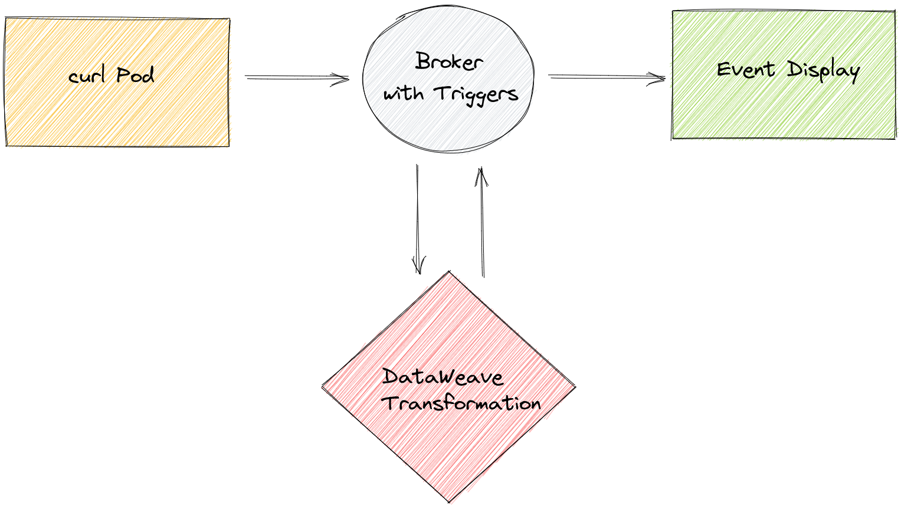

# Transforming using DataWeave
The TriggerMesh `DataWeaveTransformation` API object can be used to process a Cloudevent containing JSON or XML and transform the document using [DataWeave](https://docs.mulesoft.com/mule-runtime/3.9/dataweave).

This guide shows you how to configure an event flow that transforms an incoming CloudEvent in XML by parsing it with a DataWeave Spell. It has five steps:

* Deploy a Broker that will receive the transformed data.
* Deploy the `EventDisplay` service.
* Deploy the `DataWeaveTransformation` object.
* Configure the [Triggers](https://knative.dev/docs/eventing/broker/triggers/)
* Deploy a curl pod that will allow us to send events to the broker.

## How to use a DataWeaveTransformation

A `DataWeaveTransformation` object can be configured to either reply to the event sender or to send the 
transformed data to a `Sink`, if one is provided. In this guide, we will deploy without a `Sink` and 
configure the replies from the transformation to route to the `EventDisplay` service using a `Broker` and a `Trigger`.

The `DataWeaveTransformation` can have a pre-defined parameters configured in the YAML but it also allows to send the parameters as part of the request. In this guide we will use both ways; we will configure the pre-defined parameters in the YAML but we will also use other parameters in the request, which is made possible by enabling the `allowPerEventDwSpell` parameter.

## DataWeaveTransformation parameters

- allowPerEventDwSpell: Allow to send the DataWeaveSpell as part of the request. (Optional)
- dwSpell: DataWeave spell used to transform incoming CloudEvents. (Optional)
- inputContentType: Content type for transformation ['application/json', 'application/xml']. (Optional)
- outputContentType: Content type for transformation output. ['application/json', 'application/xml']. (Optional)

Below is a sample DataWeave spell that will be used throughout the guide.
```
%dw 2.0
output application/json
---
{
    email: payload.order.buyer.email,
    name: payload.order.buyer.name,
}
```

It transforms the following XML:
```xml
<order>
	<product>
		<price>5</price>
		<model>Company 2020</model>
	</product>
	<item_amount>3</item_amount>
	<payment>
		<payment-type>credit-card</payment-type>
		<currency>USD</currency>
		<installments>1</installments>
	</payment>
	<buyer>
		<email>james@hotmail.com</email>
		<name>James</name>
		<address>Cocodrile Boulevard 61</address>
		<city>Seattle</city>
		<state>CA</state>
		<postCode>98101</postCode>
		<nationality>USA</nationality>
	</buyer>
	<shop>main branch</shop>
	<salesperson>Liam Smith</salesperson>
</order>
```

Into this new JSON document:
```json
{
  "email": "james@hotmail.com",
  "name": "James"
}
```

Let's go step by step to see how we can deploy this transformation as part of a TriggerMesh Bridge.

Below is a diagram of the Bridge we will construct.



## Deploy the Broker
Deploy a Broker by writing the following YAML in a file:
```yaml
apiVersion: eventing.knative.dev/v1
kind: Broker
metadata:
  name: demo
```

Create the Broker with the following command:
```console
kubectl apply -f <manifest.yaml>
```

## Deploying the `EventDisplay` Service
Let's now deploy the end of our event flow. The `EventDisplay` is a simple application that can be used to display CloudEvents. It can 
be deployed by writing the following YAML in a file and using `kubectl apply -f <manifest.yaml>`:

```yaml
apiVersion: serving.knative.dev/v1
kind: Service
metadata:
    name: event-display
spec:
  template:
    spec:
      containers:
        - image: gcr.io/knative-releases/knative.dev/eventing/cmd/event_display
```

## Deploy the `DataWeaveTransformation` Object
With the `event-display` in place, the `DataWeaveTransformation` object can now be deployed in the same manner using the following manifest. It contains an inline DataWeave spell that will be used by default but can be overridden by passing a spell in the CloudEvent payload.

```yaml
apiVersion: flow.triggermesh.io/v1alpha1
kind: DataWeaveTransformation
metadata:
  name: demo
spec:
  allowPerEventDwSpell: true
  dwSpell:
    value: |-
      %dw 2.0
      output application/json
      ---
      {
          email: payload.order.buyer.email,
          name: payload.order.buyer.name,
      }
  inputContentType: application/xml
  outputContentType: application/json
```

## Configure the Triggers
Next, Triggers need to be configured to route our Cloudevents to the `DataWeaveTransformation` and `EventDisplay` objects. This can be done by writing the following YAML in a file and using `kubectl apply -f <manifest.yaml>`. We have two triggers, one to send events containing XML to the transformation and one to send all events to the event display.

```yaml
kind: Trigger
apiVersion: eventing.knative.dev/v1
metadata:
  name: event-display
spec:
  broker: demo
  subscriber:
    ref:
      apiVersion: serving.knative.dev/v1
      kind: Service
      name: event-display
---
kind: Trigger
apiVersion: eventing.knative.dev/v1
metadata:
  name: dataweavetransformation-xmldoc
spec:
  broker: demo
  filter:
    attributes:
      # setting a filter to process only events of type `xml.document`
      type: xml.document
  subscriber:
    ref:
      apiVersion: flow.triggermesh.io/v1alpha1
      kind: DataWeaveTransformation
      name: demo
```

## Deploy a Curl Pod
Finally, an event source can be deployed that will emit CloudEvents with XML data in the payload. We can do this in two steps:

    1. Deploy a curl pod that will emit the CloudEvents by writing the following YAML in a file and apply it with `kubectl apply -f <manifest.yaml>`.

```yaml
apiVersion: v1
kind: Pod
metadata:
  labels:
    run: curl
  name: curl
spec:
  containers:
  - image: radial/busyboxplus:curl
    imagePullPolicy: IfNotPresent
    name: curl
    stdin: true
    tty: true
```

    2. Execute the following command to emit a cloudevent to the broker we created: 
    
```cmd
kubectl exec -ti curl -- curl -v "http://broker-ingress.knative-eventing.svc.cluster.local/default/demo" \
  -H "Ce-Specversion: 1.0" \
  -H "Ce-Type: xml.document" \
  -H "Ce-Source: curl.shell" \
  -H "Content-Type: application/xml" \
  -H "Ce-Id: 1234-abcd" \
  -d '<?xml version="1.0"?>
<order><product><price>5</price><model>Company 2020</model></product><item_amount>3</item_amount><payment><payment-type>credit-card</payment-type><currency>USD</currency><installments>1</installments></payment><buyer><email>james@hotmail.com</email><name>James</name><address>Cocodrile Boulevard 61</address><city>Seattle</city><state>CA</state><postCode>98101</postCode><nationality>USA</nationality></buyer><shop>main branch</shop><salesperson>Liam Smith</salesperson></order>'
```


## Viewing the Transformation's Output in the Event Display
With our event flow in place, we can now view the transformed data in the `EventDisplay`.

We need to retrieve the `EventDisplay` Pod name by running the following command:

```cmd
kubectl get pods                                                          
NAME                                                   READY   STATUS    RESTARTS   AGE
curl                                                   1/1     Running   0          4m36s
event-display-00001-deployment-fb48c8d7c-g7bmv        2/2     Running   0          3s
dataweavetransformation-demo-00001-deployment-7978655d45-jsfbr   2/2     Running   0          3s
```
With the Pod name, we can run the following command to view the transformed data in the `EventDisplay` Pod logs:

```cmd
kubectl logs event-display-00001-deployment-fb48c8d7c-g7bmv user-container
☁️  cloudevents.Event
Context Attributes,
  specversion: 1.0
  type: xml.document
  source: curl.shell
  id: 1234-abcd
  datacontenttype: application/xml
Extensions,
  knativearrivaltime: 2022-05-09T10:32:43.32759997Z
Data,
  <?xml version="1.0"?>
<order><product><price>5</price><model>Company 2020</model></product><item_amount>3</item_amount><payment><payment-type>credit-card</payment-type><currency>USD</currency><installments>1</installments></payment><buyer><email>james@hotmail.com</email><name>James</name><address>Cocodrile Boulevard 61</address><city>Seattle</city><state>CA</state><postCode>98101</postCode><nationality>USA</nationality></buyer><shop>main branch</shop><salesperson>Liam Smith</salesperson></order>
☁️  cloudevents.Event
Context Attributes,
  specversion: 1.0
  type: xml.document.response
  source: curl.shell
  id: 1234-abcd
  time: 2022-05-09T10:32:44.697405628Z
  datacontenttype: application/json
Extensions,
  knativearrivaltime: 2022-05-09T10:32:44.699348327Z
Data,
  {
    "email": "james@hotmail.com",
    "name": "James"
  }
```

We now see the incoming event and the transformed data, as expected. 


## Sending the parameters in the request.
Now we can try passing parameters such as the DataWeave spell and input and output content types as part of the Cloud Event.

    1. Execute the following command to emit a cloudevent to the broker we created: 
    
```cmd
kubectl exec -ti curl -- curl -v "http://broker-ingress.knative-eventing.svc.cluster.local/default/demo" \
  -H "Ce-Specversion: 1.0" \
  -H "Ce-Type: xml.document" \
  -H "Ce-Source: curl.shell" \
  -H "Content-Type: application/json" \
  -H "Ce-Id: 1234-abcd" \
  -d '{
  "input_data": "<order><product><price>5</price><model>Company 2020</model></product><item_amount>3</item_amount><payment><payment-type>credit-card</payment-type><currency>USD</currency><installments>1</installments></payment><buyer><email>james@hotmail.com</email><name>James</name><address>Cocodrile Boulevard 61</address><city>Seattle</city><state>CA</state><postCode>98101</postCode><nationality>USA</nationality></buyer><shop>main branch</shop><salesperson>Liam Smith</salesperson></order>",
  "spell": "{address1:payload.order.buyer.address,city:payload.order.buyer.city,country:payload.order.buyer.nationality,email:payload.order.buyer.email,name:payload.order.buyer.name,postalCode:payload.order.buyer.postCode,stateOrProvince:payload.order.buyer.state}",
  "input_content_type": "application/xml",
  "output_content_type": "application/json"
}'
```


## Viewing the Transformation's Output in the Event Display
```cmd
kubectl logs event-display-00001-deployment-fb48c8d7c-2h444 user-container
☁️  cloudevents.Event
Context Attributes,
  specversion: 1.0
  type: xml.document
  source: curl.shell
  id: 1234-abcd
  datacontenttype: application/json
Extensions,
  knativearrivaltime: 2022-05-09T10:39:47.80922913Z
Data,
  {
    "input_data": "<order><product><price>5</price><model>Company 2020</model></product><item_amount>3</item_amount><payment><payment-type>credit-card</payment-type><currency>USD</currency><installments>1</installments></payment><buyer><email>james@hotmail.com</email><name>James</name><address>Cocodrile Boulevard 61</address><city>Seattle</city><state>CA</state><postCode>98101</postCode><nationality>USA</nationality></buyer><shop>main branch</shop><salesperson>Liam Smith</salesperson></order>",
    "spell": "{address1:payload.order.buyer.address,city:payload.order.buyer.city,country:payload.order.buyer.nationality,email:payload.order.buyer.email,name:payload.order.buyer.name,postalCode:payload.order.buyer.postCode,stateOrProvince:payload.order.buyer.state}",
    "input_content_type": "application/xml",
    "output_content_type": "application/json"
  }
☁️  cloudevents.Event
Context Attributes,
  specversion: 1.0
  type: xml.document.response
  source: curl.shell
  id: 1234-abcd
  time: 2022-05-09T10:39:47.852857516Z
  datacontenttype: application/json
Extensions,
  knativearrivaltime: 2022-05-09T10:39:47.86469464Z
Data,
  {
    "address1": "Cocodrile Boulevard 61",
    "city": "Seattle",
    "country": "USA",
    "email": "james@hotmail.com",
    "name": "James",
    "postalCode": "98101",
    "stateOrProvince": "CA"
  }
```

We now see the incoming event and the transformed data, as expected with the parameters set in the request.

