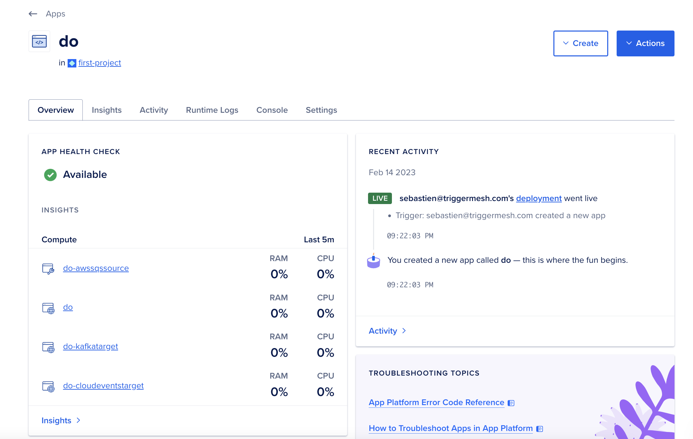
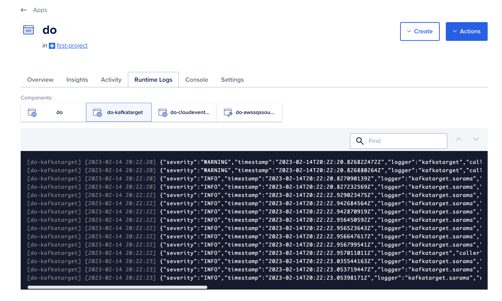

# Deploy to DO App Platform

With a Broker and associated components that are running successfully locally you are ready to deploy them on DO App Platform.

First, stop the local Broker to avoid duplicating consumers.

```console
tmctl stop
```

You can verify that all the components are stopped and that no containers are running

```console
docker ps
```

## Generate the App Spec and Create the App

You can generate the DO App Spec with `tmctl` and pipe it directly to `doctl` like so:

```console
tmctl dump -p digitalocean
tmctl dump -p digitalocean | doctl apps create --spec -
```

!!! Tip
    The `tmctl dump` command will generate Kubernetes manifests that you can use on a Kubernetes cluster that runs TriggerMesh. The `tmctl dump -p docker-compose` will generate a Docker compose file. Additional options are available to configure the generated manifests.

    ```console
    $ tmctl dump --help
    ```

## View the App on DO

Head over to the DO App Platform console, you will see an App named with the name of your local broker. Each TriggerMesh component will be running as separate container like locally.



You can select the _Runtime Logs_ tab and you will see the logs of each container.




## Manage the App

You can manage the App via the DO console like any other App, and you can manage it via the `doctl` client as well.

```console
doctl apps list
ID                                      Spec Name    Default Ingress    Active Deployment ID                    In Progress Deployment ID    Created At                       Updated At
954ab2c0-26cf-4fba-8ef5-de52d8b7c99c    do                              93b34e5b-439e-4d9b-8ee6-193d481d3904                                 2023-02-14 20:22:03 +0000 UTC    2023-02-14 20:22:25 +0000 UTC

doctl apps delete 954ab2c0-26cf-4fba-8ef5-de52d8b7c99c
❯ Are you sure you want to delete this App? yes
```

Once you have deleted your App in DO, you can restart your Pipe locally

```console
tmctl start
2023/02/14 21:31:48 do | Starting broker
2023/02/14 21:31:49 do | Starting do-kafkatarget
2023/02/14 21:31:49 do | Starting do-awssqssource
2023/02/14 21:31:50 do | Starting do-cloudeventstarget
```
