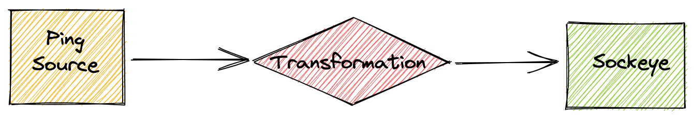
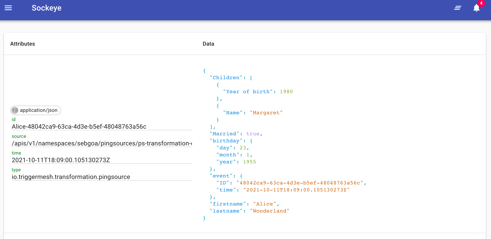

# Doing a Transformation

The `Transformation` object in TriggerMesh defines a set of operations that are
sequentially applied to incoming CloudEvents. In this guide, we will create a
simple Bridge with an event producer and a transformation to see the declarative syntax that is used for modifying events.

!!! tip
    You can verify that the API is available with the following command:

    ```console
    $ kubectl get crd transformations.flow.triggermesh.io
    NAME                                  CREATED AT
    transformations.flow.triggermesh.io   2021-10-06T09:01:40Z
    ```
    
    You can also explore the API specification with:
    ```console
    $ kubectl explain transformation
    ```




Let's create all the required objects:

- [x] The sockeye target which serves as an event display.
- [x] The `PingSource` which serves as an event producer.
- [x] The `Transformation` to modify the produced events.

## Event display

First of all, we need to have a tool to see the transformed events. Create a `sockeye`
service by saving the following YAML manifest in a file called `sockeye.yaml` and applying it to your Kubernetes cluster:

```yaml
apiVersion: serving.knative.dev/v1
kind: Service
metadata:
  name: sockeye
spec:
  template:
    spec:
      containers:
        - image: docker.io/n3wscott/sockeye:v0.7.0@sha256:e603d8494eeacce966e57f8f508e4c4f6bebc71d095e3f5a0a1abaf42c5f0e48
```

```
kubectl apply -f sockeye.yaml
```

Open the web interface in a browser at the URL that you find with the following command:

```shell
$ kubectl get ksvc sockeye -o=jsonpath='{.status.url}'
```

## Events producer

Next, we need to create a
[PingSource](https://knative.dev/docs/developer/eventing/sources/ping-source) to
produce CloudEvents by saving the following YAML manifests in a file and applying it to your Kubernetes cluster with `kubectl apply`:

```yaml
apiVersion: sources.knative.dev/v1
kind: PingSource
metadata:
  name: ps-transformation-demo
spec:
  schedule: "*/1 * * * *"
  contentType: "application/json"
  data: '{
    "First Name": "Alice",
    "Last Name": "Wonderland",
    "Date of birth": {
      "year": 1955,
      "month": 1,
      "day" : 23
    },
    "Married": true,
    "Children":
    [
        {"Name": "Martin", "Year of birth": 1980},
        {"Name": "Margaret", "Year of birth": 1983}
    ],
    "Mobile phone": null
  }'
  sink:
    ref:
      apiVersion: flow.triggermesh.io/v1alpha1
      kind: Transformation
      name: trn-transformation-demo
```

## Transformation

And finally the transformation object that will receive CloudEvents from
the PingSource defined above, apply its operations and forward modified events to
the `sockeye` service:

```yaml
apiVersion: flow.triggermesh.io/v1alpha1
kind: Transformation
metadata:
  name: trn-transformation-demo
spec:
  sink:
    ref:
      apiVersion: serving.knative.dev/v1
      kind: Service
      name: sockeye

  context:
  - operation: store
    paths:
    - key: $time
      value: time
    - key: $id
      value: id
  - operation: add
    paths:
    - key: id
      value: $person-$id
    - key: type
      value: io.triggermesh.transformation.pingsource

  data:
  - operation: store
    paths:
    - key: $person
      value: First Name
  - operation: add
    paths:
    - key: event.ID
      value: $id
    - key: event.time
      value: $time
  - operation: shift
    paths:
    - key: Date of birth:birthday
    - key: First Name:firstname
    - key: Last Name:lastname
  - operation: delete
    paths:
    - key: Mobile phone
    - key: Children[1].Year of birth
    - value: Martin
```

Once created with `kubectl apply` verify that the transformation is ready:

```console
$ kubectl get transformation -w
NAME                      ADDRESS                                                   READY   REASON
trn-transformation-demo   http://trn-transformation-demo.sebgoa.svc.cluster.local   True
```

If all the components of the Bridge are ready, the `sockeye` web interface will start showing modified events shortly:



You will notice that the CloudEvent attributes have beeen modified according to the `context` section in the specification of the `Transformation` object. The event type was modified and the `id` was prepended with the string `Alice`.

The payload was also transformed according to the `data` section of the `Transformation` object. For example the mobile phone was deleted, a key `event` was added and a few keys were _shifted_: "Date of Birth" became "birthday".

!!! tip "Play with your Transformation as Code"
    You can play around by modifying the `Transformation` object and re-applying it with `kubectl`. This gives you a declarative event transformer which you can manage with your [GitOps workflow](https://www.weave.works/technologies/gitops/).

## More about Transformations

Learn more about Transformations on the [Concepts page](../concepts/transformation.md).
