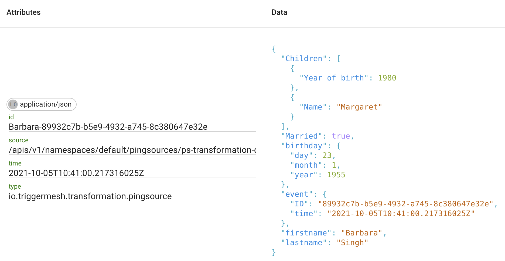

# Doing a Transformation

The Transformation object in TriggerMesh defines a set of operations that are
sequentially applied to incoming CloudEvents. In this guide, we will create a
simple flow with an event producer and transformation to see the declarative syntax
that is used for modifying events.

## Prerequisites

1. K8s cluster and configured kubectl
1. [Knative Serving and Eventing Operators](https://knative.dev/docs/admin/install/knative-with-operators/)
1. [TriggerMesh Bumblebee](https://github.com/triggermesh/bumblebee)

## Event display

Before we begin to produce and transform events we need to have a tool to see
results. Create a `sockeye` service:

```yaml
apiVersion: serving.knative.dev/v1
kind: Service
metadata:
  name: sockeye
spec:
  template:
    spec:
      containers:
        - image: docker.io/n3wscott/sockeye:v0.7.0@sha256:e603d8494eeacce966e57f8f508e4c4f6bebc71d095e3f5a0a1abaf42c5f0e48
```

Open the web interface in a browser:

```shell
browse $(kubectl get ksvc sockeye -o=jsonpath='{.status.url}')
```

## Events producer

Next, we need to create a
[PingSource](https://knative.dev/docs/developer/eventing/sources/ping-source) to
produce CloudEvents:

```yaml
apiVersion: sources.knative.dev/v1
kind: PingSource
metadata:
  name: ps-transformation-demo
spec:
  schedule: "*/1 * * * *"
  contentType: "application/json"
  data: '{
    "First Name": "Barbara",
    "Last Name": "Singh",
    "Date of birth": {
      "year": 1955,
      "month": 1,
      "day" : 23
    },
    "Married": true,
    "Children":
    [
        {"Name": "Martin", "Year of birth": 1980},
        {"Name": "Margaret", "Year of birth": 1983}
    ],
    "Mobile phone": null
  }'
  sink:
    ref:
      apiVersion: flow.triggermesh.io/v1alpha1
      kind: Transformation
      name: trn-transformation-demo
```

## Transformation

And finally the transformation object that will receive CloudEvents from
the PingSource defined above, apply its operations and forward modified events to
the `sockeye` service:

```yaml
apiVersion: flow.triggermesh.io/v1alpha1
kind: Transformation
metadata:
  name: trn-transformation-demo
spec:
  sink:
    ref:
      apiVersion: serving.knative.dev/v1
      kind: Service
      name: sockeye

  context:
  - operation: store
    paths:
    - key: $time
      value: time
    - key: $id
      value: id
  - operation: add
    paths:
    - key: id
      value: $person-$id
    - key: type
      value: io.triggermesh.transformation.pingsource

  data:
  - operation: store
    paths:
    - key: $person
      value: First Name
  - operation: add
    paths:
    - key: event.ID
      value: $id
    - key: event.time
      value: $time
  - operation: shift
    paths:
    - key: Date of birth:birthday
    - key: First Name:firstname
    - key: Last Name:lastname
  - operation: delete
    paths:
    - key: Mobile phone
    - key: Children[1].Year of birth
    - value: Martin
```

If all the components were created correctly, the `sockeye` web interface will start
showing modified events shortly:



More Transformation examples and specifications are available
[here](https://github.com/triggermesh/bumblebee#readme).
