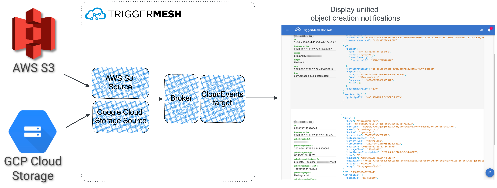
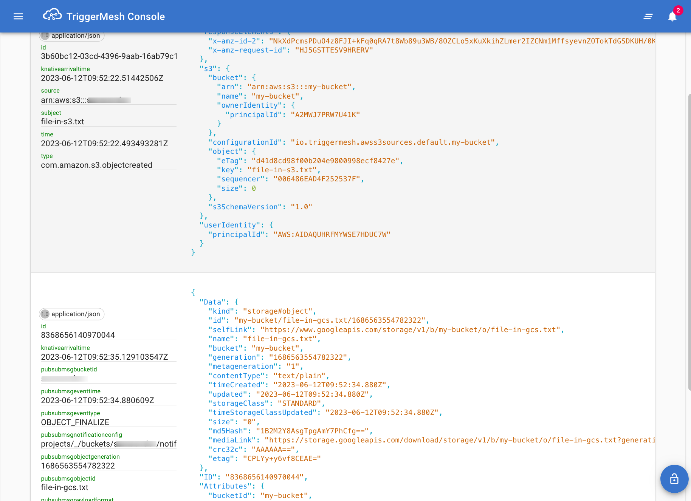

# Using TriggerMesh with Tanzu Application Platform

VMware Tanzu Application Platform is a packaged set of components that helps developers and operators to more easily build, deploy, and manage apps on a Kubernetes platform. Since version 1.5, Tanzu Application Platform includes eventing sources for AWS, Azure and Google Cloud Platform developed by TriggerMesh.

In this guide you will deploy Tanzu Application Platform on a Google Kubernetes Engine (GKE) cluster, followed by creating a Knative eventing pipeline utilizing the TriggerMesh event sources packaged with  Tanzu Application Platform.

Please note that this guide contains a subset of Tanzu Application Platform installation information documented in [official installation guide](https://docs.vmware.com/en/VMware-Tanzu-Application-Platform/1.5/tap/install-intro.html) and is not intended to be a replacement for the official documentation.

## Create the GKE Cluster

Refer to the [resource requirements](https://docs.vmware.com/en/VMware-Tanzu-Application-Platform/1.5/tap/prerequisites.html#resource-requirements-4) section for a better understanding of Tanzu Application Platform cluster requirements.

Begin by setting up a GKE cluster with sufficient cluster resources for deploying Tanzu Application Platform:

```bash
gcloud container clusters create tap-cluster --num-nodes=5 --machine-type=e2-standard-4
```

After the cluster has been created, the Kubernetes context is automatically updated so that `kubectl` can interact with the newly created cluster.

## Install Tanzu Application Platform

### Prerequisites

To install Tanzu Application Platform you need a [VMWare Tanzu Network](https://network.tanzu.vmware.com) account to download the container images as well as other tools required in the installation process. You will also need a Docker registry with read and write access. You can use any registry of your choice such as [Docker Hub](https://hub.docker.com), [GCR](https://gcr.io) and so on. Additionally you will also need to set up a wildcard DNS record at your Domain registrar, make sure you have the required access.

Sign in to your [VMWare Tanzu Network](https://network.tanzu.vmware.com/) account and [accept the EULA's](https://docs.vmware.com/en/VMware-Tanzu-Application-Platform/1.5/tap/install-tanzu-cli.html#accept-the-end-user-license-agreements-0) for Tanzu Application Platform and [Cluster Essentials for Tanzu](https://network.tanzu.vmware.com/products/tanzu-cluster-essentials/). 
After accepting the EULA's, install the _Tanzu CLI and plugins_ package as described [here](https://docs.vmware.com/en/VMware-Tanzu-Application-Platform/1.5/tap/install-tanzu-cli.html#install-or-update-the-tanzu-cli-and-plugins-3) followed by installing the _Cluster Essentials for VMware Tanzu_ package for your platform using [these instructions](https://docs.vmware.com/en/Cluster-Essentials-for-VMware-Tanzu/1.5/cluster-essentials/deploy.html#id=%22-download-artifacts-from-tanzu-network-3%22).

### Deploy the Cluster Essentials

After completing the prequisites, deploy the _VMWare Cluster Essentials_ to the Kubernetes cluster using the following commands.

```bash
export INSTALL_BUNDLE=registry.tanzu.vmware.com/tanzu-cluster-essentials/cluster-essentials-bundle@sha256:c7b0988cf3e982625287b241db5d78c30780886dfe9ada01559bb5cd341e6181
export INSTALL_REGISTRY_HOSTNAME=registry.tanzu.vmware.com
export INSTALL_REGISTRY_USERNAME=TANZU-NET-USER
export INSTALL_REGISTRY_PASSWORD=TANZU-NET-PASSWORD
cd $HOME/tanzu-cluster-essentials
./install.sh --yes
```

Remember to update `TANZU-NET-USER` and `TANZU-NET-PASSWORD` with your VMWare Tanzu Network credentials.

### Install Tanzu Application Platform package

Set up the following environment variables:

```bash
export IMGPKG_REGISTRY_HOSTNAME_0=registry.tanzu.vmware.com
export IMGPKG_REGISTRY_USERNAME_0=TANZU-NET-USER
export IMGPKG_REGISTRY_PASSWORD_0=TANZU-NET-PASSWORD
export IMGPKG_REGISTRY_HOSTNAME_1=MY-REGISTRY
export IMGPKG_REGISTRY_USERNAME_1=MY-REGISTRY-USER
export IMGPKG_REGISTRY_PASSWORD_1=MY-REGISTRY-PASSWORD
export INSTALL_REGISTRY_HOSTNAME=MY-REGISTRY
export INSTALL_REGISTRY_USERNAME=MY-REGISTRY-USER
export INSTALL_REGISTRY_PASSWORD=MY-REGISTRY-PASSWORD
export TAP_VERSION=1.5.1
export INSTALL_REPO=TARGET-REPOSITORY
```

- `TANZU-NET-USER` and `TANZU-NET-PASSWORD` are the VMWare Tanzu Network account credentials
- `MY-REGISTRY` is your container registry location, fe. `gcr.io`
- `MY-REGISTRY-USER` and `MY-REGISTRY-PASSWORD` are the registry credentials
- `TARGET-REPOSITORY` is the target repository on `MY-REGISTRY`, fe. `project/tanzu`

If you are using the Google Container Registry, the value of `IMGPKG_REGISTRY_HOSTNAME_1` should be `_json_key` and the value of `IMGPKG_REGISTRY_PASSWORD_1` would be the content of the JSON key file.

In the next step, you will be relocating the Tanzu Container images to your container image registry:

```bash
imgpkg copy \
  --bundle registry.tanzu.vmware.com/tanzu-application-platform/tap-packages:${TAP_VERSION} \
  --to-repo ${INSTALL_REGISTRY_HOSTNAME}/${INSTALL_REPO}/tap-packages
```

After the container images have been relocated to your image registry, create a namespace named `tap-install`:

```bash
kubectl create ns tap-install
```

Create a secret named `tap-registry` with the access credentials to the registry with the Tanzu container images:

```bash
tanzu secret registry add tap-registry \
  --server   ${INSTALL_REGISTRY_HOSTNAME} \
  --username ${INSTALL_REGISTRY_USERNAME} \
  --password ${INSTALL_REGISTRY_PASSWORD} \
  --namespace tap-install \
  --export-to-all-namespaces \
  --yes
```

Create another secret named `registry-credentials` with access credentials to internal registry:

```bash
tanzu secret registry add registry-credentials \
  --server   ${INSTALL_REGISTRY_HOSTNAME} \
  --username ${INSTALL_REGISTRY_USERNAME} \
  --password ${INSTALL_REGISTRY_PASSWORD} \
  --namespace tap-install \
  --export-to-all-namespaces \
  --yes
```

Add the Tanzu Application Platform package repository to the cluster:

```bash
tanzu package repository add tanzu-tap-repository \
  --url ${INSTALL_REGISTRY_HOSTNAME}/${INSTALL_REPO}/tap-packages:$TAP_VERSION \
  --namespace tap-install
```

The Tanzu Application Platform profile provided below has the minimum configuration required to deploy Tanzu Application Platform. Refer to the [Full Profile](https://docs.vmware.com/en/VMware-Tanzu-Application-Platform/1.5/tap/install-online-profile.html#full-profile-3) sample to understand and configure the parameters as per your needs.

Create a file named `tap-values.yaml` with the following content:

```yaml
shared:
  ingress_domain: "INGRESS-DOMAIN"

  image_registry:
    project_path: "SERVER-NAME/REPO-NAME"
    secret:
      name: "registry-credentials"
      namespace: "tap-install"

kubernetes_version: "K8S-VERSION"

ceip_policy_disclosed: true
profile: full
```

- `INGRESS-DOMAIN` is the ingress hostname (fe. `tanzu.example.com`) that points at the external IP address of the `tanzu-shared-ingress` service. You will be creating the DNS record after completing the installation.
- `K8S-VERSION` is the Kubernetes version in use, fe. `1.25.8`.
- `SERVER-NAME/REPO-NAME` is the target repository on your registry, fe. `project/tanzu`.

You can now deploy the Tanzu Application Platform package to the cluster with:

```bash
tanzu package install tap -p tap.tanzu.vmware.com -v ${TAP_VERSION} \
  --values-file tap-values.yaml -n tap-install
```

Please be patient while the Tanzu Application Platform package is being deployed. The command may return with a **Reconcile failed** message, however remain patient it could take more than 45 minutes for the reconciliation to succeed.

Execute the following command to check the status of the package:

```bash
tanzu package installed get tap -n tap-install
NAMESPACE:          tap-install
NAME:               tap
PACKAGE-NAME:       tap.tanzu.vmware.com
PACKAGE-VERSION:    1.5.1
STATUS:             Reconcile succeeded
CONDITIONS:         - type: ReconcileSucceeded
  status: "True"
  reason: ""
  message: ""
```

Retrieve this External IP address of the `envoy` service that the shared `tanzu-system-ingress` uses: 

```bash
kubectl -n tanzu-system-ingress get svc envoy
NAME    TYPE           CLUSTER-IP    EXTERNAL-IP     PORT(S)                      AGE
envoy   LoadBalancer   10.52.12.49   34.83.226.138   80:32262/TCP,443:31059/TCP   101m
```

Finally, you need to set up a wildcard DNS record  (fe. `*.tanzu.example.com`) for the `INGRESS-DOMAIN` configured in `tap-values.yaml` that points to the external IP address of the `envoy` service.

## Deploy TriggerMesh Sources

TriggerMesh eventing sources for AWS, Azure and Google Cloud Platform are bundled with Tanzu Application Platform.

Use the following command to confirm that the `triggermesh-controller` is running:

```bash
kubectl -n triggermesh get deploy
NAME                     READY   UP-TO-DATE   AVAILABLE   AGE
triggermesh-controller   1/1     1            1           69m
```

To see the TriggerMesh sources in action, you would be creating knative eventing pipeline similar to the one described in the TriggerMesh [Multicloud object storage notifications](https://www.triggermesh.com/blog/multicloud-object-storage-notifications) blog post.



In essence, you are going to:

1. Create the `Broker`
1. Create the `AWSS3Source`
1. Create the `GoogleCloudStorageSource`
1. Deliver unified events to an event display `Service`

### Create a Broker

Create a file named `broker.yaml` containing the manifest for creating a [Broker](https://knative.dev/docs/eventing/brokers/) as shown below:

```yaml
apiVersion: eventing.knative.dev/v1
kind: Broker
metadata:
  name: default
```

Deploy the broker using the command:

```bash
kubectl apply -f broker.yaml
```

Verify that a broker named `default` is successfully created:

```bash
kubectl get broker default
NAME      URL                                                                        AGE   READY   REASON
default   http://broker-ingress.knative-eventing.svc.cluster.local/default/default   13s   True
```

### Create the AWSS3Source

To create a [AWSS3Source](https://docs.triggermesh.io/latest/sources/awss3/), the prerequisites are:

- an [AWS IAM access key](https://docs.aws.amazon.com/IAM/latest/UserGuide/security-creds.html#access-keys-and-secret-access-keys) to authenticate with S3
- an AWS S3 bucket `ARN`

Once you have those, create a [Secret](https://kubernetes.io/docs/concepts/configuration/secret/) named `awscreds` containing the AWS credentials:

```bash
kubectl create secret generic awscreds \
  --from-literal=aws_access_key_id=AWS_ACCESS_KEY_ID \
  --from-literal=aws_secret_access_key=AWS_SECRET_ACCESS_KEY
```

- `AWS_ACCESS_KEY_ID` and `AWS_SECRET_ACCESS_KEY ` are the AWS credentials

Next, create a file named `awss3source.yaml` containing the manifest to create the `AWSS3Source` object:

```yaml
apiVersion: sources.triggermesh.io/v1alpha1
kind: AWSS3Source
metadata:
  name: my-bucket
spec:
  arn: AWS_S3_BUCKET_ARN

  eventTypes:
  - s3:ObjectCreated:*
  - s3:ObjectRemoved:*

  auth:
    credentials:
      accessKeyID:
        valueFromSecret:
          name: awscreds
          key: aws_access_key_id
      secretAccessKey:
        valueFromSecret:
          name: awscreds
          key: aws_secret_access_key

  sink:
    ref:
      apiVersion: eventing.knative.dev/v1
      kind: Broker
      name: default
```

- `AWS_S3_BUCKET_ARN` is the ARN of the S3 bucket

Deploy the `AWSS3Source` object:

```bash
kubectl apply -f awss3source.yaml
```

Verify that the object is created successfully:

```bash
kubectl get awss3source my-bucket
NAME        READY   REASON   QUEUE                                                    SINK                                                                       AGE
my-bucket   True             arn:aws:sqs:eu-west-1:012345678901:s3-events_my-bucket   http://broker-ingress.knative-eventing.svc.cluster.local/default/default   14s
```

### Create the GoogleCloudStorageSource

To use the [GoogleCloudStorageSource](https://docs.triggermesh.io/latest/sources/googlecloudstorage/), start by following the steps below to configure the necessary resources and permissions. This is a simplified but overly permissive approach, there are ways in which you can be more restrictive.

- [Create a service account](https://cloud.google.com/iam/docs/service-accounts-create) with the [Pub/Sub Editor](https://cloud.google.com/pubsub/docs/access-control#pubsub.editor) and [Storage Admin](https://cloud.google.com/storage/docs/access-control/iam-roles#standard-roles) permissions
- Create a new `JSON` key file for the service account and save it as `serviceaccount.json`
- Create a [Google Cloud Storage](https://console.cloud.google.com/storage/browser) bucket
- Copy the _Cloud Storage Service Account_ name from the bucket settings page and grant it the [Pub/Sub Publisher](https://cloud.google.com/pubsub/docs/access-control#pubsub.publisher) permission from the IAM console

Create a file named `googlecloudstoragesource.yaml` containing the manifest to create the `GoogleCloudStorageSource` object:

```yaml
apiVersion: sources.triggermesh.io/v1alpha1
kind: GoogleCloudStorageSource
metadata:
  name: my-bucket
spec:
  bucket: MY-BUCKET

  pubsub:
    project: MY-PROJECT

  eventTypes:
  - OBJECT_FINALIZE
  - OBJECT_DELETE

  serviceAccountKey:
    value: >-
      {
        "type": "service_account",
        "project_id": "triggermesh",
        ...
        ...
        "universe_domain": "googleapis.com"
      }

  sink:
    ref:
      apiVersion: eventing.knative.dev/v1
      kind: Broker
      name: default
```

- `MY-BUCKET` is the name of the Google Cloud Storage bucket
- `MY-PROJECT` is the Google Cloud Project Identifier
- `spec.serviceAccountKey.value` is the content of the `serviceaccount.json` file

Deploy the `GoogleCloudStorageSource` object using the command:

```bash
kubectl apply -f googlecloudstoragesource.yaml
```

Verify that the `GoogleCloudStorageSource` object was created successfully:

```bash
kubectl get googlecloudstoragesource my-bucket
NAME        READY   REASON   SINK                                                                       AGE
my-bucket   True             http://broker-ingress.knative-eventing.svc.cluster.local/default/default   10s
```

### Create the Event Viewer

[TriggerMesh console](https://docs.triggermesh.io/latest/get-started/triggermesh-console/) is a simple event viewer service that displays events in a web-based console:

Create a file named `event-viewer,yaml` containing the manifest to deploy the TriggerMesh console:

```bash
apiVersion: serving.knative.dev/v1
kind: Service
metadata:
  name: event-viewer
spec:
  template:
    spec:
      containers:
        - image: gcr.io/triggermesh/triggermesh-console:v0.0.1
```

Deploy the event viewer using the command:

```bash
kubectl apply -f event-viewer.yaml
```

Verify that the `Service` was created successfully:

```bash
kubectl get ksvc event-viewer
NAME           URL                                              LATESTCREATED        LATESTREADY          READY   REASON
event-viewer   https://event-viewer.default.tanzu.example.com   event-viewer-00001   event-viewer-00001   True
```

Finally, set up a [Trigger](https://knative.dev/docs/eventing/triggers/) to send events received by the `Broker` to the `event-viewer`:

```yaml
apiVersion: eventing.knative.dev/v1
kind: Trigger
metadata:
  name: default
spec:
  broker: default
  subscriber:
    ref:
      apiVersion: serving.knative.dev/v1
      kind: Service
      name: event-viewer
```

Deploy the `Trigger` object:

```bash
kubectl apply -f trigger.yaml
```

Verify that the `Trigger` was created successfully:

```bash
kubectl get trigger default
NAME      BROKER    SUBSCRIBER_URI                                  AGE   READY   REASON
default   default   http://event-viewer.default.svc.cluster.local   36s   True
```

### Test it out!

Get the URL of the `event-viewer` service using the following command and open it in your web browser:

```bash
kubectl get ksvc event-viewer -o jsonpath={.status.url}
https://event-viewer.default.tanzu.example.com
```

Create new objects in S3 and GCS, and witness the beauty your new unified event stream 🙂.


