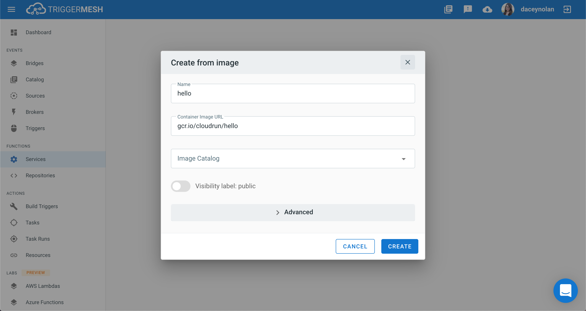
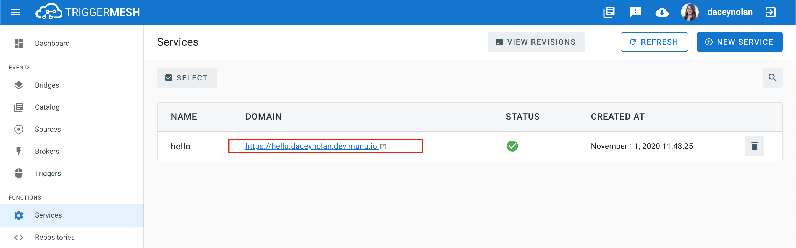
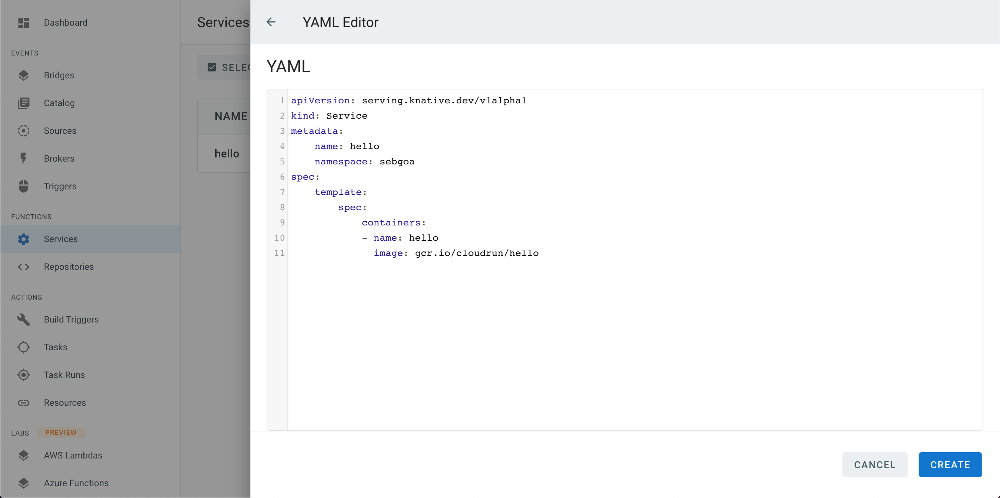

# Getting Started on TriggerMesh

To get you up and running quickly we are going to run a sample Hello service.

## Starting a Service via the Console


Click on the _Create Service_ button on the bottom on the home page of the console.


Click on _Create Service_ and select _from image_


We are going to do two things:

1. Set a name for our service: _hello_
2. Specify a container image: _gcr.io/cloudrun/hello_



After a few seconds a _URL_ will appear similar to:



Clicking on it will get you to the Hello web application shown below:


Congratulations you will have started your first service, if you do not use it, it will automatically scale to zero and wake up when you need to.

## Creating a Service with its Manifest

If you know the Knative API already you can choose to paste the Service YAML manifest in the wizard directly.

For example, given this manifest:

```yaml
apiVersion: serving.knative.dev/v1
kind: Service
metadata:
    name: hello
    namespace: sebgoa
spec:
    template:
        spec:
            containers:
            - name: hello
              image: gcr.io/cloudrun/hello
```

You would create the service _From YAML_ as in the snapshot below:



> Note that a namespace with your username needs to be specified. Hence replace _sebgoa_ in the snapshot above with your own username.

