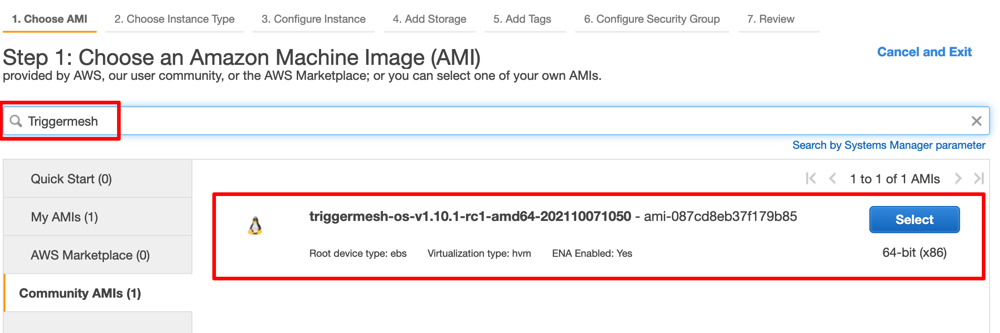
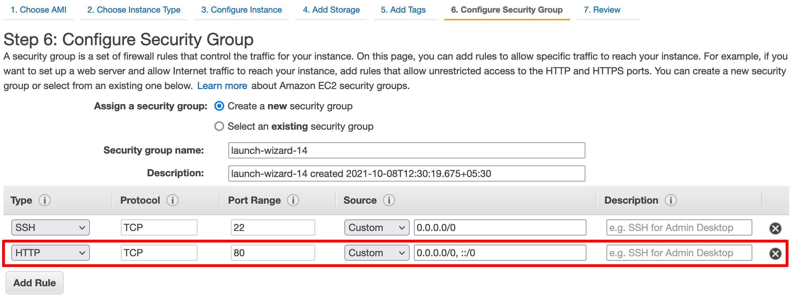
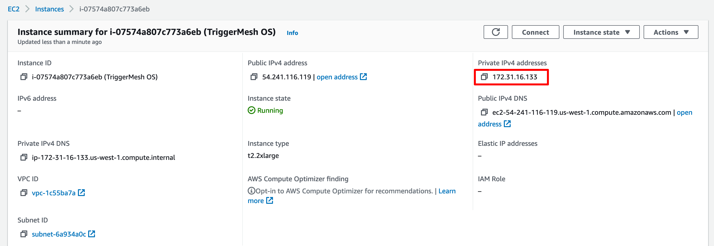

# TriggerMesh AMI

This document walks you through deploying the TriggerMesh AMI (beta) on the Amazon AWS platform.

!!! warning
    This installation method is meant to provide a fast mechanism to test TriggerMesh on AWS. It is not meant to be used in a production environment.
    
## Pre-requisites

* [Amazon AWS account](https://aws.amazon.com)

## Creating the TriggerMesh EC2 Instance

Log in to the [Amazon AWS console](https://us-west-1.console.aws.amazon.com/ec2/v2/home?region=us-west-1#Home:) and create a [new EC2 instance](https://us-west-1.console.aws.amazon.com/ec2/v2/home?region=us-west-1#LaunchInstanceWizard:) in the `us-west-1` region. 

Search for the **TriggerMesh** AMI in **Community AMIs** and select it for the EC2 instance.



The TriggerMesh AMI runs the TriggerMesh Cloud-Native Integration Platform (and its dependencies) on top of a single node Kubernetes cluster using ([k3s](https://k3s.io/)). The recommended instance type for the EC2 instance is `t2.2xlarge` or higher. 

The instance requires `32GiB` or higher as required.

For the Knative services to be accessible externally over the HTTP protocol, configure the EC2 instance security group to allow HTTP traffic to the instance as shown in the screenshot below:



Launch the EC2 instance after specifying the SSH keypair for logging into the instance.

## Logging into the instance

As the user `rancher`, SSH into the EC2 instance using its public IPv4 address.



## Verifying the deployment

After logging into the EC2 instance, verify that the `triggermesh-controller` and the `triggermesh-webhook` deployments are running successfully in the `triggermesh` namespace.

```console
$ kubectl get deploy -n triggermesh
NAME                     READY   UP-TO-DATE   AVAILABLE   AGE
triggermesh-controller   1/1     1            1           29m
triggermesh-webhook      1/1     1            1           29m
```

To check if Knative services are accessible externally, deploy [sockeye](https://github.com/n3wscott/sockeye) to the cluster.

```console
$ kubectl apply -f https://github.com/n3wscott/sockeye/releases/download/v0.7.0/release.yaml
service.serving.knative.dev/sockeye configured
```

Now try to access the `sockeye` Knative service you just deployed using the URL listed by the following command:

```console
$ kubectl get ksvc sockeye
NAME      URL                                             LATESTCREATED   LATESTREADY     READY   REASON
sockeye   http://sockeye.default.54.219.32.xxx.sslip.io   sockeye-00001   sockeye-00001   True
```

If the deployment was successful, the Sockeye webpage should load without any errors.

You can now delete the `sockeye` Knative service:

```console
$ kubectl delete ksvc sockeye
service.serving.knative.dev "sockeye" deleted
```

## Next steps

* [Getting started](gettingstarted.md)
