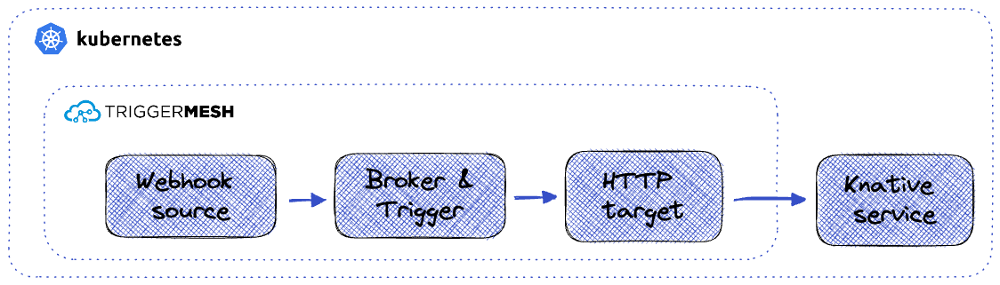

# Trigger a Knative service

TriggerMesh and Knative are powerful building blocks for building event-driven applications. On the one hand, [Knative Serving](https://knative.dev/docs/serving/) can be used to deploy services to Kubernetes that can react to incoming events, scale according to load, and scale to zero when idle. On the other hand, TriggerMesh is great at capturing events from many different systems and processing and routing them to event consumers. 

There are two ways that you can trigger a Knative service from TriggerMesh: either with generic HTTP requests, or with CloudEvents. This guide explains how to make generic HTTP requests with the [HTTP target](../../targets/http.md), in which the `data` attribute from the event in TriggerMesh is directly used as the body of the HTTP request. 

If on the other your Knative service expects a CloudEvent, or you'd like an example of how to build one from the ground up, then take a look at [this post](https://www.triggermesh.com/blog/build-a-custom-triggermesh-component-with-fastapi) that shows how to build a CloudEvents Knative service using Python FastAPI and route CloudEvents to it with TriggerMesh. 

The solution we’ll build in this guide is illustrated in the schema below.



## Setup

If you haven’t already done so, you’ll need to install TriggerMesh and Knative Serving on your cluster. I’m using [Minikube](https://minikube.sigs.k8s.io/docs/start/) to create a local cluster and I [followed the guide](../../installation/kubernetes-yaml.md) for installing TriggerMesh and Knative Serving onto the cluster. 

I’m going to use a simple containerised http service that I [found here](https://hub.docker.com/r/strm/helloworld-http/) to run as a Knative service. Feel free to replace this with your own of course. 

Define the Knative service in a manifest called knative-service.yaml:‍‍

```yaml
apiVersion: serving.knative.dev/v1
kind: Service
metadata:
  name: hello-http
spec:
  template:
    spec:
      containers:
        - image: strm/helloworld-http
          ports:
          - containerPort: 80
```

Apply this to the cluster:‍‍

```sh
kubectl apply -f knative-service.yaml
```

Check that the Knative service is running with the following command:‍‍

```sh
kubectl get ksvc hello-http 
NAME         URL                                          LATESTCREATED     LATESTREADY       READY   REASON
hello-http   http://hello-http.default.svc.cluster.local  hello-http-00002  hello-http-00002  True  
```

Now deploy a TriggerMesh broker to the cluster. The broker decouples event producers and consumers, and provides triggers that send events to consumers if they match a given filter. Create the following broker.yaml:‍‍

```yaml
apiVersion: eventing.triggermesh.io/v1alpha1
kind: MemoryBroker
metadata:
  name: broker
```

And apply it to the cluster:‍‍

```sh
kubectl apply -f broker.yaml
```

Check that the broker is available:‍‍

```sh
kubectl get memorybrokers.eventing.triggermesh.io 
NAME     URL                                                 AGE     READY   REASON
broker   http://broker-mb-broker.default.svc.cluster.local   3h38m   True    
```

Now create a Webhook source, in a file called webhook-source.yaml, that we'll use as an event producer. It will let us easily send events of type `my.event.type` to the broker over HTTP. Later, you can replace it or add additional event sources like Kafka, AWS SQS, Google Pub/Sub, etc… ‍‍

```yaml
apiVersion: sources.triggermesh.io/v1alpha1
kind: WebhookSource
metadata:
  name: sample
spec:
  eventType: my.event.type
  sink:
    ref:
      apiVersion: eventing.triggermesh.io/v1alpha1
      kind: MemoryBroker
      name: broker
```

And create the Webhook source

```sh
kubectl apply -f webhook-source.yaml
```

Create the HTTP target in a http-target.yaml file, and set its endpoint parameter to the cluster local address of the Knative service that you created before.‍‍

```yaml
apiVersion: targets.triggermesh.io/v1alpha1
kind: HTTPTarget
metadata:
  name: http-target
spec:
  endpoint: http://hello-http.default.svc.cluster.local
  method: GET
```

Create the HTTP target:

```sh
kubectl apply -f http-target.yaml
```

‍‍Now create a Trigger that will route events of type `my.event.type` (those produced by the Webhook source) to the HTTP target, in a trigger.yaml file:

```yaml
apiVersion: eventing.triggermesh.io/v1alpha1
kind: Trigger
metadata:
  name: trigger-knative-service
spec:
  broker:
    group: eventing.triggermesh.io
    kind: MemoryBroker
    name: broker
  filters:
  - exact:
      type: my.event.type
  target:
    ref:
      apiVersion: targets.triggermesh.io/v1alpha1
      kind: HTTPTarget
      name: http-target
```

Create the Trigger:‍‍

```sh
kubectl apply -f trigger.yaml
```

## Test it out!

Run minikube tunnel in a separate terminal, so that the load balancer service is assigned an IP. That loadbalancer IP is used by the sslip.io config. 

Run the command below to get the Webhook source’s URL (accessible outside of the cluster thanks to minikube tunnel):

```sh
kubectl get webhooksources.sources.triggermesh.io
NAME     READY   REASON   URL                                                      SINK                                                AGE
sample   True             http://webhooksource-sample.default.127.0.0.1.sslip.io   http://broker-mb-broker.default.svc.cluster.local   3h19m
```

Then send an event into your Webhook source:‍‍

```sh
curl http://webhooksource-sample.default.127.0.0.1.sslip.io -d '{"http":"is easy"}' -H 'Content-type: application/json'
```

Quickly run `kubectl get pods` and if all went well, you should see the HTTP target pods, the hello-http pods, as well as the webhook source pods spin up:‍‍

```sh
kubectl get po                                      
NAME                                                       READY   STATUS              RESTARTS   AGE
broker-mb-broker-5546995d8f-jdltd                          1/1     Running             0          3h43m
httptarget-http-target-00002-deployment-7cb9bc65dc-nlxjj   1/2     Running             0          1s
knative-operator-66f5b45fcd-z6q95                          1/1     Running             0          27h
hello-http-00002-deployment-6c8b4c7658-pwzp2               0/2     ContainerCreating   0          0s
operator-webhook-9f5487b8f-qc8zj                           1/1     Running             0          27h
webhooksource-sample-00001-deployment-797d4f57f6-2ch8f     2/2     Running             0          3s
```

These three services run as Knative services, which is why you’ll only see their pods appear when there are events to process (else they scale down to 0). If you look at the hello-http pod logs you’ll see that it has received the event:‍‍

```sh
kubectl logs pods/hello-http-00002-deployment-6c8b4c7658-pwzp2 
Defaulted container "user-container" out of: user-container, queue-proxy
127.0.0.1 - - [23/May/2023 18:09:15] "GET / HTTP/1.1" 200 -
```

Congratulations, you’ve triggered a generic http Knative service with TriggerMesh 🥳. Now that you’ve seen how to do this, you could use other event sources to trigger the service other than the Webhook source shown in this demo. For instance, you could try triggering it when an event lands on an [AWS SQS queue](../../sources/awssqs.md), a [Google Pub/Sub topic](../../sources/googlecloudpubsub.md), or an [Azure Event Hub](../../sources/azureeventhubs.md).