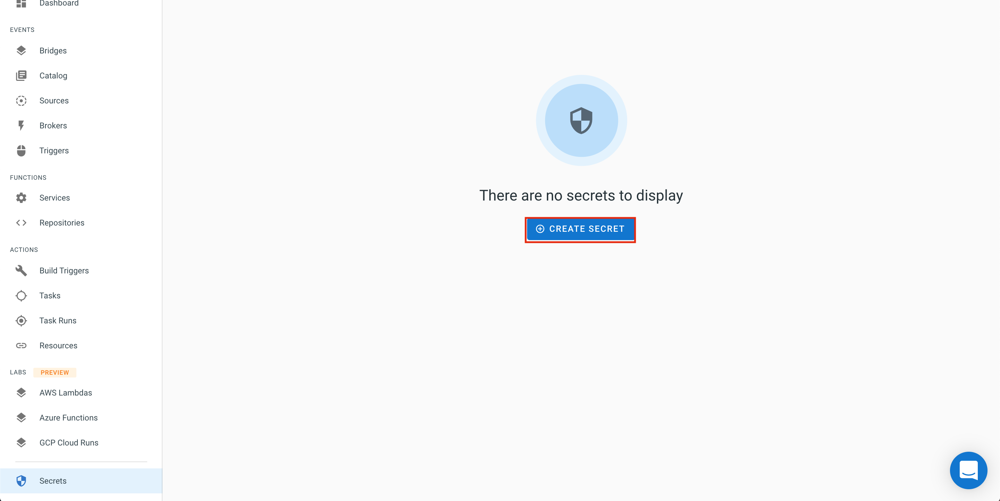
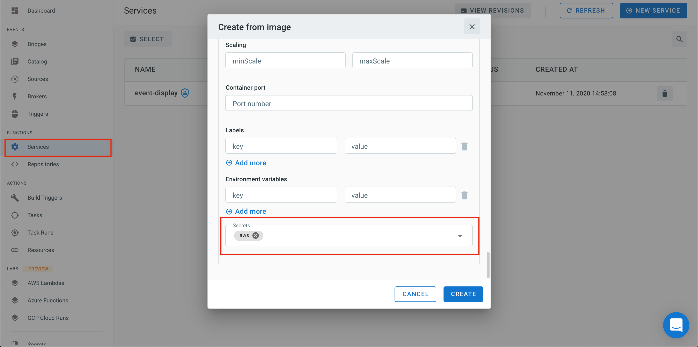
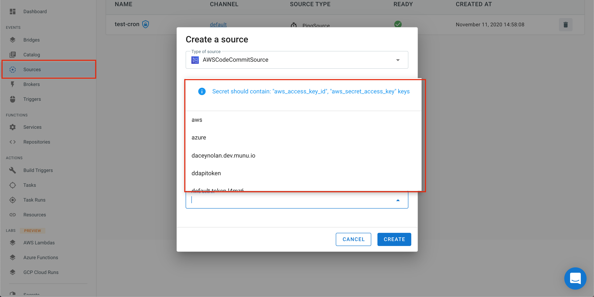

# Secrets

If you need to use sensitive data to run your services or connect to public Cloud services, you can store that information as `Secrets`.

The TriggerMesh console provides a `Secrets` view which lists all the secrets that are available. These secrets can then be used in the service or source manifests created via the console or via the client.

The snapshot below shows this Secret view. In the top right you will see an icon to create new secret. Clicking on that button will give you a choice to create various secrets (e.g AWS, GitHub, GitLab, GCP)



## Generic Secrets

If you need a generic secret you can also create it. The wizard will walk you through adding as many keys and values as you need.


## AWS API keys 

All the AWS event sources need access to some AWS API credentials to be able to establish a secure connection.

You should create a AWS IAM user and generate a dedicated set of API credentials with only the proper permissions. Once you do so, you can create a secret with the AWS specific wizard shown below:


The secret name is pre-configured to be `awscreds` and the keys are `aws_access_key_id` and `aws_secrets_access_key`. These are greyed out in the wizard and cannot be changed.

## Using a Secret in a Service definition

If your service needs access to a secret, you can load it in a service definition through the Service creation wizard.

Select `Advanced Configuration`, a pane will expand and at the bottom you will be able to select the secrets that you want your service to use.



## Using a Secret in a Source definition

When you deploy a new event source, that source may need a secret to access an external API. A dropdown menu is available in the source configuration which will let you choose the pre-created secret.



## Accessing your Secrets with `kubectl`

These secrets are stored as Kubernetes secrets and protected via RBAC rules.

You can delete your secrets and view them using `kubectl` and the configuration downloaded for using `tm`.

```
kubectl --kubeconfig=config.json -n <your_login_username> get secrets
```