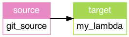

The TriggerMesh Integration Language (TIL) is a configuration language based on the [HCL syntax][hcl-spec] which purpose is to provide a user-friendly interface for describing [TriggerMesh Bridges][tm-brg].

!!! info "Use TIL with the TriggerMesh Platform"
    The TriggerMesh Integration Language is easily usable with the `til` CLI which helps you generate the manifests describing your event-driven application. It is the perfect companion to the TriggerMesh controller. Go to the [complete documentation](../til/Introduction.md) for the detailed specification.

## Installation

Download the CLI from the GitHub [release page](https://github.com/triggermesh/til/releases). For example on Linux x86_64 architecture do:

```console
wget https://github.com/triggermesh/til/releases/download/v0.1.0/til_v0.1.0_linux_amd64
```

Put it in your `PATH` and make the binary executable.

```console
mv til_v0.1.0_linux_amd64 /usr/local/bin/til
chmod +x /usr/local/bin/til
```

Check that you can run the command.

```console
$ til -h
Interpreter for TriggerMesh's Integration Language.

USAGE:
    til <command>

COMMANDS:
    generate     Generate Kubernetes manifests for deploying a Bridge.
    validate     Validate a Bridge description.
    graph        Represent a Bridge as a directed graph in DOT format.
```

For the complete usage reference go to the [TIL documentation](../til/Introduction.md).

## Example

With the `til` CLI installed you are ready to write your first Bridge.

In this guide we take the simple example of a point to point conection between a GitHub repository and a Splunk index. This assumes:

* We are using a sample repository on Github called `triggermesh/bridges`. Pick one that you have access to
* We are using a GitHub token stored as a Kubernetes secret called `github-source-tokens`, see the [GitHub secret class](../til/Secret-References.md#github-secret-class) for details.
* We are using Splunk credentials stored as a Kubernettes secret called `my_splunk_credentials`, see the [Splunk secret class](../til/Secret-References.md#splunk_hec-secret-class) for details.
* We want to receive all events related to `push` and `pull_requests` actions in our repository.

Using the TIL syntax you write this point to point connection in a file called `til-demo.brg.hcl` as is:

```hcl
bridge "github_to_splunk" { }

/* Event source block 
   Sources events from a GitHub repository
*/
source github "my_repo" {
  owner_and_repository = "triggermesh/bridges"
  tokens = secret_name("github-source-tokens")

  event_types = [
    "push", 
    "pull_request",
  ]

  to = target.github_archive_index
}

/* Event target block 
   Receives events and stores them into a Splunk index
*/
target splunk "github_archive_index" {
  endpoint = "https://prd-x-12345.splunkcloud.com"
  auth = secret_name("my-splunk-credentials")

  index = "github_events"
}
```

To generate the manifest in YAML you issue the following command:

```console
$ til generate ../til-demo.brg.hcl --yaml
apiVersion: targets.triggermesh.io/v1alpha1
kind: SplunkTarget
metadata:
  labels:
    bridges.triggermesh.io/id: github_to_splunk
  name: github-archive-index
spec:
  endpoint: https://prd-x-12345.splunkcloud.com
  index: github_events
  token:
    valueFromSecret:
      key: hec_token
      name: my-splunk-credentials
---
apiVersion: sources.knative.dev/v1alpha1
kind: GitHubSource
metadata:
  labels:
    bridges.triggermesh.io/id: github_to_splunk
  name: my-repo
spec:
  accessToken:
    secretKeyRef:
      key: access_token
      name: github-source-tokens
  eventTypes:
  - push
  - pull_request
  ownerAndRepository: triggermesh/bridges
  secretToken:
    secretKeyRef:
      key: webhook_secret
      name: github-source-tokens
  sink:
    ref:
      apiVersion: targets.triggermesh.io/v1alpha1
      kind: SplunkTarget
      name: github-archive-index
```

With these manifests ready you can deploy them easily. For example using [kapp](https://carvel.dev/kapp/)

!!! info "Deployment options for TIL"
    TIL is a specification language and a CLI to help you author Kubernetes objects. It does not dictate how you deploy your Bridge. As suh you can choose `helm`, `kapp` or simply `kubectl`. Check the deployment [samples](../til/Introduction.md#deployment)

## Generate the diagram of your event flow

If you want to generate a diagram of your flow, you can create a so-called dot file using `til`.

```console
til graph til-demo.brg.hcl > til-demo.dot
dot -Tpng til-demo.dot > til-demo.png
```

!!! info
    To visualize your event flow you can install [Graphviz](https://graphviz.org/) on your local machine or use the [on-line viewer](http://magjac.com/graphviz-visual-editor/)

The PNG file created will look like the one below.



[tm-brg]: https://www.triggermesh.com/integrations
[hcl-spec]: https://github.com/hashicorp/hcl/blob/main/hclsyntax/spec.md