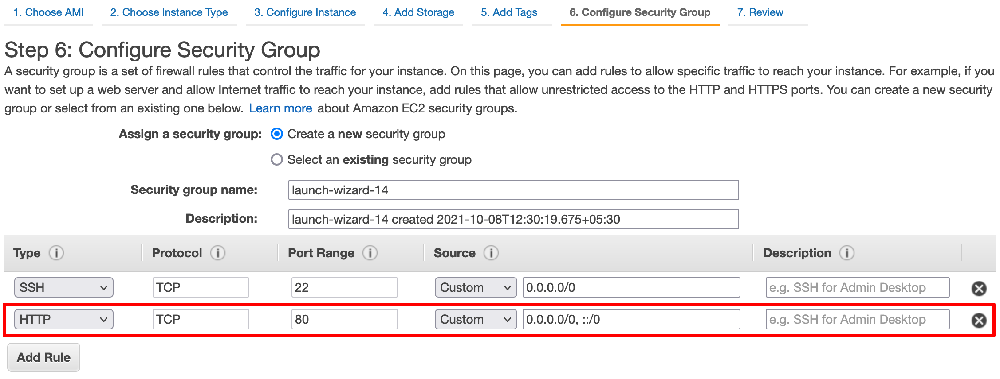

# TriggerMesh AMI

This document walks you through deploying the TriggerMesh AMI (beta) on the Amazon AWS platform.

## Pre-requisites

* [Amazon AWS account](https://aws.amazon.com)

## Creating the TriggerMesh EC2 Instance

Log in to the [Amazon AWS console](https://us-west-1.console.aws.amazon.com/ec2/v2/home?region=us-west-1#Home:) and create a [new EC2 instance](https://us-west-1.console.aws.amazon.com/ec2/v2/home?region=us-west-1#LaunchInstanceWizard:) in the `us-west-1` region. 

Search for the **TriggerMesh** AMI in **Community AMIs** and select it for the EC2 instance.

The TriggerMesh AMI deploys the TriggerMesh Cloud-Native Integration Platform (and its dependencies) on top of a Kubernetes cluster ([K3S](https://k3s.io/)). The recommended instance type for the EC2 instance is `t2.xlarge` or higher. 

The instance requires `32GiB` or higher as required.

For the Knative services to be accessible externally over the HTTP protocol, configure the EC2 instance security group to allow HTTP traffic to the instance as shown in the screenshot below:

Launch the EC2 instance after specifying the SSH keypair for logging into the instance.

## Logging into the instance

As the user `rancher`, SSH into the EC2 instance using its public IPv4 address.

