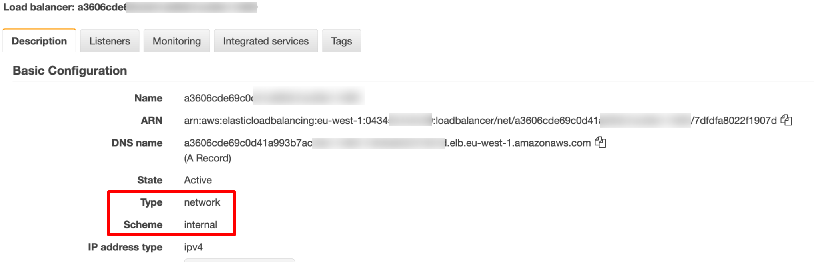
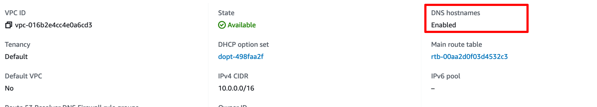
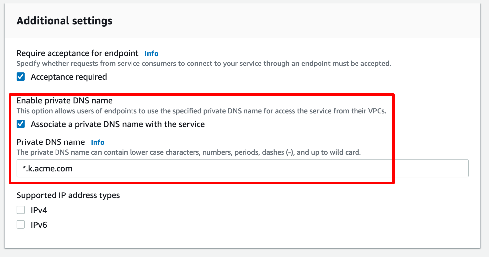
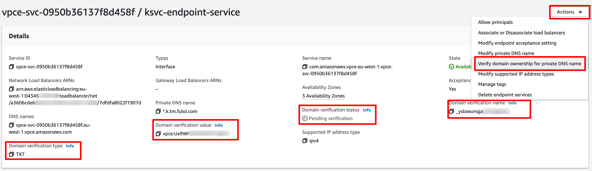
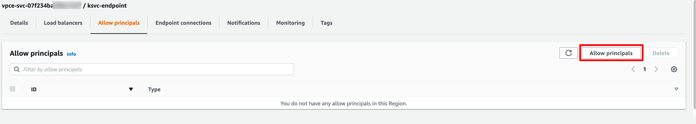
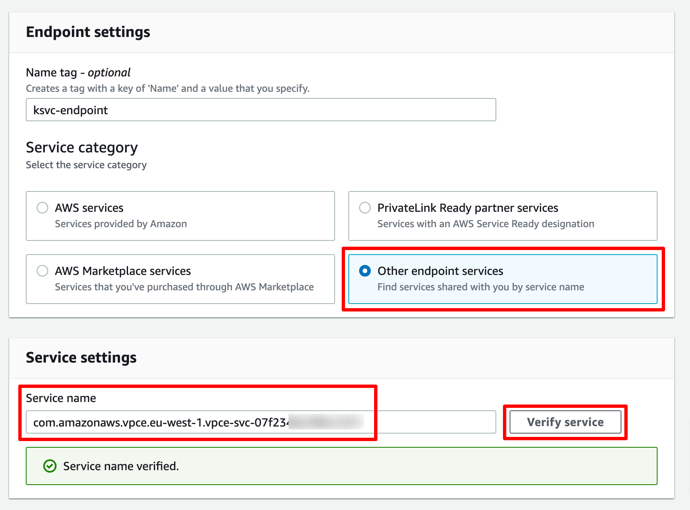
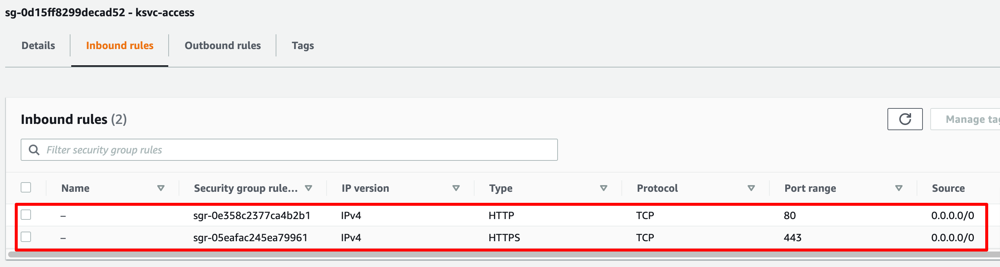
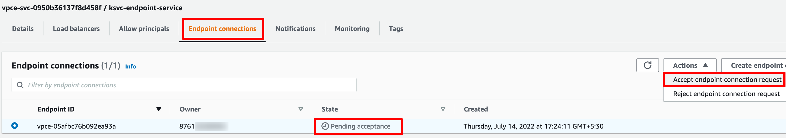
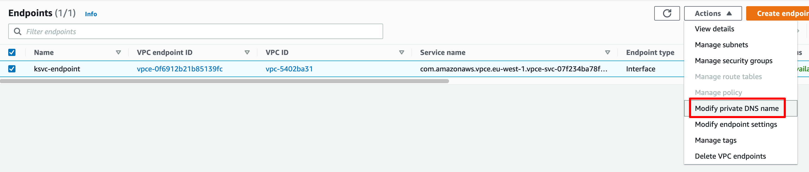

# Creating a PrivateLink to TriggerMesh Services

[PrivateLink](https://aws.amazon.com/privatelink) is a service that enables you to establish private connectivity 
between VPCs and services hosted on Amazon Web Services (AWS) or on-premises, 
without exposing data to the internet. Let’s look at the configuration required
to access TriggerMesh services deployed on an AWS Elastic Kubernetes Service (AWS) 
cluster across AWS accounts over a PrivateLink connection.

## Configuring the Istio Ingress Gateway

The Istio networking layer (or others such as Kourier) creates an Elastic Load 
Balancer (ELB) allowing public access to the TriggerMesh services running in the cluster. 
However, let’s consider a use-case where we want to disable the public access and 
instead make the services accessible over a PrivateLink. 

The first thing we need to do is to configure the Istio Ingress Gateway to use 
a Network Load Balancer (NLB) instead of an ELB using the annotation 
`service.beta.kubernetes.io/aws-load-balancer-type: nlb` and to specify that 
the NLB will be internal we need to add the annotation 
`service.beta.kubernetes.io/aws-load-balancer-internal: internal` as shown in 
the snippet below:

```yaml
apiVersion: install.istio.io/v1alpha1
kind: IstioOperator
...
spec:
  ...
  components:
    ingressGateways:
    - enabled: true
      name: istio-ingressgateway
      k8s:
        serviceAnnotations:
          service.beta.kubernetes.io/aws-load-balancer-internal: "true"
          service.beta.kubernetes.io/aws-load-balancer-type: nlb
```

After the configuration has been applied successfully, we can see that the Istio 
Ingress Gateway is now using an NLB as shown in the screenshot below:



## Setting up the PrivateLink endpoint service

Before we set up the PrivateLink, let’s make sure that the VPC to which our EKS 
cluster is attached has the DNS hostnames feature enabled. This is needed in order 
to be able to access our TriggerMesh services using the URL configured for the services.



To set up the service endpoint, we need to login to the AWS console and
[create an endpoint service](https://eu-west-1.console.aws.amazon.com/vpc/home?#CreateVpcEndpointServiceConfiguration:). Let’s specify the **Name** as 
_ksvc-endpoint-service_, **Load balancer type** as _Network_ and select the NLB 
that is associated with our Istio Ingress Gateway.

In the **Additional settings** section we need to enable the private DNS name 
configuration and specify the domain name associated with our TriggerMesh services. 
For example, if the domain of our Knative serving component is `k.acme.com`, 
then specify the wildcard domain `*.k.acme.com` as the **Private DNS name** as 
shown in the screenshot below:



Before we can start accessing the TriggerMesh endpoints using the Private DNS name, 
we need to verify ownership of the domain name. To do so we need to create a **TXT** 
record in our domain host with the **Domain verification name** and 
**Domain verification value** and trigger the verification as shown in screenshot 
below:



After the verification has been completed, the Domain verification status changes 
to Verified and we should now be able to reach our TriggerMesh services using the service 
URL.

## Connecting to the endpoint service

Now that we have the services exposed on a VPC endpoint service, we can now access 
the TriggerMesh services from another VPC in the same AWS account as well as 
from another AWS account. Let’s try accessing the TriggerMesh services from another 
AWS account.

To allow access to the service endpoint we need to first add the Amazon Resource 
Name (ARN) of the AWS root account under the **Allow Principals** tab. This is the 
ARN of the account from where we will be accessing the services, let's call this 
the consumer.



Login to the VPC dashboard of the AWS account of the consumer and [create an endpoint](https://eu-west-1.console.aws.amazon.com/vpc/home?#CreateVpcEndpoint:) 
connection. It’s important to note that you need to be in the same region as the
endpoint service in order to establish a PrivateLink connection.

Let’s name the endpoint connection _ksvc-endpoint_, for the **Service category** choose 
_Other endpoint services_, enter the Service name of our service endpoint and click 
on **Verify service**.



Select the VPC and Subnets on which you want to make the endpoint connection 
available and finally specify the security groups to associate with the endpoint. 
We need to ensure that our security group allows HTTP/HTTPS connection requests 
as shown in the screenshot below:



Upon creating the endpoint, we need to go back to the VPC service endpoint and 
accept the connection request.



Once the connection request has been accepted it takes a few minutes for the 
endpoint connection to become Available in the consumer account. Lastly, in order 
to access the TriggerMesh services using their URLs, we need to Enable private DNS 
names which is available under the Modify private DNS name action menu item of 
the endpoint connection as shown below:



## Accessing TriggerMesh services

To access the TriggerMesh services via the PrivateLink, we can create an EC2 instance, 
in the consumers AWS account, on the same VPC in which the endpoint was created 
and use cURL to reach the TriggerMesh service endpoints.

For demonstration, I have deployed the [TriggerMesh WebhookSource](https://github.com/triggermesh/triggermesh/blob/main/config/samples/sources/webhooksource.yaml) in the EKS
cluster and the URL for the service is http://webhook.k.acme.com. This endpoint 
can now simply be reached from the EC2 instance as shown below:

```console
$ curl -d '{"foo": "bar"}' -H "Content-Type: application/json" http://webhook.k.acme.com
```
