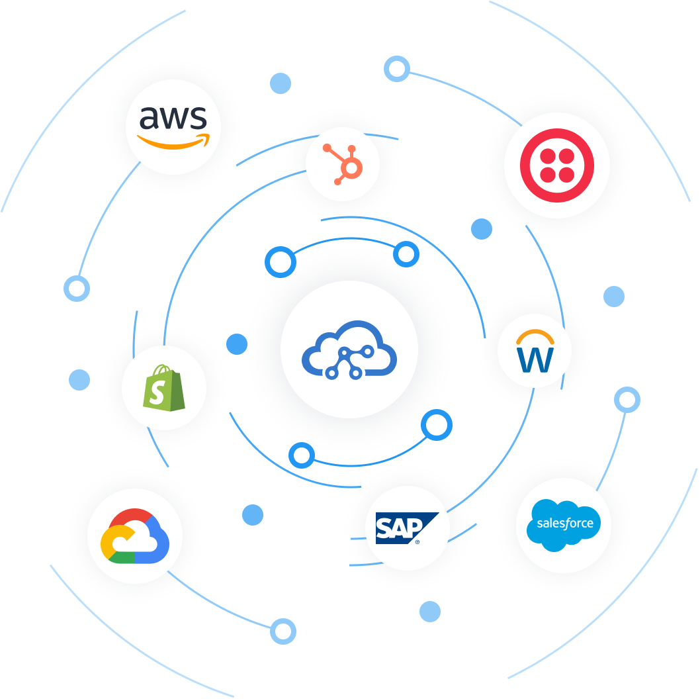

# TriggerMesh Open Source Cloud Native Integration Platform. Event Driven Applications in Kubernetes.

Build your event driven applications in Kubernetes with TriggerMesh APIs. Event sources, targets, filters, splitters, functions, you can do it all.

|  |
|:--:|
| TriggerMesh |

* [Concepts](concepts/index.md)
* [Get started](installation/index.md)
