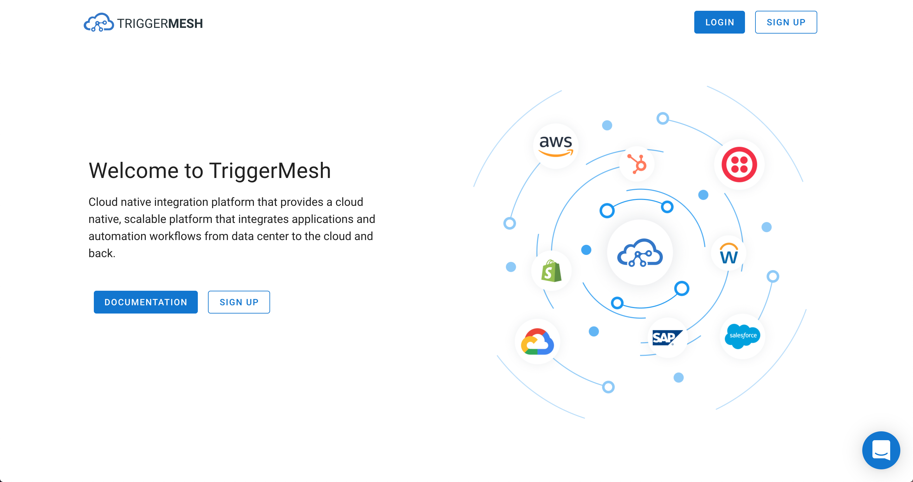

# Welcome to TriggerMesh's Documentation

Couple steps are needed before you get productive

If you are already logged in, check out our guides:

* [Getting Started](./guides/gettingstarted/). Create a Hello World service.
* [Bridges](./guides/bridge/). Understanding and creating Bridges.
* [Secrets](./guides/secrets/). Create and use secrets to store API keys.

Sources and Targets are documented at:

* [Sources](./sources/)
* [Targets](./targets/)

Kubernetes style APIs can be found at:

* [APIs](./apis/)

If you need to sign-up, check the section below.

## Sign-up

Go to [https://cloud.triggermesh.io](https://cloud.triggermesh.io), click on the log-in button at the top right of the page, choose your favorite identity provider or create an email and password as credentials.



You are ready to use the TriggerMesh console shown just below.


If you want to use our command line client keep reading...

## For CLI lovers

If you would prefer to use a CLI, we have prepared `tm` for you.

`tm` is a generic Knative client with some added features to deploy functions from source. You can download `tm` by following our [instructions](https://docs.triggermesh.io/tm/install)

For example you will be able to bypass the console and do something like this:

```
tm deploy service hello --from-image=gcr.io/cloudrun/hello
```
