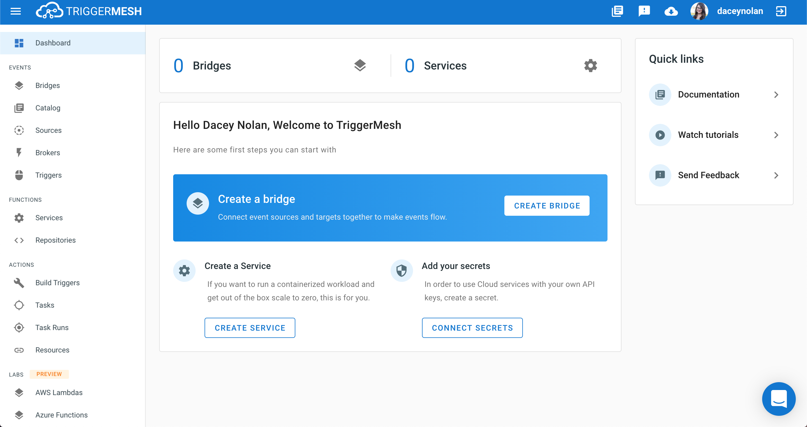

# Welcome to TriggerMesh's Documentation

Couple steps are needed before you get productive

## Sign-up

1. Sign up for the Early Access Program [here](https://triggermesh.com/serverless_eap/).

2. Go to [https://cloud.triggermesh.io](https://cloud.triggermesh.io), click on the log-in button at the top right of the page and choose your favorite identity provider.


You are ready to use the TriggerMesh console shown just below.



If you want to use our command line client keep reading...

## Download and configure the client

3. Download the `tm` client from the GitHub [release page](https://github.com/triggermesh/tm/releases)

4. Once logged in on the Cloud console, download your TriggerMesh configuration file by clicking on the _download_ button in the upper right corner (depicted by a cloud with an arrow inside of it)

5. Save the file as `$HOME/.tm/config.json` and you are ready to use the `tm` CLI

## Get going

```
tm deploy service hello --from-image=gcr.io/cloudrun/hello
```