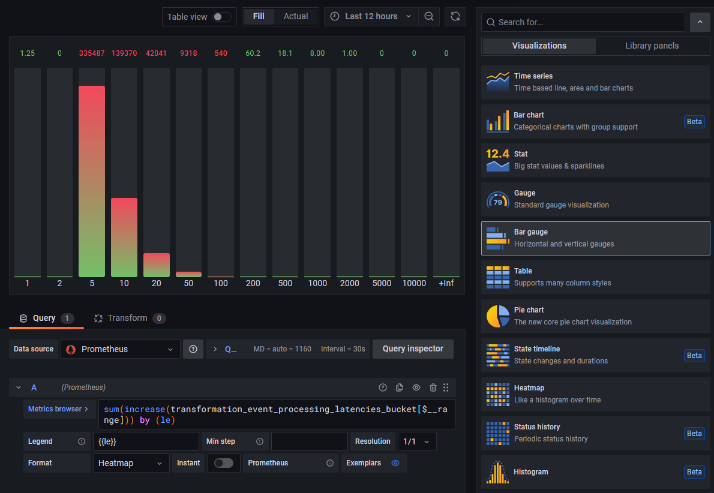

# Telemetry Metrics

Metrics allow operators to understand the internal state of a system by observing its outputs.

In TriggerMesh, telemetry is achieved by exposing a variety of time-based numeric measurements — also referred to as
[time-series][grafana-ts] — that can be collected and analyzed by third-party monitoring solutions.

This guide provides an overview of the nature and format of the telemetry metrics exposed by the TriggerMesh platform,
as well as detailed examples of approaches for collecting and analyzing them.

## Exposed Telemetry Data

### Metrics Categories

Here is an overview of the types of metrics that are exposed by TriggerMesh components. The list is deliberately broad
and generic, as some categories of metrics may only be exposed by certain types of components.

- Processing of events
    - Successes and errors
    - Latency distribution
- Delivery of events
    - Successes and errors
    - Latency distribution
- Software runtime
    - Heap memory usage
    - Garbage collection

Later in this document, we will explore how metrics in these different categories can be collected, analyzed and
visualized.

### Data Model

Metrics are exposed by TriggerMesh in a line-oriented [text-based format][prom-metrics-fmt] popularized by the
[Prometheus][prom-overview] open source monitoring toolkit.

A Prometheus metric is typically represented as a single line of UTF-8 characters, optionally prepended with a `HELP`
and a `TYPE` comment lines, starting with the **name** of the metric and ending with its **value**:

```openmetrics
# HELP event_processing_success_count The number of events successfully processed
# TYPE event_processing_success_count counter
event_processing_success_count{event_source="my.cloud.storage", event_type="object.created"} 129389
```

The `HELP` comment provides a description of _what_ the metric represents, whereas the `TYPE` comment carries
information about the _type_ of the metric (one of the four [core metric types][prom-metrics-typ] offered by
Prometheus).

As illustrated in the example above, the metric name may be directly followed by a list of comma-separated key-value
pairs between curly brackets called **labels**. Labels allow differentiating the characteristics of what is being
measured. Each unique combination of labels identifies a particular **dimension** of a metric. Labels, and metric
dimensions by extension, vary from metric to metric.

### Enabling Metrics

By default TriggerMesh does not enable any metrics backend. Observability of TriggerMesh can be configured 
via the `config-observability` ConfigMap object.

For example, the following ConfigMap object enables the Prometheus metrics exporter in all TriggerMesh components:

```yaml
apiVersion: v1
kind: ConfigMap
metadata:
  name: config-observability
  namespace: triggermesh
data:
  metrics.backend-destination: prometheus
```

For a description of the configuration settings which are currently supported, please refer to the 
`observability.yaml` manifest files inside the [Knative Eventing source repository][kn-cmaps].

### Access to Metrics

Every TriggerMesh component exposes a set of telemetry metrics on the local HTTP endpoint `:9092/metrics`. Available
measurements can be retrieved via a simple `GET` request. The returned values are an **instant view** of each
measurement at the time of the request.

This model is particularly suitable for a pull-based retrieval of metrics ("scrape") on a fixed interval by monitoring
software, and for storage in a time-series database. Prometheus itself is a popular choice for this job, as it includes
both a server for scraping telemetry metrics, and a time-series database optimized for the Prometheus data model. 


Most of the available metrics fall into the categories described previously in this document, whenever applicable based
on the type of component. Some components may expose additional, application-specific metrics. The data model presented
in the previous section makes these metrics easily discoverable by consumers.

## Collection and Analysis with Prometheus and Grafana

This section provides examples of configurations for collecting metrics from TriggerMesh components using the
[Prometheus][prom-overview] monitoring toolkit, and visualizing them using the observability platform
[Grafana][grafana-overview].

The rest of this document assumes that Prometheus and Grafana are both available in the Kubernetes cluster where
TriggerMesh is deployed.

!!! tip Installing Prometheus and Grafana

    If you don't already have Prometheus and Grafana set up in your TriggerMesh cluster, we recommend installing a
    pre-configured Prometheus-Grafana stack using the [Helm][helm-overview] application manager for Kubernetes by
    executing the commands below:

    ```sh
    helm repo add prometheus-community https://prometheus-community.github.io/helm-charts
    helm repo update
    helm install -n monitoring prometheus-stack prometheus-community/kube-prometheus-stack
    ```

    Detailed installation instructions are available in the [`kube-prometheus-stack` chart's
    documentation][helm-prom-chart].

### Scraping Metrics via Prometheus

The Prometheus Operator — which is included in the aforementioned [kube-prometheus Stack][helm-prom-chart] and manages
most [Prometheus installations on Kubernetes][prom-k8s] — allows configuring Prometheus' [scrape targets][prom-scrape]
using familiar Kubernetes API objects.

The manifest below contains a PodMonitor that instructs Prometheus to automatically discover and scrape TriggerMesh
components:

```yaml
apiVersion: monitoring.coreos.com/v1
kind: PodMonitor
metadata:
  name: triggermesh-components
  namespace: monitoring
spec:
  selector:
    matchLabels:  # (1)
      app.kubernetes.io/part-of: triggermesh
  namespaceSelector:  # (2)
    any: true
  podMetricsEndpoints:  # (3)
  - port: metrics
  - port: user-port
    relabelings:
    - action: replace
      targetLabel: __address__
      sourceLabels:
      - __meta_kubernetes_pod_ip
      replacement: $1:9092
  jobLabel: app.kubernetes.io/name  # (4)
```

1.  Selects all targets (Pods) that are labeled as being managed by TriggerMesh.
2.  Looks up targets (Pods) matching the above selector in all Kubernetes namespace.
3.  For targets that matched the above selectors, either scrape the port named `metrics` if it exists, or fall back to
    the TCP port `9092`.
4.  Sets the value of the `job` label in collected metrics to the name of the component.

After applying this configuration to the Kubernetes cluster using the `kubectl apply -f` command, a list of targets
matching the name of the PodMonitor should be reported by Prometheus with the state `UP`.

!!! tip Opening the Prometheus web interface

    If you installed Prometheus via the [`kube-prometheus-stack` Helm chart][helm-prom-chart] — as suggested in the
    introduction to this section — you should be able to forward the local port `9090` to the Prometheus instance
    running in the Kubernetes cluster:

    ```sh
    kubectl -n monitoring port-forward svc/kube-prometheus-stack-prometheus 9090
    ```

    Then, open your web browser at <http://localhost:9090/targets>.


!!! warning If you installed Prometheus using the Operator

    If you used the operator to install Prometheus, then it is possible that Prometheus was configured to use a label selector for pod monitors, with something similar to what is shown below:
    
    ```yaml
    Pod Monitor Selector:
      Match Labels:
        Release: kube-prometheus-stack
    ```
    
     If you create a pod monitor that doesn't have those labels, then Prometheus will not pick it up. 

     You can either reconfigure the selector installed by Prometheus, or you can update your pod monitor to include the new label:

    ```yaml
    release=kube-prometheus-stack
    ```

### Visualizing Metrics in a Grafana Dashboard

By combining the visualization power of Grafana with the [query language][promql] of Prometheus, we are able to analyze
trends in collected metrics using different types of graphs and charts.

In the following example, we will create a dashboard like the one below where we analyze the latency distribution of a
given measure — such as the processed or delivered events — over a selected period of time.


!!! tip Accessing Grafana

    If you installed Grafana via the [`kube-prometheus-stack` Helm chart][helm-prom-chart] — as suggested in the
    introduction to this section — you should be able to forward the local port `3000` to the Grafana instance
    running in the Kubernetes cluster:

    ```sh
    kubectl -n monitoring port-forward svc/kube-prometheus-stack-grafana 3000:80
    ```

    Then, open your web browser at <http://localhost:3000>.

#### Number of Events Grouped by Latency Bucket

In this panel, we will use a [bar gauge][grafana-chart-bg] to display the distribution of the time spent by a component
_processing events_ over a selected period of time, organized in _latency buckets_.

The chart will be based on a Prometheus metric of type [histogram][prom-hist] with a pre-configured bucket distribution
in milliseconds, defined by TriggerMesh as follows:

```openmetrics
# HELP event_processing_latencies Time spent in the CloudEvents handler processing events
# TYPE event_processing_latencies histogram
```

In a histogram metric, cumulative counters for each bucket are exposed as sub-metrics of the main histogram metric, with
*\_bucket* appended to the name, and a `le` ("less than or equal") label indicating the upper bound of the bucket, such
as in the example below:

```openmetrics
event_processing_latencies_bucket{le="1"} 0
event_processing_latencies_bucket{le="2"} 0
event_processing_latencies_bucket{le="5"} 1541
event_processing_latencies_bucket{le="10"} 6161
event_processing_latencies_bucket{le="20"} 6776
event_processing_latencies_bucket{le="50"} 6865
event_processing_latencies_bucket{le="100"} 6868
```

We can start by charting the evolution of the raw counters corresponding to each latency bucket over time in a standard
[time series graph][grafana-chart-ts], before switching to bar gauges, in order to understand the metric's trend:

```promql
sum(
  event_processing_latencies_bucket
) by (le)
```

!!! warning Prometheus histograms in Grafana

    Always select the **Heatmap** format while working with Prometheus metrics of type `histogram`. This enables
    Grafana's intrinsic knowledge about Prometheus histograms, which results in buckets being sorted per `le` value and
    distinctive counts being shown for each bucket as one would expect.


We can observe that counter values are cumulative. Some buckets have a steeper evolution than others, which already
hints at a trend about the distribution of the component's processing latency.

When switching from a time series chart to a bar gauge chart, we will want the summary value to correspond to the
aggregation of all events processed in a given latency bucket. We could be tempted to simply summarize totals as the
_last value_ per bucket in the selected time period, but 

1. This would show the _overall_ total of events processed by the component prior to the end of the time period, not the
   total of events processed _during_ the selected time period.
1. This might result in skewed calculations if the counters were reset during that time period, as illustrated at the
   very end of the range in the previous graph. Such situation isn't unusual and could occur for different reasons, such
   as roll outs of new versions, horizontal scaling, Pod relocations, etc.

We will instead calculate the increase in the time series in the selected time range using a [query function][promql-fn]
which adjusts for breaks in monotonicity, such as counter resets:

```promql
sum(
  increase(event_processing_latencies_bucket[$__range])
) by (le)
```


Selecting `Bar Gauge` in the list of visualizations instead of `Time Series` now shows a histogram which summary values
accurately represent the number of events processed in each latency bucket _for the selected time period_:



The visualization options can be adjusted to one's preferences in order to obtain the desired result:


#### Rate of Processed Events by Latency Bucket

In this panel, we will use a [time series graph][grafana-chart-ts] to display the _rate of events processed by a
component_ over time, and distributed in _latency buckets_.

The chart will be based on the same Prometheus metric as in the previous example.

This time around, we will stick with the default `Time Series` visualization, but replace the `increase()` function used
previously with the `irate()` function:

```promql
sum(
  irate(event_processing_latencies_bucket[$__rate_interval])
) by (le)
```

The interval used to calculate the rate of change of the metric can be either

1. Selected manually using an explicit [time duration][promql-dur] such as "[3m]".
1. Delegated to Grafana using Grafana's [`$__rate_interval` variable][grafana-vars], which calculates an optimal value
   based on the number of data points in the graph.

The result of this calculation is a series of metrics ("instant vectors"), each representing the number of events per
second processed by the component over time in a given latency bucket:


#### 90th Percentile of the Processing Latency Over Time

In this panel, we will use a [time series graph][grafana-chart-ts] to display the _90th percentile of processing
durations_ of events handled by a component over time. This measure indicates the _longest time it took to process an
event_, for 90% of all the events processed during each time interval on the graph.

The chart will be based on the same Prometheus metric as in the previous example.

We can reuse the query from the previous example, and pass it to the `histogram_quantile()` function with the desired
quantile:

```promql
histogram_quantile(0.90,
  sum(
    irate(event_processing_latencies_bucket[$__rate_interval])
  )
) by (le)
```

The result of this calculation is a single metric ("instant vector"). An interesting exercise could be to compare this
graph with the rate of processed events measured in the previous example, and observe whether or not spikes in the 90th
latency percentile can be correlated with higher processing rates:


#### Additional Notes and Takeaways

It can be noted that, in the previous examples, we generated three valuable types of visualizations from a **single
metric**, by simply changing Prometheus queries to perform different types of calculations/aggregations.

Thanks to the power of time series and the multi-dimensional aspect of Prometheus metrics, we could explore other types
of visualizations based on this same metric, for example by filtering or grouping metrics by labels.

For instance, the following query could be used to graph the event processing rate over time _broken down by event
type_:

```promql
sum(
  irate(event_processing_latencies_count[$__rate_interval])
) by (event_type)
```

This other query could be used to graph the event processing rate over time for a _specific event type_:

```promql
sum(
  irate(event_processing_latencies_count{event_type="object.created"}[$__rate_interval])
)
```

The same idea can be applied when it comes to visualizing metrics pertaining to a specific instance of a given
component, or for example to all instances of that component within a specific Kubernetes namespace. There is a large
amount of possibilities to be explored, the only limit is the choice of labels available for each metric. 


[prom-overview]: https://prometheus.io/docs/introduction/overview/
[prom-metrics-fmt]: https://prometheus.io/docs/instrumenting/exposition_formats/
[prom-metrics-typ]: https://prometheus.io/docs/concepts/metric_types/
[prom-k8s]: https://github.com/prometheus-operator/kube-prometheus#readme
[prom-scrape]: https://prometheus.io/docs/prometheus/latest/configuration/configuration/#scrape_config
[prom-hist]: https://prometheus.io/docs/practices/histograms/
[promql]: https://prometheus.io/docs/prometheus/latest/querying/basics/
[promql-dur]: https://prometheus.io/docs/prometheus/latest/querying/basics/#time-durations
[promql-fn]: https://prometheus.io/docs/prometheus/latest/querying/functions/

[grafana-overview]: https://grafana.com/grafana/
[grafana-ts]: https://grafana.com/docs/grafana/latest/basics/timeseries/
[grafana-chart-bg]: https://grafana.com/docs/grafana/latest/visualizations/bar-gauge-panel/
[grafana-chart-ts]: https://grafana.com/docs/grafana/latest/visualizations/time-series/
[grafana-vars]: https://grafana.com/docs/grafana/latest/datasources/prometheus/#using-__rate_interval

[helm-overview]: https://helm.sh/
[helm-prom-chart]: https://artifacthub.io/packages/helm/prometheus-community/kube-prometheus-stack

[kn-cmaps]: https://github.com/knative/eventing/tree/v0.31.0/config/core/configmaps
