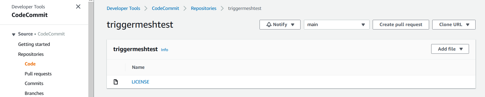
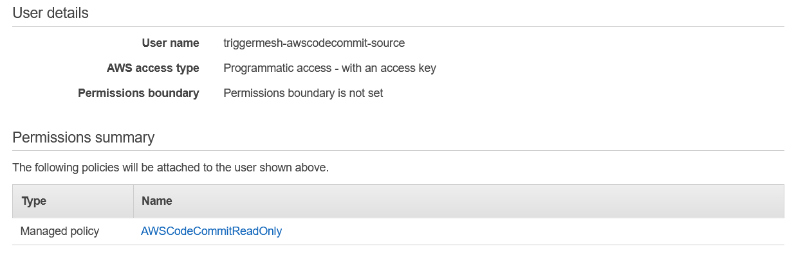

# AWS CodeCommit source

This event source captures notifications from an [AWS CodeCommit repository][cc-docs] whenever a specific action, such
as a new commit or the creation of a pull request, happens in this repository.

With `tmctl`:

```
tmctl create source awscodecommit --arn <arn> --branch <branch> --eventTypes pull_request --auth.credentials.accessKeyID <keyID> --auth.credentials.secretAccessKey <key>
```

On Kubernetes:

```yaml
apiVersion: sources.triggermesh.io/v1alpha1
kind: AWSCodeCommitSource
metadata:
  name: sample
spec:
  arn: arn:aws:codecommit:us-west-2:123456789012:triggermeshtest
  branch: master

  eventTypes:
  - push
  - pull_request

  auth:
    credentials:
      accessKeyID:
        valueFromSecret:
          name: awscreds
          key: aws_access_key_id
      secretAccessKey:
        valueFromSecret:
          name: awscreds
          key: aws_secret_access_key

  sink:
    ref:
      apiVersion: eventing.knative.dev/v1
      kind: Broker
      name: default
```

The parameters include the following:

Events produced have the following attributes:

* types
    * `com.amazon.codecommit.push`
    * `com.amazon.codecommit.pull_request`
* Schema of the `data` attribute:
    * [com.amazon.codecommit.push.json](https://raw.githubusercontent.com/triggermesh/triggermesh/main/schemas/com.amazon.codecommit.push.json)
    * [com.amazon.codecommit.pull_request.json](https://raw.githubusercontent.com/triggermesh/triggermesh/main/schemas/com.amazon.codecommit.pull_request.json)

See the [Kubernetes object reference](../../reference/sources/#sources.triggermesh.io/v1alpha1.AWSCodeCommitSource) for more details.

## Prerequisite(s)

- CodeCommit Repository and Branch
- Amazon Resource Name (ARN)
- API Credentials

### CodeCommit Repository and Branch

If you don't already have an AWS CodeCommit repository, create one by following the instructions at [Create an AWS
CodeCommit repository][cc-create]. The repository should contain at least one [branch][cc-branches]. To create one,
follow the instructions at [Create a branch in AWS CodeCommit][cc-branch-create].



### Amazon Resource Name (ARN)

A fully qualified ARN is required to uniquely identify the AWS CodeCommit repository.

The easiest way to obtain the ARN of a CodeCommit repository is by using the [AWS CLI][aws-cli]. The following command
retrieves the information of a repository called `triggermeshtest` in the `us-west-2` region:

```console
$ aws codecommit get-repository --repository-name triggermeshtest --region us-west-2
{
    "repositoryMetadata": {
        "accountId": "123456789012",
        "repositoryId": "510acd3d-b96d-473c-bbe4-a8c6799d02a9",
        "repositoryName": "triggermeshtest",
        "defaultBranch": "main",
        "lastModifiedDate": "2020-07-20T20:54:27.806000+02:00",
        "creationDate": "2020-07-20T20:49:12.324000+02:00",
        "cloneUrlHttp": "https://git-codecommit.eu-central-1.amazonaws.com/v1/repos/triggermeshtest",
        "cloneUrlSsh": "ssh://git-codecommit.eu-central-1.amazonaws.com/v1/repos/triggermeshtest",
        "Arn": "arn:aws:codecommit:eu-central-1:123456789012:triggermeshtest"
    }
}
```

If you don't have the AWS CLI installed on your workstation, you can use the template below to compose a fully
qualified ARN of a CodeCommit repository.

```
arn:aws:codecommit:{awsRegion}:{awsAccountId}:{repositoryName}
```

### API Credentials

The TriggerMesh event source for Amazon CodeCommit authenticates calls to the AWS API using AWS Access Keys. The page
[Understanding and getting your AWS credentials][accesskey] contains instructions to create access keys when signed-in
either as the root user or as an IAM user. Take note of the **Access Key ID** and **Secret Access Key**, they will be
used to create an instance of the event source.

It is considered a [good practice][iam-bestpractices] to create dedicated users with restricted privileges in order to
programmatically access AWS services. Permissions can be added or revoked granularly for a given IAM user by attaching
[IAM Policies][iam-policies] to it.

As an example, the following policy contains only the permissions required by the TriggerMesh AWS CodeCommit event
source to operate:

```json
{
    "Version": "2012-10-17",
    "Statement": [
        {
            "Effect": "Allow",
            "Action": [
                "codecommit:GetBranch",
                "codecommit:GetCommit",
                "codecommit:ListPullRequests",
                "codecommit:GetPullRequest"
            ],
            "Resource": "arn:aws:codecommit:*:*:*"
        }
    ]
}
```




[arn]: https://docs.aws.amazon.com/IAM/latest/UserGuide/list_awscodecommit.html#awscodecommit-resources-for-iam-policies
[accesskey]: https://docs.aws.amazon.com/general/latest/gr/aws-sec-cred-types.html#access-keys-and-secret-access-keys
[aws-cli]: https://aws.amazon.com/cli/
[iam-bestpractices]: https://docs.aws.amazon.com/general/latest/gr/aws-access-keys-best-practices.html#iam-user-access-keys
[iam-policies]: https://docs.aws.amazon.com/IAM/latest/UserGuide/access_policies.html

[cc-docs]: https://docs.aws.amazon.com/codecommit/latest/userguide/welcome.html
[cc-create]: https://docs.aws.amazon.com/codecommit/latest/userguide/how-to-create-repository.html
[cc-branches]: https://docs.aws.amazon.com/codecommit/latest/userguide/branches.html
[cc-branch-create]: https://docs.aws.amazon.com/codecommit/latest/userguide/how-to-create-branch.html

[tm-secret]: ../secrets.md
