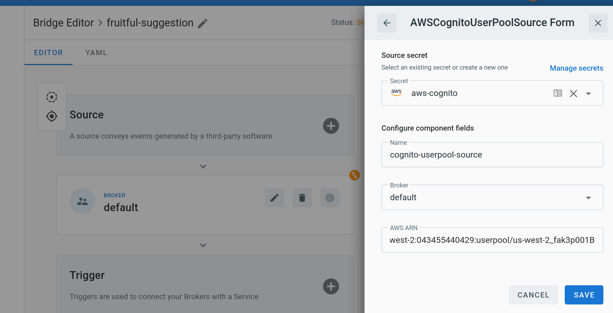
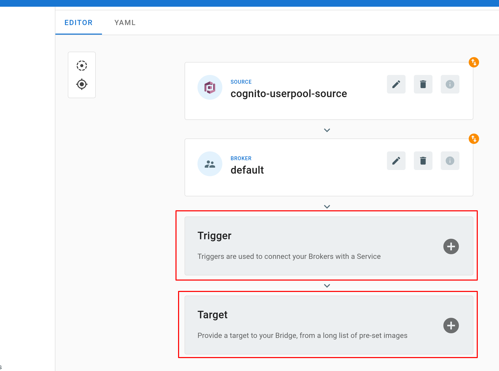
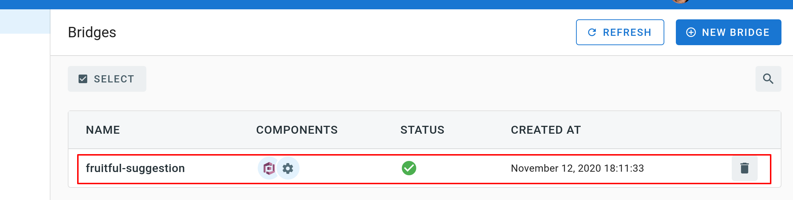

# Event source for AWS Cognito User Pool

This event source captures messages from an [AWS Cognito User Pool ][cup-docs] whenever a specific action, such as the creation of a new user, happens in the user identity pool.

## Prerequisites

### AWS Cognito User Pool

If you don't already have an AWS Cognito User Pool, create one by following the instructions in the [Getting started with User Pools][cup-getting-started] guide.

### Amazon Resource Name (ARN)

A fully qualified ARN is required to uniquely identify the AWS Cognito User Pool.


As shown in the above screenshot, you can obtain the ARN of a User Pool from the AWS console. It typically has the following format:

```
arn:aws:cognito-idp:{awsRegion}:{awsAccountId}:userpool/{poolId}
```

Alternatively you can also use the [AWS CLI][aws-cli]. The following command retrieves the ARN of a User Pool in the `us-west-2` region which has the pool id `us-west-2_fak3p001B`.

```console
$ aws --region us-west-2 cognito-idp  describe-user-pool --user-pool-id us-west-2_fak3p001B
{
    "UserPool": {
        "Id": "us-west-2_fak3p001B",
        ...
        "Arn": "arn:aws:cognito-idp:us-west-2:043455440429:userpool/us-west-2_fak3p001B",
        ...
    }
}
```

### API credentials

The TriggerMesh AWS Cognito UserPool event source authenticates calls to the AWS Cognito API using an [Access Key][accesskey]. The page at this link contains instructions to create an access key when signed either as the root user or as an IAM user. Take note of the **Access Key ID** and **Secret Access Key**, they will be used to create an instance of the event source.

It is considered a [good practice][iam-bestpractices] to create dedicated users with restricted privileges in order to programmatically access AWS services. Permissions can be added or revoked granularly for a given IAM user by attaching [IAM Policies][iam-policies] to it.

As an example, the following policy contains the permissions required by the TriggerMesh AWS Cognito User Pool event source to list users in any user pool associated with the AWS account:

```json
{
    "Version": "2012-10-17",
    "Statement": [
        {
            "Sid": "AWSCognitoUserPoolSourceReceiveAdapter",
            "Effect": "Allow",
            "Action": "cognito-idp:ListUsers",
            "Resource": "arn:aws:cognito-idp:*:*:userpool/*"
        }
    ]
}
```

## Deploying an instance of the Source

Open the Bridge creation screen and add a source of type `AWS Cognito User Pool`.


In the Source creation form, give a name to the event source and add the following information:

* [**Secret**][accesskey]: Reference to a [TriggerMesh secret][tm-secret] containing an Access Key ID and a Secret Access Key to communicate with the AWS SQS API, as described in the previous sections.
* [**AWS ARN**][arn]: ARN of the User Pool, as described in the previous sections.



After clicking the `Save` button, you will be taken back to the Bridge editor. Proceed to adding the remaining components to the Bridge, then submit it.



A ready status on the main _Bridges_ page indicates that the event source is ready to receive notifications from the AWS Cognito User Pool.



[cup-docs]: https://docs.aws.amazon.com/cognito/latest/developerguide/cognito-user-identity-pools.html
[cup-getting-started]: https://docs.aws.amazon.com/cognito/latest/developerguide/getting-started-with-cognito-user-pools.html
[accesskey]: https://docs.aws.amazon.com/general/latest/gr/aws-sec-cred-types.html#access-keys-and-secret-access-keys
[iam-bestpractices]: https://docs.aws.amazon.com/general/latest/gr/aws-access-keys-best-practices.html#iam-user-access-keys
[iam-policies]: https://docs.aws.amazon.com/IAM/latest/UserGuide/access_policies.html
[arn]: https://docs.aws.amazon.com/IAM/latest/UserGuide/list_amazoncognitouserpools.html
[tm-secret]: ../guides/secrets.md
