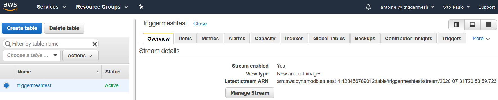
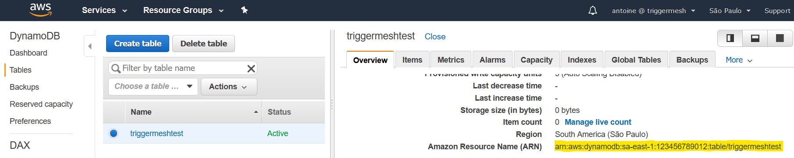
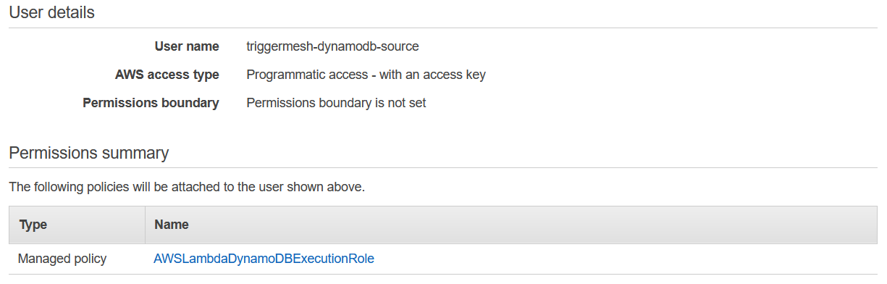
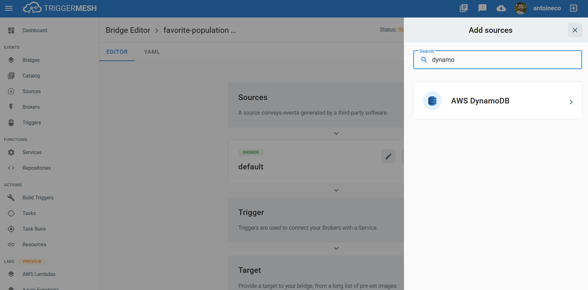
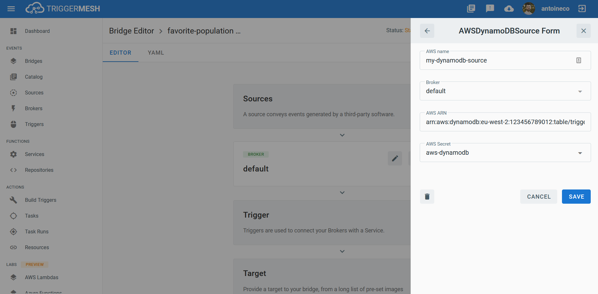
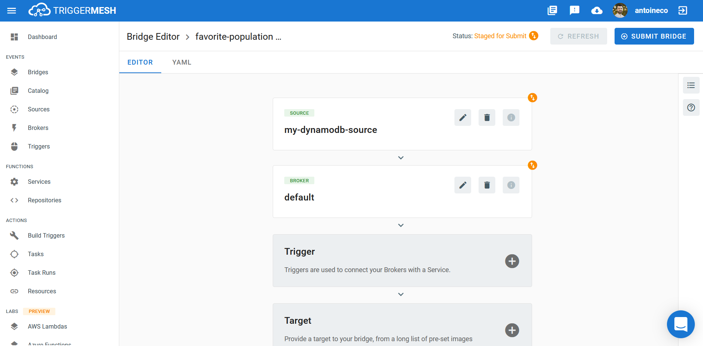

# Event Source for AWS DynamoDB

This event source captures changes to items stored in an [AWS DynamoDB Table][ddb-docs] by reading the time-ordered
sequence of item-level modifications from a [DynamoDB Stream][ddb-streams].

## Prerequisites

### DynamoDB Table and Stream

If you don't already have an AWS DynamoDB Table, create one by following the instructions at [Getting Started with
DynamoDB][ddb-gettingstarted]. In order for change notifications to be consumed by the TriggerMesh AWS DynamoDB event
source, it is mandatory to enable a [Stream][ddb-streams] on the DynamoDB Table. To do so, follow the instructions at
[Enabling a Stream][ddb-stream-enable]. You are free to select the _View type_ that is the most suitable for your own
usage of the event source.



### Amazon Resource Name (ARN)

A fully qualified ARN is required to uniquely identify the AWS DynamoDB Table.

This ARN can be obtained directly from the _Overview_ tab after clicking the DynamoDB Table name in the list of existing
tables. It typically has the following format:

```
arn:aws:dynamodb:{awsRegion}:{awsAccountId}:table/{tableName}
```



Alternatively, one can obtain the ARN of a DynamoDB Table by using the [AWS CLI][aws-cli]. The following command
retrieves the information of a table called `triggermeshtest` in the `us-west-2` region:

```console
$ aws dynamodb describe-table --table-name triggermeshtest --region us-west-2
{
    "Table": {
        "TableName": "triggermeshtest",
        "TableStatus": "ACTIVE",
        "TableArn": "arn:aws:dynamodb:us-west-2:123456789012:table/triggermeshtest",
        (...)
    }
}
```

### API Credentials

The TriggerMesh AWS DynamoDB event source authenticates calls to the AWS DynamoDB API using an [Access Key][accesskey].
The page at this link contains instructions to create an access key when signed either as the root user or as an IAM
user. Take note of the **Access Key ID** and **Secret Access Key**, they will be used to create an instance of the event
source.

It is considered a [good practice][iam-bestpractices] to create dedicated users with restricted privileges in order to
programmatically access AWS services. Permissions can be added or revoked granularly for a given IAM user by attaching
[IAM Policies][iam-policies] to it.

As an example, the following policy contains only the permissions required by the TriggerMesh AWS DynamoDB event
source to operate:

```json
{
    "Version": "2012-10-17",
    "Statement": [
        {
            "Effect": "Allow",
            "Action": [
                "dynamodb:ListStreams",
                "dynamodb:DescribeStream",
                "dynamodb:GetShardIterator",
                "dynamodb:GetRecords"
            ],
            "Resource": "arn:aws:dynamodb:*:*:*"
        }
    ]
}
```



## Deploying an Instance of the Source

Open the Bridge creation screen and add a source of type `AWS DynamoDB`.



In the Source creation form, give a name to the event source and add the following information:

* [**AWS ARN**][arn]: ARN of the DynamoDB Table, as described in the previous sections.
* [**AWS Secret**][accesskey]: Reference to a [TriggerMesh secret][tm-secret] containing an Access Key ID and a Secret
  Access Key to communicate with the AWS DynamoDB API, as described in the previous sections.



After clicking the `Save` button, you will be taken back to the Bridge editor. Proceed to adding the remaining
components to the Bridge, then submit it.



A ready status on the main _Bridges_ page indicates that the event source is ready to receive notifications from the AWS
DynamoDB Stream.


## Event Types

The AWS DynamoDB event source emits events of the following types:

* `com.amazon.dynamodb.insert`
* `com.amazon.dynamodb.modify`
* `com.amazon.dynamodb.remove`

[arn]: https://docs.aws.amazon.com/IAM/latest/UserGuide/list_amazondynamodb.html#amazondynamodb-resources-for-iam-policies
[accesskey]: https://docs.aws.amazon.com/general/latest/gr/aws-sec-cred-types.html#access-keys-and-secret-access-keys
[aws-cli]: https://aws.amazon.com/cli/
[iam-bestpractices]: https://docs.aws.amazon.com/general/latest/gr/aws-access-keys-best-practices.html#iam-user-access-keys
[iam-policies]: https://docs.aws.amazon.com/IAM/latest/UserGuide/access_policies.html

[ddb-docs]: https://docs.aws.amazon.com/amazondynamodb/latest/developerguide/Introduction.html
[ddb-streams]: https://docs.aws.amazon.com/amazondynamodb/latest/developerguide/Streams.html
[ddb-gettingstarted]: https://docs.aws.amazon.com/amazondynamodb/latest/developerguide/GettingStartedDynamoDB.html
[ddb-stream-enable]: https://docs.aws.amazon.com/amazondynamodb/latest/developerguide/Streams.html#Streams.Enabling

[tm-secret]: ../guides/secrets.md
