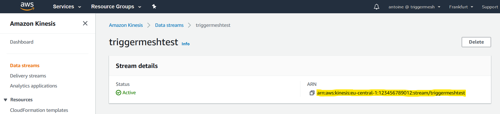
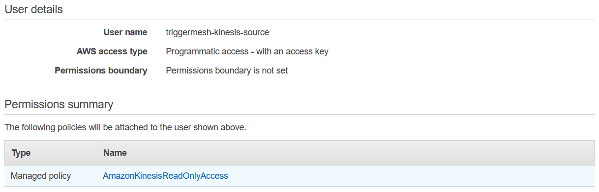
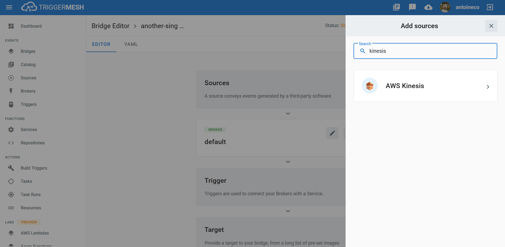
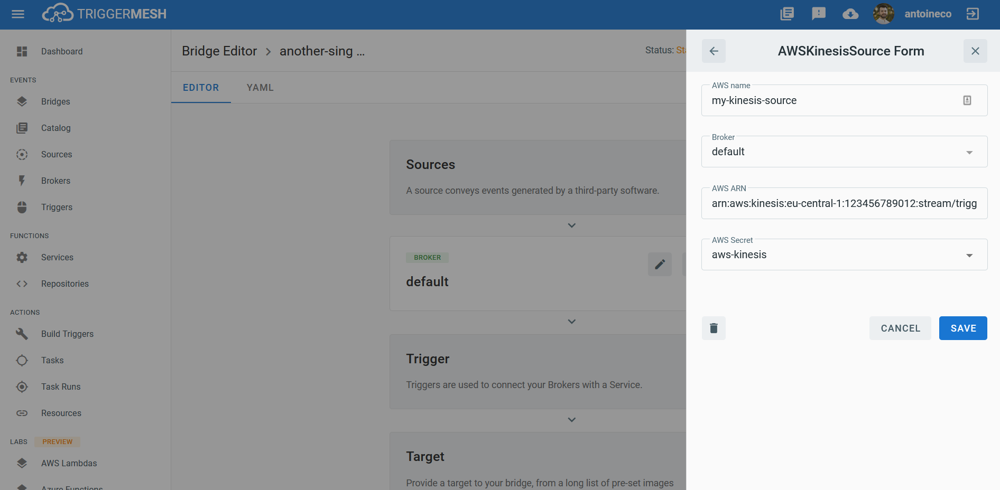
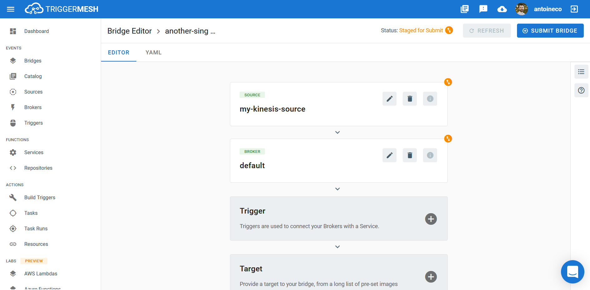

# Event Source for AWS Kinesis

This event source acts as a consumer of an [AWS Kinesis Data Stream][kinesis-docs] and forwards all messages it reads
after wrapping them in a [CloudEvent][ce] envelope.

## Prerequisite(s)

- Kinesis Data Stream
- Amazon Resource Name (ARN)
- API Credentials

### Kinesis Data Stream

If you don't already have an AWS Kinesis Data Stream, create one by following the instructions at [Creating and Updating
Data Streams][kinesis-stream-create].

### Amazon Resource Name (ARN)

A fully qualified ARN is required to uniquely identify the AWS Kinesis Stream.

This ARN can be obtained directly from the overview page of the Kinesis Stream. It typically has the following format:

```
arn:aws:kinesis:{awsRegion}:{awsAccountId}:stream/{steamName}
```



Alternatively, one can obtain the ARN of a Kinesis Stream by using the [AWS CLI][aws-cli]. The following command
retrieves the information of a stream called `triggermeshtest` in the `us-west-2` region:

```console
$ aws kinesis describe-stream --stream-name triggermeshtest --region us-west-2
{
    "StreamDescription": {
        "StreamARN": "arn:aws:kinesis:us-west-2:123456789012:stream/triggermeshtest",
        "StreamName": "triggermeshtest",
        "StreamStatus": "ACTIVE",
        (...)
    }
}
```

### API Credentials

The TriggerMesh event source for Amazon Kinesis authenticates calls to the AWS API using AWS Access Keys. The page
[Understanding and getting your AWS credentials][accesskey] contains instructions to create access keys when signed-in
either as the root user or as an IAM user. Take note of the **Access Key ID** and **Secret Access Key**, they will be
used to create an instance of the event source.

It is considered a [good practice][iam-bestpractices] to create dedicated users with restricted privileges in order to
programmatically access AWS services. Permissions can be added or revoked granularly for a given IAM user by attaching
[IAM Policies][iam-policies] to it.

As an example, the following policy contains only the permissions required by the TriggerMesh AWS Kinesis event source
to operate:

```json
{
    "Version": "2012-10-17",
    "Statement": [
        {
            "Effect": "Allow",
            "Action": [
                "kinesis:DescribeStream",
                "kinesis:GetShardIterator",
                "kinesis:GetRecords"
            ],
            "Resource": "arn:aws:kinesis:*:*:*"
        }
    ]
}
```



## Deploying an Instance of the Source

Open the Bridge creation screen and add a source of type `AWS Kinesis`.



In the Source creation form, give a name to the event source and add the following information:

- [**AWS ARN**][arn]: ARN of the Kinesis Data Stream, as described in the previous sections.
- [**AWS Secret**][accesskey]: Reference to a [TriggerMesh secret][tm-secret] containing an Access Key ID and a Secret
  Access Key to communicate with the AWS Kinesis API, as described in the previous sections.



After clicking the `Save` button, you will be taken back to the Bridge editor. Proceed to adding the remaining
components to the Bridge, then submit it.



A ready status on the main _Bridges_ page indicates that the event source is ready to forward messages from the AWS
Kinesis Data Stream.


## Event Types

The AWS Kinesis event source emits events of the following types:

- `com.amazon.kinesis.stream_record`

[arn]: https://docs.aws.amazon.com/IAM/latest/UserGuide/list_amazonkinesis.html#amazonkinesis-resources-for-iam-policies
[accesskey]: https://docs.aws.amazon.com/general/latest/gr/aws-sec-cred-types.html#access-keys-and-secret-access-keys
[aws-cli]: https://aws.amazon.com/cli/
[iam-bestpractices]: https://docs.aws.amazon.com/general/latest/gr/aws-access-keys-best-practices.html#iam-user-access-keys
[iam-policies]: https://docs.aws.amazon.com/IAM/latest/UserGuide/access_policies.html

[kinesis-docs]: https://docs.aws.amazon.com/streams/latest/dev/introduction.html
[kinesis-stream-create]: https://docs.aws.amazon.com/streams/latest/dev/amazon-kinesis-streams.html

[tm-secret]: ../guides/secrets.md

[ce]: https://cloudevents.io/
