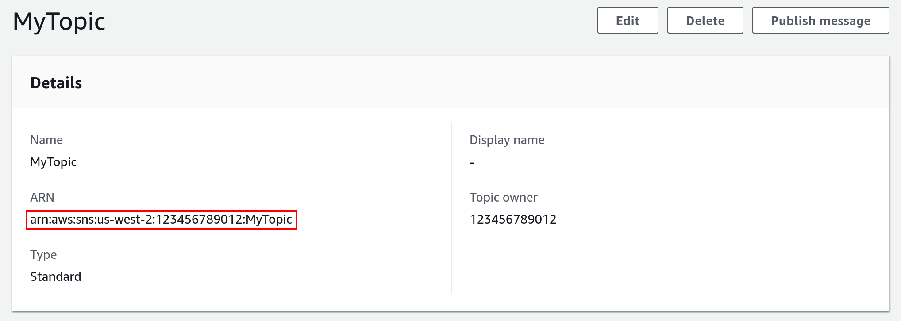
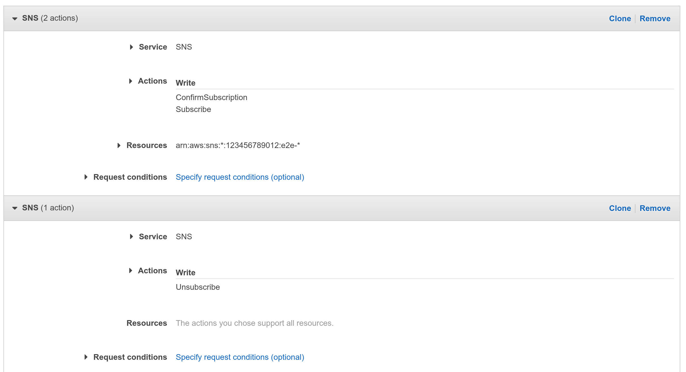

# Amazon SNS source

This event source subscribes to messages from a [Amazon SNS topic][sns-docs].

With `tmctl`:

```
tmctl create --arn <arn> --auth.credentials.accessKeyID <keyID> --auth.credentials.secretAccessKey <key>
```

On Kubernetes:

```yaml
apiVersion: sources.triggermesh.io/v1alpha1
kind: AWSSNSSource
metadata:
  name: sample
spec:
  arn: arn:aws:sns:us-west-2:123456789012:triggermeshtest

  # For a list of supported subscription attributes, please refer to the following resources:
  #  * https://docs.aws.amazon.com/sns/latest/api/API_SetSubscriptionAttributes.html
  #  * https://docs.aws.amazon.com/sns/latest/dg/sns-how-it-works.html
  subscriptionAttributes:
    DeliveryPolicy: |
      {
        "healthyRetryPolicy": {
          "numRetries": 3,
          "minDelayTarget": 20,
          "maxDelayTarget": 20
        }
      }
  auth:
    credentials:
      accessKeyID:
        valueFromSecret:
          name: awscreds
          key: aws_access_key_id
      secretAccessKey:
        valueFromSecret:
          name: awscreds
          key: aws_secret_access_key

  sink:
    ref:
      apiVersion: eventing.triggermesh.io/v1alpha1
      kind: RedisBroker
      name: triggermesh
```

Attributes:

- [**AWS ARN**][arn]: ARN of the SNS topic, as described in the previous sections.
- [**DeliveryPolicy**][sns-delivery-policy]: Delivery policy to define how Amazon SNS retries the delivery of messages
  to HTTP/S endpoints.

For details on authenticating with AWS, please take a look at our [dedicated guide on AWS credentials](../guides/credentials/awscredentials.md).

Events produced have the following attributes:

* type `com.amazon.sns.notification`
* Schema of the `data` attribute: [com.amazon.sns.notification.json](https://raw.githubusercontent.com/triggermesh/triggermesh/main/schemas/com.amazon.sns.notification.json)

See the [Kubernetes object reference](../../reference/sources/#sources.triggermesh.io/v1alpha1.AWSSNSSource) for more details.

## Prerequisite(s)

- SNS Topic (standard)
- Amazon Resource Name (ARN)
- API Credentials

### SNS Topic (standard)

If you don't already have an Amazon SNS standard topic, create one by following the instructions in the [Getting started
with Amazon SNS][sns-getting-started] guide.

### Amazon Resource Name (ARN)

A fully qualified ARN is required to uniquely identify the Amazon SNS topic.



As shown in the above screenshot, you can obtain the ARN of a SNS topic from the AWS console. It typically has the
following format:

```
arn:aws:sns:{awsRegion}:{awsAccountId}:{topicName}
```

Alternatively you can also use the [AWS CLI][aws-cli]. The following command retrieves the ARN of a SNS topic named
`MyTopic` in the `us-west-2` region.

```console
$ aws --region us-west-2 sns list-topics
{
    "Topics": [
        ...
        {
            "TopicArn": "arn:aws:sns:us-west-2:123456789012:MyTopic"
        },
        ...
    ]
}
```

### API Credentials

The TriggerMesh event source for Amazon SNS authenticates calls to the AWS API using AWS Access Keys. The page
[Understanding and getting your AWS credentials][accesskey] contains instructions to create access keys when signed-in
either as the root user or as an IAM user. Take note of the **Access Key ID** and **Secret Access Key**, they will be
used to create an instance of the event source.

It is considered a [good practice][iam-bestpractices] to create dedicated users with restricted privileges in order to
programmatically access AWS services. Permissions can be added or revoked granularly for a given IAM user by attaching
[IAM Policies][iam-policies] to it.

As an example, the following policy contains the permissions required by the TriggerMesh Amazon SNS event source to read
and delete messages from any topic linked to the AWS account:

```json
{
    "Version": "2012-10-17",
    "Statement": [
        {
            "Sid": "AWSSNSSourceReceiveAdapter",
            "Effect": "Allow",
            "Action": "sns:ConfirmSubscription",
            "Resource": "*"
        },
        {
            "Sid": "AWSSNSSourceReconciler",
            "Effect": "Allow",
            "Action": [
                "sns:ListSubscriptionsByTopic",
                "sns:Subscribe",
                "sns:Unsubscribe"
            ],
            "Resource": "*"
        }
    ]
}
```



[sns-docs]: https://docs.aws.amazon.com/sns/latest/dg/welcome.html
[sns-getting-started]: https://docs.aws.amazon.com/sns/latest/dg/sns-getting-started.html
[sns-delivery-policy]: https://docs.aws.amazon.com/sns/latest/dg/sns-message-delivery-retries.html#creating-delivery-policy
[aws-cli]: https://aws.amazon.com/cli/
[accesskey]: https://docs.aws.amazon.com/general/latest/gr/aws-sec-cred-types.html#access-keys-and-secret-access-keys
[iam-bestpractices]: https://docs.aws.amazon.com/general/latest/gr/aws-access-keys-best-practices.html#iam-user-access-keys
[iam-policies]: https://docs.aws.amazon.com/IAM/latest/UserGuide/access_policies.html
[arn]: https://docs.aws.amazon.com/service-authorization/latest/reference/list_amazonsns.html#amazonsns-resources-for-iam-policies
[tm-secret]: ../secrets.md
